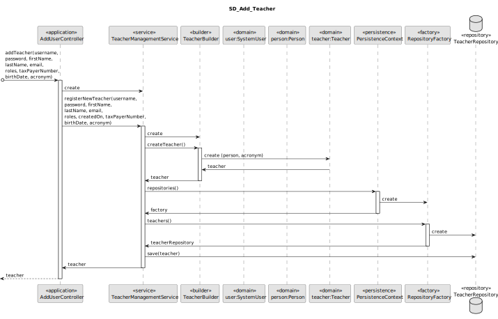
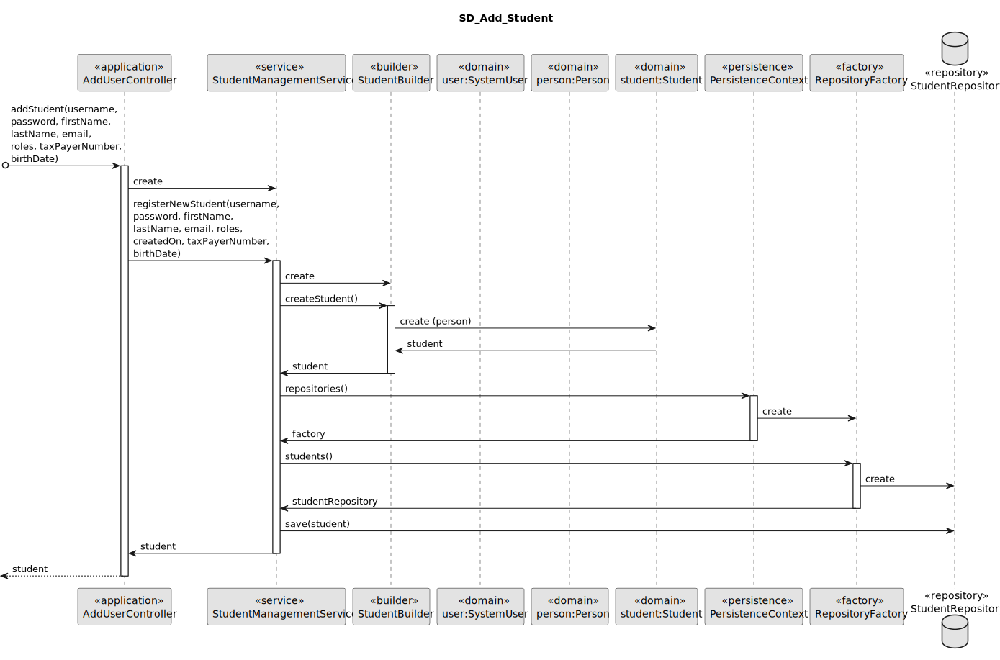

# US 1001

Este documento contém a documentação relativa à US 1001.

## 1. Contexto

Esta *User Story (US)* foi introduzida neste *sprint* para ser desenvolvida seguindo as boas práticas de engenharia de
*software*.
Esta *US* faz parte da disciplina de **EAPLI**.

## 2. Requisitos

**US 1001** - As Manager, I want to be able to register, disable/enable, and list users of the system (Teachers and Students, as well as Managers)

A respeito deste requisito, entendemos que esta *US* pode subdividir-se em três:
- **US 1001_1** - As Manager, I want to be able to register users of the system (Teachers and Students, as well as Managers)
- **US 1001_2** - As Manager, I want to be disable/enable users of the system (Teachers and Students, as well as Managers)
- **US 1001_3** - As Manager, I want to be list users of the system (Teachers and Students, as well as Managers)

### 2.1. Complementos encontrados

Não existe nenhuma *User Story (US)* que complementa esta.

### 2.2. Dependências encontradas

Esta *User Story (US)* não possui nenhuma dependência.

### 2.3. Critérios de aceitação

- Cada utilizador também deve fornecer seu nome completo e nome abreviado.
- Para ser autenticado pelo sistema os utilizadores também devem fornecer uma senha.
- O número mecanográfico do aluno deve ser atribuído automaticamente pelo sistema com base no ano de matrícula e um 
número sequencial, por exemplo, "202300001".

## 3. Análise

### 3.1. Respostas do cliente

>**Questão:** "Looking at the users, they are to be given a short name and a full name. Should the short name be part of the full name?"
>
>**Resposta:** "...as a client, i should say that my interpretation of short name is like a given name."

>**Questão:** "Do the system has to support an option to create new user roles that are not specified at the system specification documents or the system will always have just the three user roles described?"
>
>**Resposta:** "Regarding user roles, the solution should support the ones necessary to cover all the actual functional requirements."

>**Questão:** "Should the user be multi-role? For example, can a system user be a teacher and a student or a manager at the same time?"
>
>**Resposta:** "I see no need for that. For me, each user as only one specific role in the system."

>**Questão:** "Is it necessary to know who created a specific user?"
>
>**Resposta:** "I think this is something related to the design of the solution, that you and your team must decide when designing the solution in order to meet the existing requirements."

### 3.2. Diagrama de Sequência do Sistema
**US 1001_1** - Registar utilizadores no sistema


**US 1001_2** - Desabilitar/habilitar utilizadores do sistema


**US 1001_3** - Listar utilizadores do sistema


### 3.3. Classes de Domínio


## 4. Design

### 4.1. Diagrama de Sequência

**US 1001_1** - Registar utilizadores no sistema


Diagrama de Sequência representando a adicão de um utilizador


Diagrama de Sequência representando a adicão de um utilizador do tipo Teacher



Diagrama de Sequência representando a adicão de um utilizador do tipo Student



**US 1001_2** - Desabilitar/habilitar utilizadores do sistema


**US 1001_3** - Listar utilizadores do sistema


### 4.2. Diagrama de Classes

**US 1001_1** - Registar utilizadores no sistema


**US 1001_2** - Desabilitar/habilitar utilizadores do sistema


**US 1001_3** - Listar utilizadores do sistema


### 4.3. Padrões Aplicados

|                                        Questão: Que classe...                                         |             Resposta             | Padrão               |                                                                Justificação                                                                 |
|:-----------------------------------------------------------------------------------------------------:|:--------------------------------:|----------------------|:-------------------------------------------------------------------------------------------------------------------------------------------:|
|       é responsável por interagir com o utilizador na funcionalidade de registar um utilizador?       |            AddUserUI             | *Pure Fabrication*   |                         Não há razão para atribuir esta responsabilidade a uma classe presente no Modelo de Domínio                         |
| é responsável por interagir com o utilizador na funcionalidade de desabilitar/habilitar utilizadores? |     ActivateDeactivateUserUI     | *Pure Fabrication*   |                         Não há razão para atribuir esta responsabilidade a uma classe presente no Modelo de Domínio                         |
|        é responsável por interagir com o utilizador na funcionalidade de listar utilizadores?         |           ListUsersUI            | *Pure Fabrication*   |                         Não há razão para atribuir esta responsabilidade a uma classe presente no Modelo de Domínio                         |
|                é responsável por coordenar a funcionalidade de registar um utilizador?                |        AddUserController         | *Controller*         |                                                                                                                                             |
|          é responsável por coordenar a funcionalidade de desabilitar/habilitar utilizadores?          | ActivateDeactivateUserController | *Controller*         |                                                                                                                                             |
|                 é responsável por coordenar a funcionalidade de listar utilizadores?                  |       ListUsersController        | *Controller*         |                                                                                                                                             |
|                         é responsável por criar todos as classes Repository?                          |        RepositoryFactory         | *Factory*            |                               Quando uma entidade é demasiado complexa, as fábricas fornecem encapsulamento.                                |
|                              permite persistir os utilizadores criados?                               |          UserRepository          | *Repository*         | Quando se pretende ocultar os detalhes de persistência/reconstrução de objetos cria-se uma classe Repository responsável por essas tarefas. |
|                         conhece todos os utilizadores registados no sistema?                          |          UserRepository          | *Information Expert* |                   Dado que é responsável pela persistência/reconstrução do *SystemUser*, conhece todos os seus detalhes.                    |
|                          conhece todos os professores registados no sistema?                          |        TeacherRepository         | *Information Expert* |                     Dado que é responsável pela persistência/reconstrução do *Teacher*, conhece todos os seus detalhes.                     |
|                          conhece todos os estudantes registados no sistema?                           |        StudentRepository         | *Information Expert* |                     dado que é responsável pela persistência/reconstrução do *Student*, conhece todos os seus detalhes.                     |
|                        sabe se o utilizador encontra-se ativado ou desativado?                        |            SystemUser            | *Information Expert* |                                             Sabe toda a informação dos dados que lhe pertencem.                                             |

### 4.4. Testes

**Teste 1:** *Verifica se não é possível criar uma instância da classe *Person* com valores nulos.*

```
@Test(expected = IllegalArgumentException.class)
public void ensureNullIsNotAllowedPerson() {
	Person instance = new Person(null, null, null);
}
```

**Teste 2:** *Verifica se não é possível criar uma instância da classe *Person* com um número de contribuinte inválido.*

```
@Test(expected = IllegalArgumentException.class)
public void ensureTaxPayerNumberIsValid() {
	Person instance = new Person(new SystemUser(...), new TaxPayerNumber("2236"), new BirthDate(...));
}
```

**Teste 3:** *Verifica se não é possível criar uma instância da classe *Person* com uma data de nascimento inválida.*

```
@Test(expected = IllegalArgumentException.class)
public void ensureBirthDateIsValid() {
    Calendar birthDate = Calendar.getInstance();
    birthDate.set(2025, Calendar.MAY, 10);
    
	Person instance = new Person(new SystemUser(...), new TaxPayerNumber(...), birthDate);
}
```

**Teste 4:** *Verifica se não é possível criar uma instância da classe *Teacher* com valores nulos.*

```
@Test(expected = IllegalArgumentException.class)
public void ensureNullIsNotAllowedTeacher() {
	Teacher instance = new Teacher(null, null);
}
```

**Teste 5:** *Verifica se não é possível criar uma instância da classe *Teacher* com um acrónimo inválido.*

```
@Test(expected = IllegalArgumentException.class)
public void ensureAcronymIsValid() {
    Teacher instance = new Teacher(new Person(..), new Acronym("A33"));
}
```

**Teste 6:** *Verifica se não é possível criar uma instância da classe *Student* com valores nulos.*

```
@Test(expected = IllegalArgumentException.class)
public void ensureNullIsNotAllowedStudent() {
	Student instance = new Student(null, null);
}
```

**Teste 7:** *Verifica se não é possível criar uma instância da classe *Student* com um número mecanográfico inválido.*

```
@Test(expected = IllegalArgumentException.class)
public void ensureMecanographicNumberIsValid() {
	Student instance = new Student(new Person(..), new MecanographicNumber("11912"));
}
```

## 5. Implementação

## 5.1. Arquitetura em Camadas
### Domínio

Na camada de domínio criou-se a entidade *Person*, *Teacher* e *Student* e os respetivos *Value* *Objects*. Além disso 
utilizou-se a entidade *SystemUser* que encontra-se na framework de *EAPLI*.

### Aplicação

Na camada de aplicação utilizou-se os controllers *AddUserController*, *ActivateDeactivateUserController* e *ListUsersController* 
que já encontravam-se criados pelo projeto base disponibilizado de *EAPLI*.

### Repositório

Na camada de repositório foi utilizada a previamente implementada interface *UserRepository*, e criada a *PersonRepository*, 
*TeacherRepository* e *StudentRepository* que são depois implementadas em *JPA* e *InMemory* no módulo de *impl*.

### Apresentação

Nesta camada foi desenvolvida as *UIs* (consola) necessárias que fazem a interação entre o Gerente e o sistema. A *AddUserUI*
permite adicionar um utilizador, a *ActivateDeactivateUserUI* possibilita a ativação/desativação de um utilizador e a 
*ListUsersUI* a listagem de todos os utilizadores do sistema.

## 5.2. Commits Relevantes

[Listagem dos Commits realizados](https://github.com/Departamento-de-Engenharia-Informatica/sem4pi-22-23-20/issues/14)

## 6. Integração/Demonstração

* No menu de Administrador foi adicionado o sub-menu **Users** com as opções **Add User**, **List all Users** e **Activate/Deactivate User**.

## 7. Observações

* Não existem observações relevantes a acrescentar.