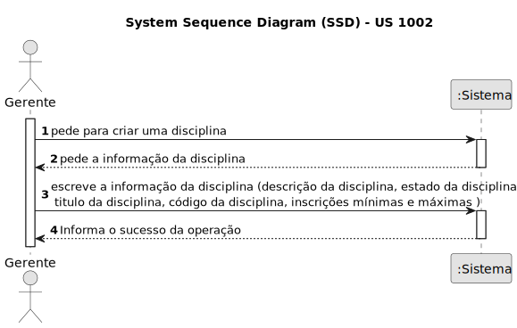
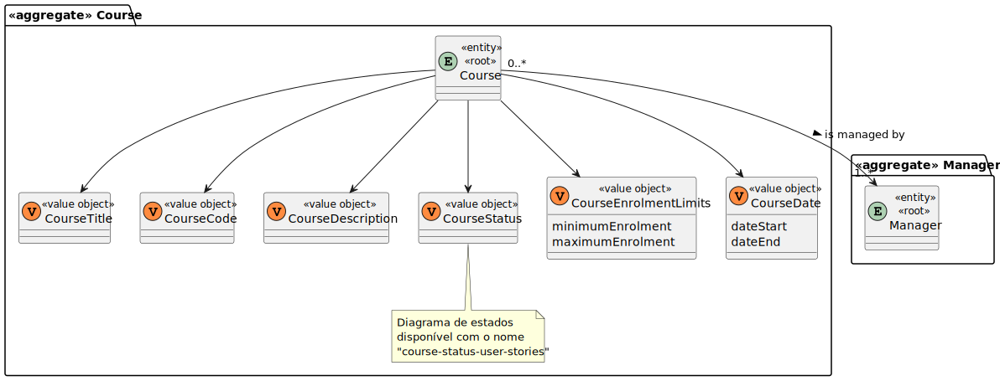
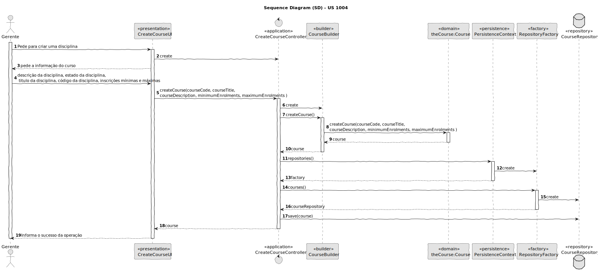
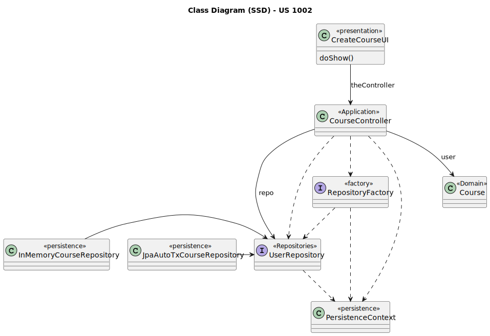

# US 1002

Este documento contém a documentação relativa à US 1002.

## 1. Contexto

Esta *User Story (US)* foi introduzida neste *sprint* para ser desenvolvida seguindo as boas práticas de engenharia de
*software*.
Esta *US* faz parte da disciplina de **EAPLI**.

## 2. Requisitos

**US 1002** - As Manager, I want to create courses.

### 2.1. Complementos encontrados

Não existe *User Stories* complementares.

### 2.2. Dependências encontradas

Esta *User Story (US)* não possui nenhuma dependência.

## 3. Análise

### 3.1. Respostas do cliente

Não foi necessário questionar o cliente em função da realização desta *User Story*.

### 3.2. Regras do negócio

- Diferentes edições de um curso devem ser consideradas cursos diferentes (por exemplo, Intro-Math-Sem01, Intro-Math-Sem02). 
- Somente os gerentes são capazes de executar esta funcionalidade.

### 3.3. Diagrama de Sequência do Sistema



## 4. Design

#### 4.1.1. Classes de Domínio



#### 4.1.2. Diagrama de Sequência



### 4.2. Diagrama de Classes



### 4.3. Padrões Aplicados

|                Questão: Que classe...                |        Resposta        | Padrão             |                                                                Justificação                                                                 |
|:----------------------------------------------------:|:----------------------:|--------------------|:-------------------------------------------------------------------------------------------------------------------------------------------:|
|    é responsável por interagir com o utilizador?     |     CreateCourseUI     | *Pure Fabrication* |                        Não há razão para atribuir esta responsabilidade a uma classe presente no Modelo de Domínio.                         |
|    é responsável por coordenar a funcionalidade?     | CreateCourseController | *Controller*       |                                                                                                                                             |
| é responsável por criar todos as classes Repository? |   RepositoryFactory    | *Factory*          |                               Quando uma entidade é demasiado complexa, as fábricas fornecem encapsulamento.                                |
|      permite persistir as disciplinas criadas?       |    CourseRepository    | *Repository*       | Quando se pretende ocultar os detalhes de persistência/reconstrução de objetos cria-se uma classe Repository responsável por essas tarefas. |

### 4.4. Testes

**Teste 1:** *Verifica se não é possível criar uma instância da classe *Course* com valores nulos.*

```
@Test(expected = IllegalArgumentException.class)
public void ensureNullIsNotAllowedCourse() {
	Course instance = new Course(null, null, null, null);
}
```

**Teste 2:** *Verifica se não é possível criar uma instância do *value object* *CourseEnrolmentLimits* com o limite mínimo e máximo de inscrição inválido.*

```
@Test(expected = IllegalArgumentException.class)
public void ensureInvalidLimitsNotAllowed() {
	CourseEnrolmentLimits instance = new CourseEnrolmentLimits(25, 2);
}
```

## 5. Implementação

## 5.1. Arquitetura em Camadas
### Domínio

Na camada de domínio criou-se a entidade *Course* e os respetivos *Value* *Objects*. 

### Aplicação
Na camada de aplicação utilizou-se os controllers *CreateCourseController*.

### Repositório
Na camada de repositório foi criada a *CourseRepository* que é depois implementada em *JPA* e *InMemory* no módulo de *impl*.

### Apresentação
Nesta camada foi desenvolvida as *UIs* (consola) necessárias que fazem a interação entre o Gerente e o sistema. A *CreateCourseUI*
permite adicionar uma disciplina.

## 5.2. Commits Relevantes

[Listagem dos Commits realizados](https://github.com/Departamento-de-Engenharia-Informatica/sem4pi-22-23-20/issues/15)

## 6. Integração/Demonstração

* No menu de Administrador foi adicionado o sub-menu **Course** com as opções **Create Course**.

## 7. Observações

* Não existem observações relevantes a acrescentar.