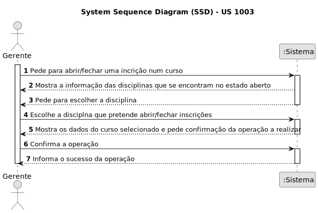
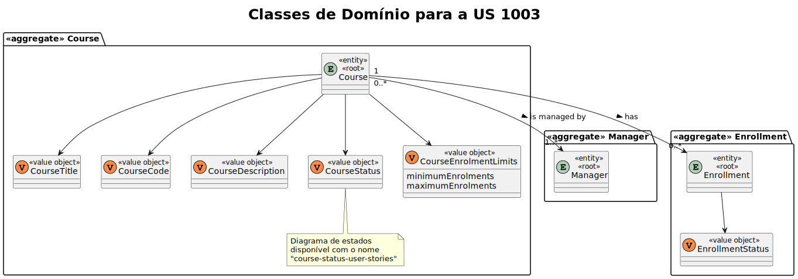
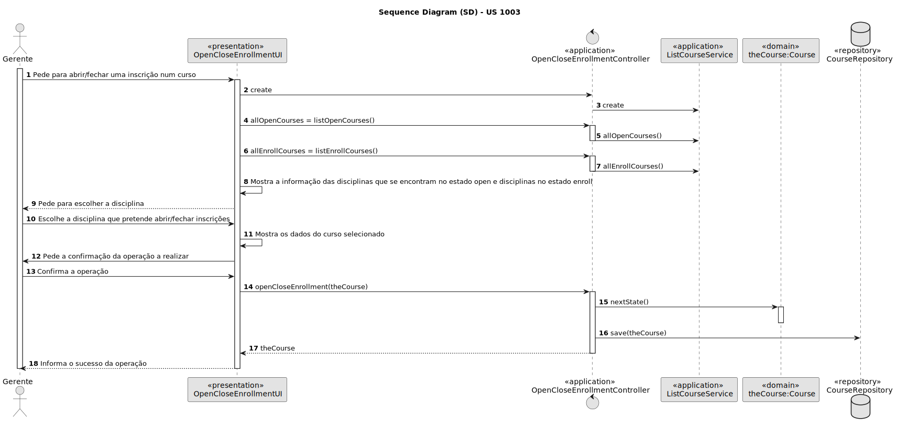
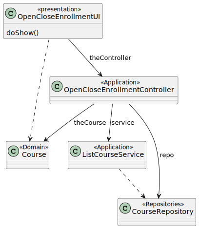

# US 1003

Este documento contém a documentação relativa à US 1003.

## 1. Contexto

- Esta *User Story (US)* está a ser introduzida neste *sprint* para ser desenvolvida seguindo as boas práticas de 
engenharia de *software*.
- Esta *US* faz parte da cadeira de **EAPLI**.

## 2. Requisitos

**US 1003** "As manager, I want to open and close enrollments in courses"

A respeito deste requisito, entendemos que uma inscrição num curso é quando conseguimos visualizar que essa inscrição
se encontra em open ou no estado enroll.

### 2.1 Complementos encontrados
- **US 1004** - As Manager, I want to open and close courses.

  **Explicação:** Esta *US* complementa a atual *US* a ser tratada devido a que a disciplina tem o seguinte ciclo de
  vida:

  Desta forma podemos observar que, a seguir à abertura de um curso é possível realizar as incrições.
  Temos ainda que, o curso será fechado após encerrar a possibilidade de efetuar inscrições no curso.

### 2.2 Dependências encontradas
- **US 1002** - As Manager, I want to create courses.

  **Explicação:** Se não existir uma disciplina, não é possível abrir nem fechar uma disciplina.

- **US 1004** - As Manager, I want to open and close courses.

  **Explicação:** Para abrir as inscrições na disciplina, é preciso primeiro que a disciplina esteja no estado "open".

### 2.3 Critérios de aceitação
**CA 1:** Um curso apenas poderá ser aberto se ainda não tiver atingido o limite de inscrições.

**CA 2:** É necessário registar a data de início do curso quando as inscrições são fechadas. (Falado com o professor)

## 3. Análise

### 3.1. Respostas do cliente

- Ainda não foi necessário questionar o cliente acerca desta *US*.

### 3.2. Diagrama de Sequência do Sistema

### 3.3 Classes de Domínio 

## 4. Design

### 4.1. Realização

#### 4.1.1. Diagrama de Sequência

### 4.2. Diagrama de Classes

### 4.3. Padrões Aplicados
|                                  Questão: Que classe...                                  |           Resposta            | Padrão               |                                            Justificação                                            |
|:----------------------------------------------------------------------------------------:|:-----------------------------:|----------------------|:--------------------------------------------------------------------------------------------------:|
|                      é responsável por interagir com o utilizador?                       |     OpenCloseEnrollmentUI     | *Pure Fabrication*   |    Não há razão para atribuir esta responsabilidade a uma classe presente no Modelo de Domínio     |
|                           é responsável por coordenar a *US*?                            | OpenCloseEnrollmentController | *Controller*         |                                                                                                    |
|                   é responsável por criar todas as classes Repository?                   |       RepositoryFactory       | *Factory*            |           Quando uma entidade é demasiado complexa, as fábricas fornecem encapsulamento.           |
|               conhece todas as disciplinas que podem ser abertas/fechadas?               |       CourseRepository        | *Information Expert* | Dado que é responsável pela persistência/reconstrução do *Course*, conhece todos os seus detalhes. |
|         sabe quais as inscrições dos alunos se encontram pendentes ou aprovadas?         |            Course             | *Information Expert* |                        Sabe toda a informação dos dados que lhe pertencem.                         |
|                sabe qual o máximo de inscrições aprovadas na disciplina?                 |            Course             | *Information Expert* |                        Sabe toda a informação dos dados que lhe pertencem.                         |

### 4.4. Testes

**Teste 1:** *Verifica que se a inscrição se encontra no estado open.*
@Test(expected = InvalidCourseStateChangeException.class)
public void ensureCourseWithPendingActivityIsNotOpenedOrClosed() {

**Teste 2:** *Verifica que se a inscrição se encontra no estado enroll.*
@Test(expected = InvalidCourseStateChangeException.class)
public void ensureCourseWithPendingActivityIsNotOpenedOrClosed() {

## 5. Implementação

## 5.1. Arquitetura em Camadas
### Domínio
Na camada de domínio criou-se a entidade *Course* e os respetivos *Value Objects*. Além disso utilizou-se as entidades
*Exam*, *ExtraClass*, *RecurringClass*, e respetivos *Value Objects* que já tinham sido criadas por outras *User Stories
(US)*.

### Aplicação
Na camada de aplicação criou-se o controller *OpenCloseEnrollementController*. Também utilizou-se o serviço *ListCourseService*.

### Repositório
Na camada de repositório foi utilizada a interface *CourseRepository*.

### Apresentação
Nesta camada foi desenvolvida a *OpenCloseEnrollmentUI* que faz a interação entre o gerente e o sistema e permite
abrir ou fechar inscrições.

## 5.2. Commits Relevantes

[Listagem dos Commits realizados](https://github.com/Departamento-de-Engenharia-Informatica/sem4pi-22-23-20/issues/16)

## 6. Integração/Demonstração

* No menu de Professor foi adicionado no sub-menu **Courses** a opção *Open/close courses enrollments*.

## 7. Observações

* Não existem observações relevantes a acrescentar.