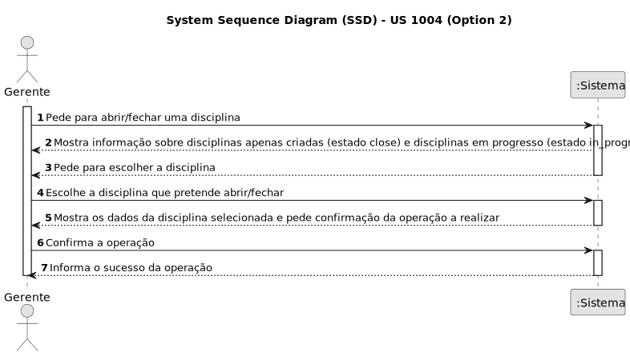
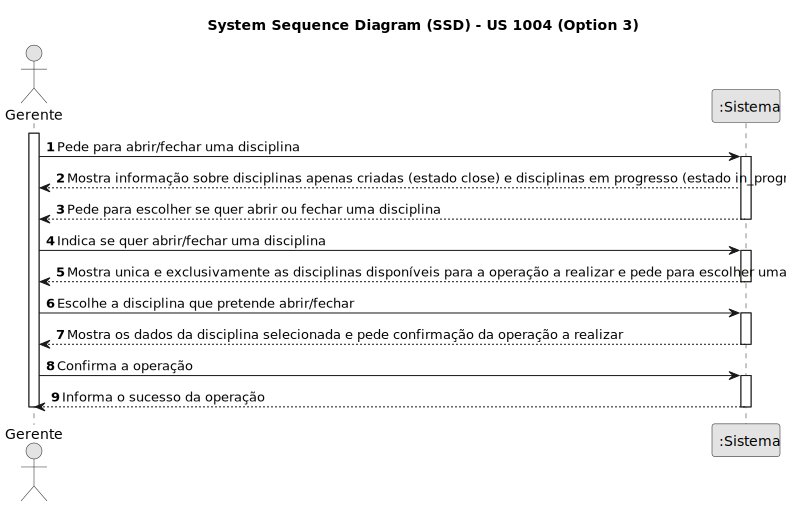
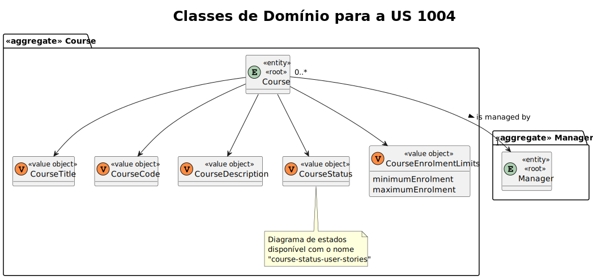
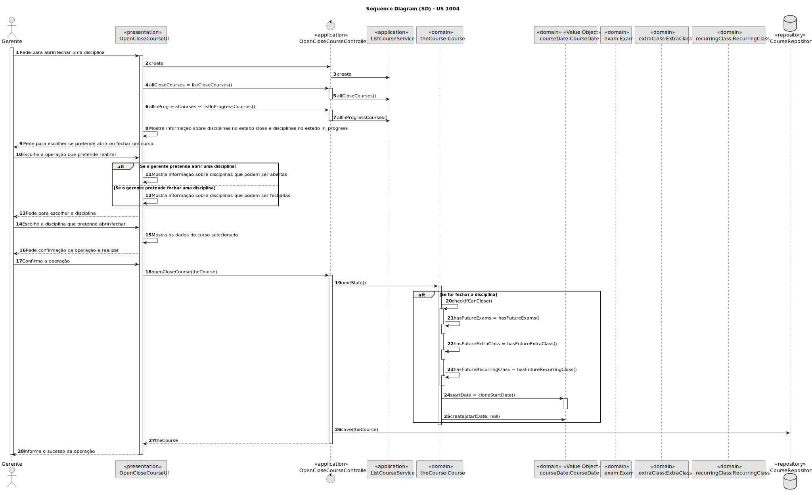
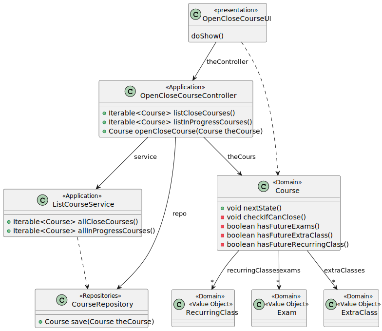

# US 1004

Este documento contém a documentação relativa à US 1004.

## 1. Contexto

Esta *User Story (US)* foi introduzida neste *sprint* para ser desenvolvida seguindo as boas práticas de engenharia de
*software*.
Esta *US* faz parte da disciplina de **EAPLI**.

## 2. Requisitos

**US 1004** - As Manager, I want to open and close courses

A respeito deste requisito, entendemos que ele se refere à funcionalidade de abrir ou fechar uma disciplina, em que 
apenas o administrador poderá fazer isto.
Entendemos também que uma disciplina aberta é quando é possível visualizar que essa disciplina existe e que futuramente 
será possível realizar a inscrição nessa mesma disciplina. Quando uma disciplina se encontra fechada, entedemos que não 
existe nenhum tipo de atividade que lhe está associada. A funcionalidade de abrir e fechar uma disciplina, vai estar 
associada à alteração do estado de uma disciplina.

### 2.1. Complementos encontrados
- **US 1003** - As Manager, I want to open and close enrollements in courses.

    **Explicação:** Esta *US* complementa a atual *US* a ser tratada devido a que a disciplina tem o seguinte ciclo de
    vida:
    
    
    Desta forma podemos observar que, a seguir à abertura de uma disciplina, é possível realizar a abertura de inscrições.
    Depois temos ainda que, a disciplina será fechada após encerrar a possibilidade de inscrição na disciplina.

### 2.2. Dependências encontradas
- **US 1002** - As Manager, I want to create courses.

    **Explicação:** Se não existir uma disciplina, não é possível abrir nem fechar uma disciplina.

- **US 1003** - As Manager, I want to open and close enrollements in courses.

    **Explicação:** Para fechar uma disciplina, ela precisa de primeiro estar no estado "in_progress", ou seja, o estado 
    em que a disciplina fica ao fechar as inscrições.

### 2.3. Critérios de aceitação
**CA 1:** Uma disciplina fechada não pode ter qualquer tipo de atividade, logo apenas será possível fechar uma 
disciplina caso não exista nenhuma atividade pendente.
**CA 2:** É necessário registar a data de fecho do curso. (Falado com o professor)

## 3. Análise
### 3.1. Respostas do cliente

Não foi necessário questionar o cliente em função da realização desta *User Story*.

### 3.2. Diagrama de Sequência do Sistema
**Opção 1:**

**Opção 2:**

**Opção 3 (Escolhida):**

O diagrama de sequência do sistema escolhido foi o da **opção 3**.
Este diagrama foi o escolhido, porque asssim é possível visualizar todos os cursos que podem ser abertos/fechados
de uma só vez. Posteriormente o utilizador pode escolher qual é a operação que deseja realizar sem que necessite
de realizar muitos mais passos até atingir o objetivo.
Contudo, as outras opções são também perfeitamente viáveis, mas obviamente apresentam mais desvantagens do que a opção
escolhida.

### 3.3. Classes de Domínio

## 4. Design

### 4.1. Diagrama de Sequência

### 4.2. Diagrama de Classes

### 4.3. Padrões Aplicados

|                                  Questão: Que classe...                                  |         Resposta          | Padrão               |                                            Justificação                                            |
|:----------------------------------------------------------------------------------------:|:-------------------------:|----------------------|:--------------------------------------------------------------------------------------------------:|
|                      é responsável por interagir com o utilizador?                       |     OpenCloseCourseUI     | *Pure Fabrication*   |    Não há razão para atribuir esta responsabilidade a uma classe presente no Modelo de Domínio     |
|                           é responsável por coordenar a *US*?                            | OpenCloseCourseController | *Controller*         |                                                                                                    |
|                   é responsável por criar todas as classes Repository?                   |     RepositoryFactory     | *Factory*            |           Quando uma entidade é demasiado complexa, as fábricas fornecem encapsulamento.           |
|               conhece todas as disciplinas que podem ser abertas/fechadas?               |     CourseRepository      | *Information Expert* | Dado que é responsável pela persistência/reconstrução do *Course*, conhece todos os seus detalhes. |
|                     sabe quais exames estão associados à disciplina?                     |          Course           | *Information Expert* |                        Sabe toda a informação dos dados que lhe pertencem.                         |
|                  sabe quais aulas extra estão associados à disciplina?                   |          Course           | *Information Expert* |                        Sabe toda a informação dos dados que lhe pertencem.                         |
|               sabe quais aulas recurrentes estão associadas à disciplina?                |          Course           | *Information Expert* |                        Sabe toda a informação dos dados que lhe pertencem.                         |
|                  sabe em que data o exame de uma disciplina se realiza?                  |           Exam            | *Information Expert* |                        Sabe toda a informação dos dados que lhe pertencem.                         |
|            sabe em que data uma dada aula extra de uma disciplina se realiza?            |        ExtraClass         | *Information Expert* |                        Sabe toda a informação dos dados que lhe pertencem.                         |
| sabe em que data alguma aula recorrente se encontra remarcada, para uma dada disciplina? |      RecurringClass       | *Information Expert* |                        Sabe toda a informação dos dados que lhe pertencem.                         |

### 4.4. Testes
**Teste 1:** *Verifica que é possível passar um curso do estado "in_progress" para o estado "closed".*
public void verifyCourseStateChangeFromInProgressToClosed() {
    //...
}

**Teste 2:** *Verifica que é possível passar um curso do estado "close" para o estado "open".*
public void verifyCourseStateChangeFromCloseToOpen() {
    //...
}

**Teste 3:** *Assegura-se de que não é possível fechar um curso se ainda tiver exames associados a serem feitos no 
futuro.*
public void ensureCourseCanNotBeClosedWhenHasPendingExams() {
//...
}

**Teste 4:** *Assegura-se de que não é possível fechar um curso se ainda tiver aulas extra associadas a decorrer no
futuro.*
public void ensureCourseCanNotBeClosedWhenHasPendingExtraClasses() {
//...
}

**Teste 5:** *Assegura-se de que não é possível fechar um curso se ainda tiver aulas recurrentes associadas a decorrer 
no futuro.*
public void ensureCourseCanNotBeClosedWhenHasPendingReccurringClasses() {
//...
}

## 5. Implementação

## 5.1. Arquitetura em Camadas
### Domínio

Na camada de domínio criou-se a entidade *Course* e os respetivos *Value Objects*. Além disso utilizou-se as entidades
*Exam*, *ExtraClass*, *RecurringClass*, e respetivos *Value Objects* que já tinham sido criadas por outras *User Stories
(US)*.

### Aplicação

Na camada de aplicação criou-se o controller *OpenCloseCourseController*.
Também se utilizou o serviço *ListCourseService*.

### Repositório

Na camada de repositório foi utilizada a *interface* *CourseRepository* que é implementada em *JPA* e *InMemory* no módulo 
de *impl*.

### Apresentação

Nesta camada foi desenvolvida a *OpenCloseCourseUI* que faz a interação entre o gerente e o sistema e permite
abrir/fechar uma disciplina.

## 5.2. Commits Relevantes

[Listagem dos Commits realizados](https://github.com/Departamento-de-Engenharia-Informatica/sem4pi-22-23-20/issues/17)

## 6. Integração/Demonstração

* No menu de Administrador foi adicionado no sub-menu **Courses** a opção *Open/close courses*.

## 7. Observações

No tópico da análise foram anaçisadas várias soluções possíveis para resolver a *US*. Lá também é possível visualizar
a justificação para a escolha do *SSD* utilizado (opção 3).
A forma como é feita a verificação de se o curso ainda tem ou não atividade poderia estar feito de uma forma mais 
eficiente, mas para isso seria necessário realizar alterações no Modelo de Domínio, mas atualmente há maior prioridade
no desenvolvimento de outras *US*, então essa melhoria terá de ser feita no futuro, noutro *sprint*.
