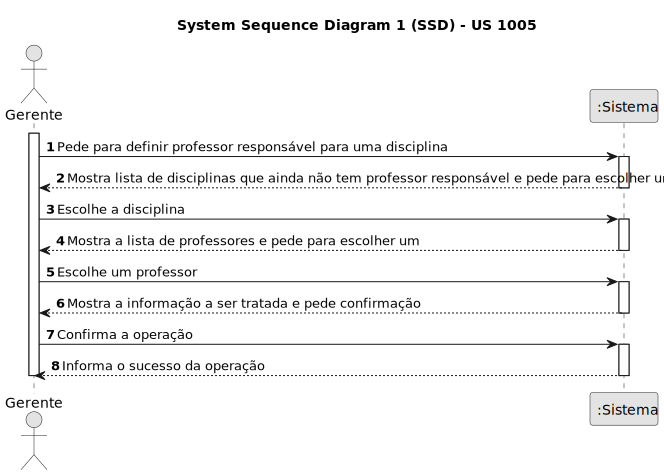
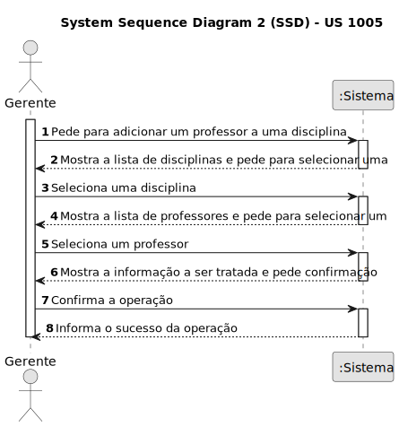
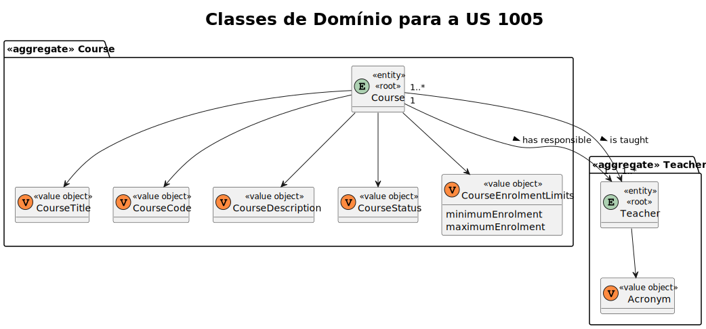
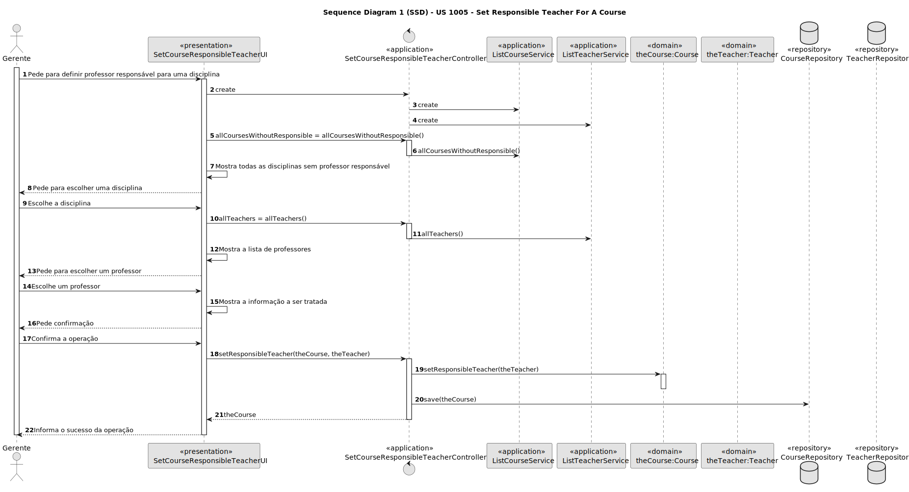
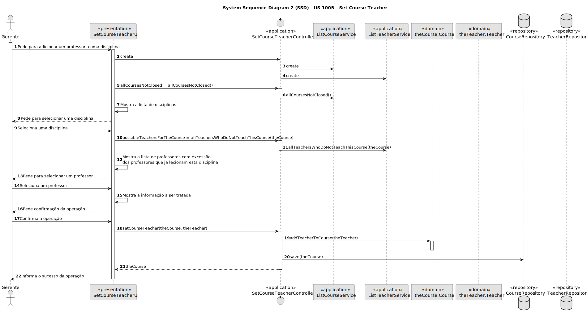
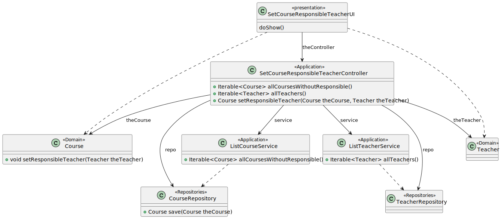
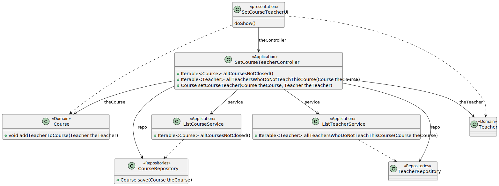

# US 1005

Este documento contém a documentação relativa à US 1005.

## 1. Contexto

Esta *User Story (US)* foi introduzida neste *sprint* para ser desenvolvida seguindo as boas práticas de engenharia de
*software*.
Esta *US* faz parte da disciplina de **EAPLI**.

## 2. Requisitos

**US 1005** - As Manager, I want to set the teachers of a course

A respeito deste requisito, entendemos que ele se refere à funcionalidade de associar os professores às disciplinas que
irão lecionar. Apenas o administrador poderá realizar esta tarefa.

### 2.1. Complementos encontrados
*Não existem User Stories complementares.*

### 2.2. Dependências encontradas
- **US 1001** - As Manager, I want to be able to register, disable/enable, and list users of the system (Teachers and Students, as well as Managers)

  **Explicação:** Se não existir um professor, não é possível que a disciplina tenha um ou mais professores.

- **US 1002** - As Manager, I want to create courses.

  **Explicação:** Se não existir uma disciplina, não é possível associar um professor a uma disciplina.

### 2.3. Critérios de aceitação
**CA 1:** A disciplina pode ter vários professores.
**CA 2:** A disciplina deve conter um e apenas um professor responsável.
**CA 3:** Uma disciplina fechada não tem qualquer tipo de atividade, logo, não é possível adicionar professores a
disciplinas fechadas.

## 3. Análise

### 3.1. Respostas do cliente

Não foi necessário questionar o cliente em função da realização desta *User Story*.

### 3.2. Diagrama de Sequência do Sistema

*Adicionar professor responsável pela disciplina.*



*Adicionar professor para lecionar a disciplina.*



### 3.3. Classes de Domínio



## 4. Design

### 4.1. Diagrama de Sequência

*Adicionar professor responsável pela disciplina.*



*Adicionar professor para lecionar a disciplina.*



### 4.2. Diagrama de Classes

*Adicionar professor responsável pela disciplina.*



*Adicionar professor para lecionar a disciplina.*



### 4.3. Padrões Aplicados

|                                                 Questão: Que classe...                                                 |               Resposta                | Padrão               |                                                            Justificação                                                            |
|:----------------------------------------------------------------------------------------------------------------------:|:-------------------------------------:|----------------------|:----------------------------------------------------------------------------------------------------------------------------------:|
|          é responsável por interagir com o utilizador na funcionalidade de definir um professor responsável?           |     SetCourseResponsibleTeacherUI     | *Pure Fabrication*   |                    Não há razão para atribuir esta responsabilidade a uma classe presente no Modelo de Domínio                     |
| é responsável por interagir com o utilizador na funcionalidade de adicionar um professor para lecionar uma disciplina? |          SetCourseTeacherUI           | *Pure Fabrication*   |                    Não há razão para atribuir esta responsabilidade a uma classe presente no Modelo de Domínio                     |
|                   é responsável por coordenar a funcionalidade de definir um professor responsável?                    | SetCourseResponsibleTeacherController | *Controller*         |                                                                                                                                    |
|          é responsável por coordenar a funcionalidade de adicionar um professor para lecionar uma disciplina?          |      SetCourseTeacherController       | *Controller*         |                                                                                                                                    |
|                                  é responsável por criar todas as classes Repository?                                  |           RepositoryFactory           | *Factory*            |                           Quando uma entidade é demasiado complexa, as fábricas fornecem encapsulamento.                           |
|                            conhece todas as disciplinas que não têm professor responsável?                             |           CourseRepository            | *Information Expert* |                 Dado que é responsável pela persistência/reconstrução do *Course*, conhece todos os seus detalhes.                 |
|                                  conhece todas as disciplinas que não estão fechadas?                                  |           CourseRepository            | *Information Expert* |                 Dado que é responsável pela persistência/reconstrução do *Course*, conhece todos os seus detalhes.                 |
|                                  conhece todos os professores registados no sistema?                                   |           TeacherRepository           | *Information Expert* |                Dado que é responsável pela persistência/reconstrução do *Teacher*, conhece todos os seus detalhes.                 |
|                            sabe todos os professores que não lecionam um determinado curso?                            | TeacherRepository e CourseRepository  | *Information Expert* | Dado que é responsável pela persistência/reconstrução do *Teacher* e do *Course*, respetivamente, conhecem todos os seus detalhes. |
|                                     sabe quem é o professor responsável do curso?                                      |                Course                 | *Information Expert* |                                        Sabe toda a informação dos dados que lhe pertencem.                                         |
|                             sabe quem são os professores que lecionam atualmente o curso?                              |                Course                 | *Information Expert* |                                        Sabe toda a informação dos dados que lhe pertencem.                                         |

### 4.4. Testes

* Adicionar professor responsável pela disciplina.
**Teste 1:** *Verifica que não é possível listar disciplinas que já tenham um professor responsável.*

```
public void ensureOnlyCoursesWithoutResponsibleTeacherAreListed() {
	// ...
}
````
**Teste 2:** *Verifica que não é possível atribuir um professor responsável a uma disciplina que já tenha um.*

```
public void ensureCannotSetNewResponsibleTeacher() {
	// ...
}
````

* Adicionar professor para lecionar a disciplina.
**Teste 1:** *Verifica que não é possível atribuir novamente um professor a uma disciplina que este já leciona.*

```
public void ensureThatTheSameTeacherIsOnlyAssignedOnce() {
	// ...
}
````

**Teste 2:** *Verifica que não é possível atribuir o professor responsável como um professor que leciona a disciplina.*

```
public void ensureThatTheResponsibleTeacherCannotBeSettedHasTeacher() {
	// ...
}
````

## 5. Implementação

## 5.1. Arquitetura em Camadas
### Domínio

Na camada de domínio criou-se/utilizou-se as entidades *Course* e *Teacher*, e os seus respetivos *Value Objects*.

### Aplicação

Na camada de aplicação criaram-se os controllers *SetCourseResponsibleTeacherController* e *SetCourseTeacherController*.
Também se utilizou os serviços *ListCourseService* e *ListTeacherService*.

### Repositório

Na camada de repositório foi utilizada a interface *CourseRepository* e *TeacherRepository*, em que estas são 
implementadas em *JPA* e *InMemory* no módulo de *impl*.

### Apresentação

Nesta camada de apresentação foi desenvolvida a *SetCourseResponsibleTeacherUI* que faz a interação entre o gerente e o 
sistema e permite definir o professor responsável (regente) de uma disciplina.

Foi também desenvolvida a *SetCourseTeacherUI* que faz a interação entre o gerente e o sistema e permite definir os 
professores que irão lecionar uma dada disciplina.

## 5.2. Commits Relevantes

[Listagem dos Commits realizados](https://github.com/Departamento-de-Engenharia-Informatica/sem4pi-22-23-20/issues/18)

## 6. Integração/Demonstração

* Para a funcionalidade de definir um professor responsável pela disciplina, no menu de Administrador foi adicionado ao
sub-menu **Courses** a opção *Set course responsible teacher*.

* Já para a funcionalidade de definir um professor que irá lecionar uma dada disciplina, no menu de Administrador foi 
adicionado ao sub-menu **Courses** a opção *Set course teacher*.

## 7. Observações

* Não existem observações relevantes a acrescentar.
