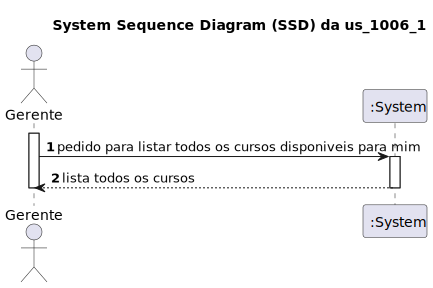
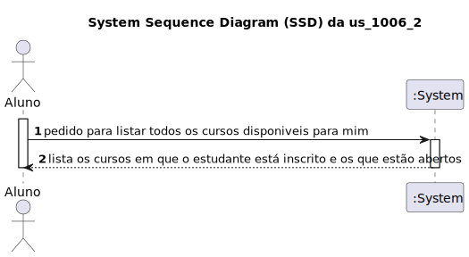
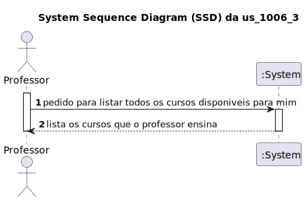
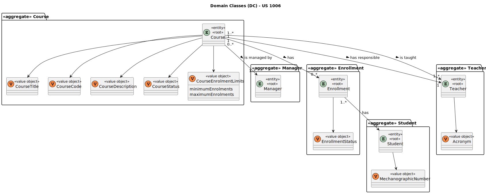
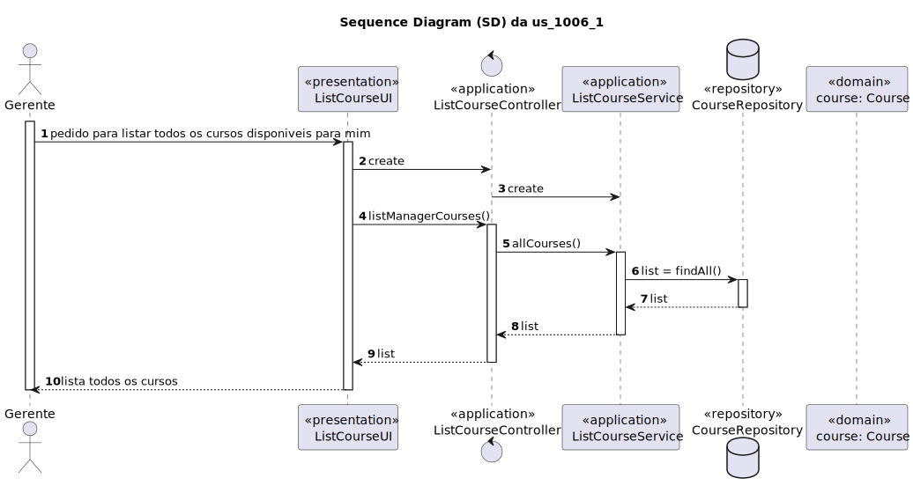
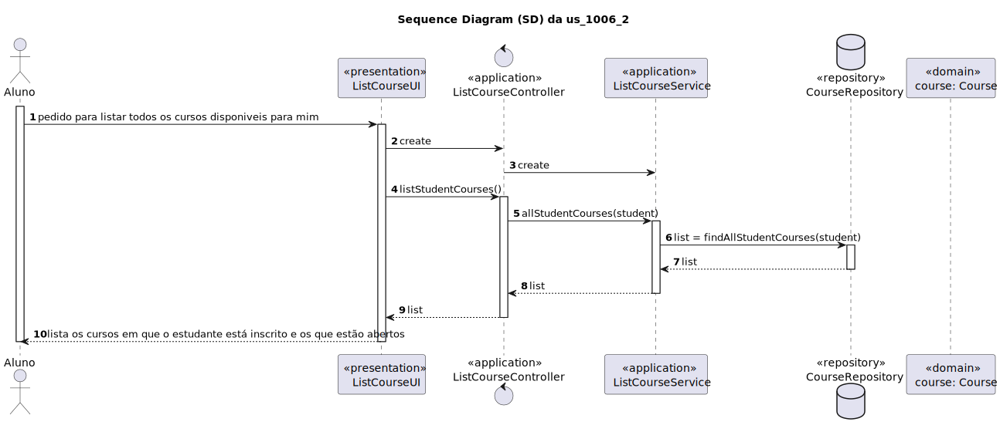
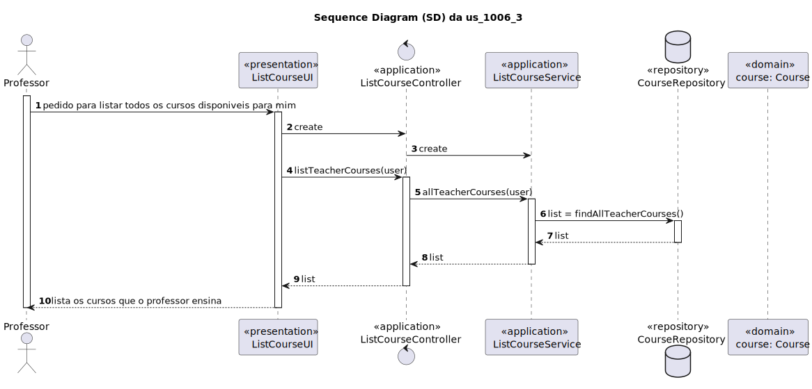
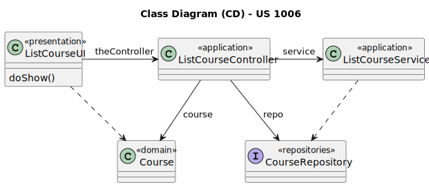

# US 1006

## 1. Contexto

Esta *User Story (US)* está a ser introduzida neste *sprint* para ser desenvolvida seguindo as boas práticas de engenharia de *software*.
Esta *US* faz parte da cadeira de **EAPLI**.

## 2. Requesitos

**US1006:** Como utilizador, quero listar todos os cursos disponiveis para mim.

Para cada utilizador os cursos disponiveis variam sendo:
Gerente - Todos os cursos.

Aluno - Todos os cursos em que está inscrito e todos os cursos abertos.

Professor - Todos os cursos que ensina.

### 2.1. Complementos encontrados

Não existe *User Stories* complementares.

### 2.2. Dependências encontradas

- **US1001** - As Manager, I want to be able to register, disable/enable, and list users of the system (Teachers and Students, as well as Managers).
  A us_1001 é necessária pois é preciso existir utilizadores para eles listarem cursos.

- **US1002** - As Manager, I want to create courses.
  A us_1002 é necessária pois é preciso existir cursos para eles serem listados.

- **US1005** - As Manager, I want to set the teachers of a course.
  A us_1005 é necessário pois para um curso estar aberto é preciso estar associado a um professor.

### 2.3. Critérios de aceitação

Não existem critérios de aceitação nesta *User Stories*.

## 3. Analise

### 3.1. Respostas do cliente

> Q1: Relative to this US, "As User, I want to list all the courses that are available to me" what should we list according to the User role?
> Student: Courses that Student is enrolled
> Teacher: Courses that Teacher teaches
> Manager: All Courses
> Are these assumptions right?
>
> A1: Regarding Teachers and Managers I agree with you. Regarding students I think it is best to list all the courses in which the student is enrolled or may be enrolled (the enrolments are opened). If not, how would a student know the courses in which he/she can enrol?

### 3.2. Diagrama de Sequência do Sistema

#### Do gerente:


#### Do aluno:


#### Do professor:


### 3.3. Classes de Domínio



## 4. Desine

### 4.1. Diagrama de Sequência

#### Do gerente:


#### Do aluno:


#### Do professor:


### 4.2. Diagrama de Classes



### 4.3. Padrões Aplicados

|                Questão: Que classe...                |     Resposta      | Padrão               |                                            Justificação                                            |
|:----------------------------------------------------:|:-----------------:|----------------------|:--------------------------------------------------------------------------------------------------:|
| é responsável por criar todas as classes Repository? | RepositoryFactory | *Factory*            |           Quando uma entidade é demasiado complexa, as fábricas fornecem encapsulamento.           |
|               conhece todas os curso?                | CourseRepository  | *Information Expert* | dado que é responsável pela persistência/reconstrução do *Course*, conhece todos os seus detalhes. |

### 4.4. Testes

**Teste 1:** *Verifica se a lista de cursos de um user é a pretendida*

```
public void checkTheListOfCoursesByUser() {
	//...
}
```

## 5. Implementação

## 5.1. Arquitetura em Camadas

### Domínio

Utilizou-se a entidade *Course* que já tinha sido criada por outra *User Storie (US)*.

### Aplicação

Na camada de aplicação criou-se o controller *ListCourseController*.

### Repositório

Na camada de repositório foi utilizada a interface *CourseRepository* que é implementada em *JPA* e *InMemory* no módulo de *impl*.

### Apresentação

Nesta camada foi desenvolvida a *ListCourseUI* que faz a interação entre o gerente e o sistema, o aluno e o sistema e o professor e o sistema e permite listar os cursos de cada utilizador com respetivos filtros.

## 5.2. Commits Relevantes

[Listagem dos Commits realizados](https://github.com/Departamento-de-Engenharia-Informatica/sem4pi-22-23-20/issues/19)

## 6. Integração/Demonstração

* No menu de Administrador foi adicionado no sub-menu **Courses** a opção *Listing all courses available*.
* No menu de aluno foi adicionado no sub-menu **Courses** a opção *List all courses that the student is enrolled in and all the available ones*.
* No menu de professor foi adicionado no sub-menu **Courses** a opção *List all courses that the teacher teaches*.

## 7. Observações

* Existem 3 versões dos CD, dos SD e dos SSD, uma para cada tipo de utilizador nesta *user storie*: gestor, aluno e professor.
* Existem 3 pastas diferentes dentro da desta *user storie* uma para cada tipo de utilizador: a us_1006_1 para o gestor, a us_1006_2 para o aluno e a us_1006_3 para o professor.