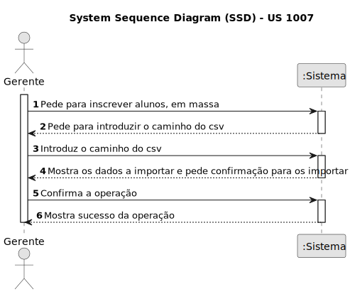
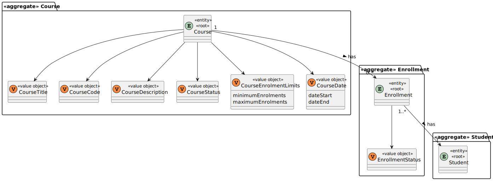
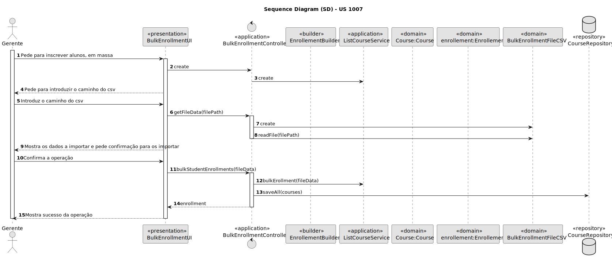
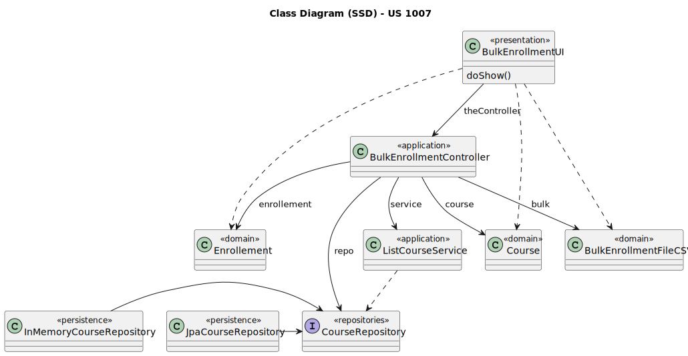

# US 1007

Este documento contém a documentação relativa à US 1007.

## 1. Contexto

Esta *User Story (US)* foi introduzida neste *sprint* para ser desenvolvida seguindo as boas práticas de engenharia de *software*.
Esta *US* faz parte da disciplina de **EAPLI**.

## 2. Requisitos

**US 1007** - As Manager, I want to enroll students in bulk by importing their data using a csv file

A respeito deste requisito, entendemos que um gerente quer inscrever alunos, em massa, usando um ficheiro csv.

### 2.1. Complementos encontrados

Não existe *User Stories* complementares.

### 2.2. Dependências encontradas

- **1001** - 1001 - As Manager, I want to be able to register, disable/enable, and list users of the system (Teachers 
and Students, as well as Managers)

  **Explicação:** É preciso haver alunos registados no sistema para poderem ser inscritos numa disciplina.

- **1002** - As Manager, I want to create courses

  **Explicação:** É preciso haver uma disciplina para ser possível increver os alunos.

### 2.3. Critérios de aceitação

Não existem critérios de aceitação nesta *User Stories*.

## 3. Análise

### 3.1. Respostas do cliente

>Q1: The students enrolled in bulk are students already registered? Or should they be registered and then enrolled after importing from the CSV file?
> 
>A1: As a manager I only want to enroll students. To be a student you must be registered as student. Enrolment does not include registration of users as students.

### 3.2. Diagrama de Sequência do Sistema



### 3.3. Classes de Domínio



## 4. Design

### 4.1. Diagrama de Sequência



### 4.2. Diagrama de Classes



### 4.3. Padrões Aplicados

|                Questão: Que classe...                |         Resposta         | Padrão               |                                                                Justificação                                                                 |
|:----------------------------------------------------:|:------------------------:|----------------------|:-------------------------------------------------------------------------------------------------------------------------------------------:|
|    é responsável por interagir com o utilizador?     |     BulkEnrollmentUI     | *Pure Fabrication*   |                        Não há razão para atribuir esta responsabilidade a uma classe presente no Modelo de Domínio.                         |
|    é responsável por coordenar a funcionalidade?     | BulkEnrollmentController | *Controller*         |                                                                                                                                             |
| é responsável por criar todas as classes Repository? |    RepositoryFactory     | *Factory*            |                               Quando uma entidade é demasiado complexa, as fábricas fornecem encapsulamento.                                |
|    conhece se uma determinada disciplina existe?     |     CourseRepository     | *Information Expert* |                     Dado que é responsável pela persistência/reconstrução do *Course*, conhece todos os seus detalhes.                      |
|       conhece se um determinado aluno existe ?       |    StudentRepository     | *Information Expert* |                     Dado que é responsável pela persistência/reconstrução do *Student*, conhece todos os seus detalhes.                     |
|       permite persistir as inscrição criados?        |     CourseRepository     | *Repository*         | Quando se pretende ocultar os detalhes de persistência/reconstrução de objetos cria-se uma classe Repository responsável por essas tarefas. |
|    sabe os detalhes de uma determinada inscrição?    |        Enrollment        | *Information Expert* |                                             Sabe toda a informação dos dados que lhe pertencem.                                             |

### 4.4. Testes

**Teste 1:** *Verifica se numa linha do ficheiro o número mecanográfico estiver errado, é enviada uma excessão.*

```
@Test(expected = ErrorInFileException.class)
public void ensureMecanographicNumbersAreValidated() {
	//...
}
```

**Teste 2:** *Verifica que o ficheiro deve existir no sistema.*

```
@Test(expected = IllegalArgumentException.class)
public void ensureFileExists() {
	//...
}
```

**Teste 3:** *Verifica que o caminho para o ficheiro não pode ser nulo.*

```
@Test(expected = IllegalArgumentException.class)
public void ensureFilePathIsntNull() {
	//...
}
```

**Teste 4:** *Verifica se os dados todos estiverem incorretos, ou seja, não existir os estudantes ou os cursos na base 
de dados, o gerente é avisado que os dados estão todos inválidos.*

```
@Test(expected = ErrorInFileException.class)
public void ensureValidationOfAIncorretFileData() {
	//...
}
```

**Teste 5:** *Verifica que os dados do ficheiro são carregados com sucesso.*

```
public void ensureEverythingWorksFine() {
	//...
}
```

## 5. Implementação

## 5.1. Arquitetura em Camadas
### Domínio

Na camada de domínio criou-se as entidades *Student*, *Course*, *Enrollments* e as respetivas classes *Value Objects* de 
cada uma.

### Aplicação

Na camada de aplicação criou-se o controller *BulkEnrollmentController*. Também se criou e utilizou o serviço 
*EnrollmentService*.

### Repositório

Na camada de repositório foi utilizada a interface *CourseRepository* e *StudentRepository* que são implementadas em 
*JPA* e *InMemory* no módulo de *impl*.

### Apresentação

Nesta camada foi desenvolvida a *BulkEnrollmentUI* que faz a interação entre o gerente e o sistema. Esta *UI* permite 
realizar a inscrição em massa de estudante através da importação de dados presentes num ficheiro.

## 5.2. Commits Relevantes

[Listagem dos Commits realizados](https://github.com/Departamento-de-Engenharia-Informatica/sem4pi-22-23-20/issues/20)

## 6. Integração/Demonstração

* No menu do gerente foi adicionado no sub-menu **Enrollment** a opção *Import file to enroll students in bulk*.

## 7. Observações

* Não existem observações relevantes a acrescentar.