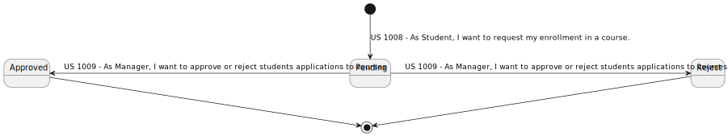
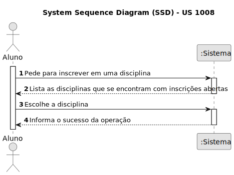
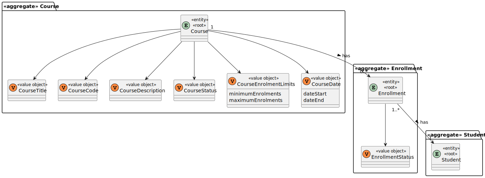
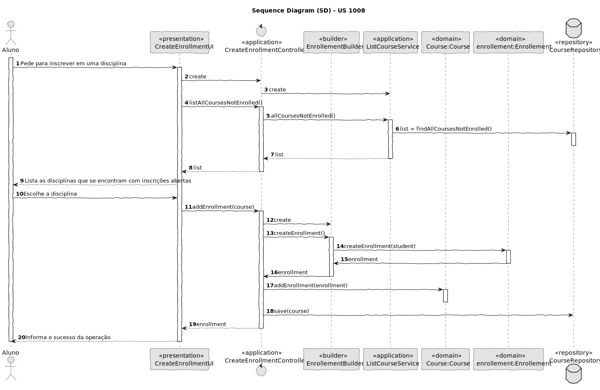
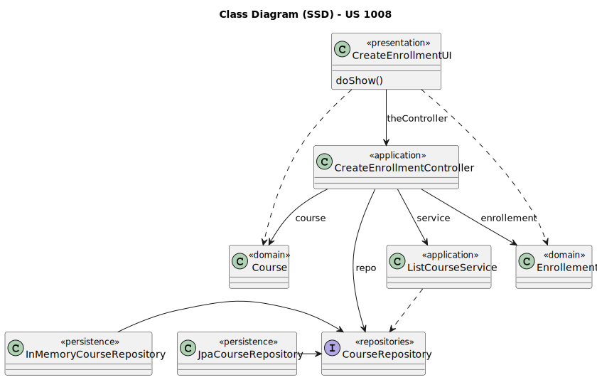

# US 1008

Este documento contém a documentação relativa à US 1008.

## 1. Contexto

Esta *User Story (US)* foi introduzida neste *sprint* para ser desenvolvida seguindo as boas práticas de engenharia de
*software*.
Esta *US* faz parte da disciplina de **EAPLI**.

## 2. Requisitos

### 2.1. Complementos encontrados

- **US 1008** - As Student, I want to request my enrollment in a course

**Explicação:** Esta *US* complementa a atual *US* a ser tratada devido a que a inscrição tem o seguinte ciclo de
vida:


Desta forma podemos observar que, a seguir à inscrição de um aluno numa disciplina, a sua inscrição encontra-se pendente.
Depois temos ainda que, a incrição pode ser aceite ou recusada.

### 2.2. Dependências encontradas

<u>**Dependências:**</u>

- US 1001 - As Manager, I want to be able to register, disable/enable, and list users of the system (Teachers and Students, as well as Managers)
- US 1002 - As Manager, I want to create courses.

Explicação: Se não existir uma disciplina e alunos, não é possível inscrever em uma disciplina.

## 3. Análise

### 3.1. Respostas do cliente

Não foi necessário questionar o cliente em função da realização desta *User Story*.

### 3.2. Diagrama de Sequência do Sistema



## 4. Design

### 4.1. Realização
#### 4.1.1. Classes de Domínio



#### 4.1.2. Diagrama de Sequência
    


### 4.2. Diagrama de Classes



### 4.3. Padrões Aplicados

|                   Questão: Que classe...                    |          Resposta          | Padrão               |                                                                Justificação                                                                 |
|:-----------------------------------------------------------:|:--------------------------:|----------------------|:-------------------------------------------------------------------------------------------------------------------------------------------:|
|        é responsável por interagir com o utilizador?        |     CreateEnrollmentUI     | *Pure Fabrication*   |                        Não há razão para atribuir esta responsabilidade a uma classe presente no Modelo de Domínio.                         |
|        é responsável por coordenar a funcionalidade?        | CreateEnrollmentController | *Controller*         |                                                                                                                                             |
|    é responsável por criar todos as classes Repository?     |     RepositoryFactory      | *Factory*            |                               Quando uma entidade é demasiado complexa, as fábricas fornecem encapsulamento.                                |
| conhece todas as disciplinas que têm as inscrições abertas? |      CourseRepository      | *Information Expert* |                     Dado que é responsável pela persistência/reconstrução do *Course*, conhece todos os seus detalhes.                      |
|          permite persistir as matrículas criados?           |      CourseRepository      | *Repository*         | Quando se pretende ocultar os detalhes de persistência/reconstrução de objetos cria-se uma classe Repository responsável por essas tarefas. |

### 4.4. Testes

**Teste 1:** *Verifica se não é possível criar uma instância da classe *Enrollement* com valores nulos.*

```
@Test(expected = IllegalArgumentException.class)
public void ensureNullIsNotAllowedEnrollement() {
	Enrollement instance = new Enrollement(null);
}
```

**Teste 1:** *Verifica se não é possível inscrever-se num curso que não tenha as inscrições abertas.*

```
public void ensureIsAllowedEnrollment() {
	//...
}
```

## 5. Implementação

## 5.1. Arquitetura em Camadas
### Domínio

Na camada de domínio criou-se a entidade *Enrollment* e os respetivos *Value* *Objects*.

### Aplicação
Na camada de aplicação utilizou-se os controllers *CreateEnrollmentController*.

### Repositório
Na camada de repositório foi criada a *CourseRepository* que é depois implementada em *JPA* e *InMemory* no módulo de *impl*.

### Apresentação
Nesta camada foi desenvolvida as *UIs* (consola) necessárias que fazem a interação entre o Gerente e o sistema. A *CreateEnrollmentUI*
permite adicionar uma disciplina.

## 5.2. Commits Relevantes

[Listagem dos Commits realizados](https://github.com/Departamento-de-Engenharia-Informatica/sem4pi-22-23-20/issues/21)

## 6. Integração/Demonstração

* No menu de Aluno foi adicionado o sub-menu **Course** com as opção **Enrollment in a course**.

## 7. Observações

* Não existem observações relevantes a acrescentar.