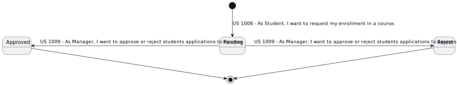
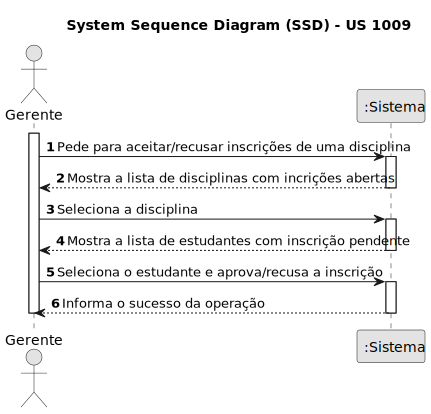
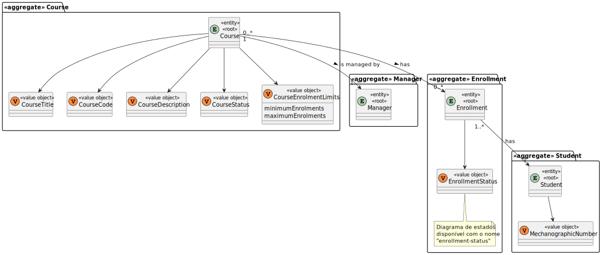
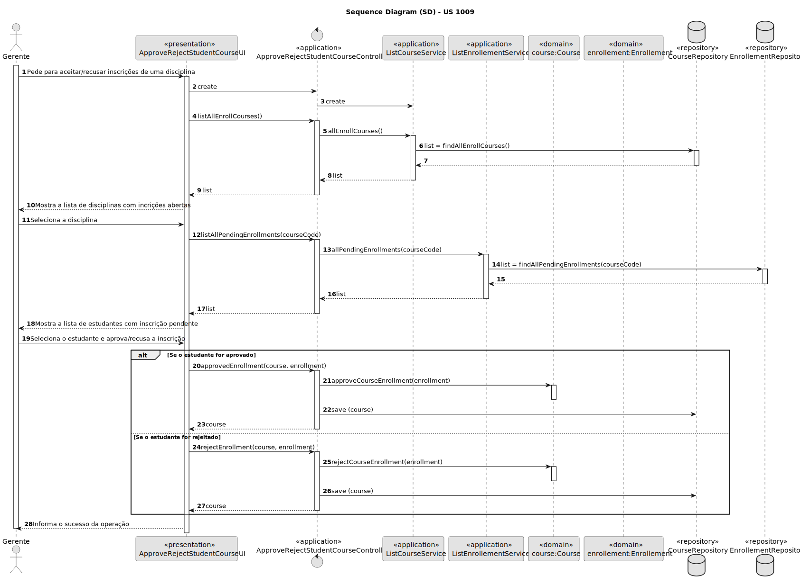
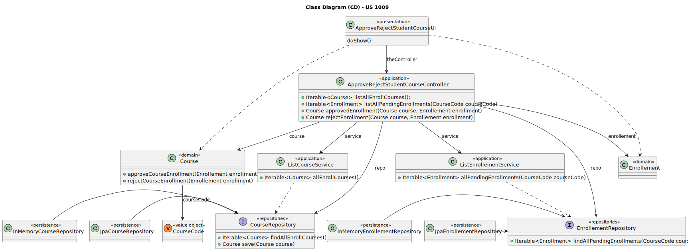

# US 1009

Este documento contém a documentação relativa à US 1009.

## 1. Contexto

Esta *User Story (US)* foi introduzida neste *sprint* para ser desenvolvida seguindo as boas práticas de engenharia de
*software*.
Esta *US* faz parte da disciplina de **EAPLI**.

## 2. Requisitos

**US 1009** - As Manager, I want to approve or reject students applications to courses

A respeito deste requisito, entendemos que apenas o gerente deve tomar a decisão de aprovar/rejeitar inscrições na disciplina,
não havendo nenhuma decisão tomada automaticamente pelo sistema. 
O gerente apenas pode aceitar/rejeitar incrições em disciplinas que se encontrem com as incrições abertas. 

### 2.1. Complementos encontrados

- **US 1008** - As Student, I want to request my enrollment in a course.

**Explicação:** Esta *US* complementa a atual *US* a ser tratada devido a que a inscrição tem o seguinte ciclo de
vida:


Desta forma podemos observar que, a seguir à inscrição de um aluno numa disciplina, a sua inscrição encontra-se pendente.
Depois temos ainda que, a incrição pode ser aceite ou recusada.

### 2.2. Dependências encontradas

- **US 1003** - As Manager, I want to open and close enrollements in courses.

  **Explicação:** Se uma disciplina não tiver com as incrições abertas, não é possível aceitar/recusar inscrições.

### 2.3. Critérios de aceitação

- **CA 1:** Uma disciplina pode conter várias inscrições.
- **CA 2:** A incrição deve conter um e apenas um aluno.
- **CA 3:** Não é possível aprovar a inscrição de um aluno numa disciplina que tenha atinjido o limite máximo de incrições aprovadas.

## 3. Análise

### 3.1. Respostas do cliente

>**Questão:** "We would like to know what are the requirements for a student to be accepted or rejected from an application  to a course."
> 
>**Resposta:** "I think that decision can not be automatically taken by the system, it is a decision of the manager. The responsibility is of the manager according to course rules that ar out of the scope of this implementation."

### 3.2. Diagrama de Sequência do Sistema



### 3.3. Classes de Domínio



## 4. Design

### 4.1. Diagrama de Sequência



### 4.2. Diagrama de Classes



### 4.3. Padrões Aplicados

|                            Questão: Que classe...                             |                Resposta                 | Padrão               |                                                             Justificação                                                              |
|:-----------------------------------------------------------------------------:|:---------------------------------------:|----------------------|:-------------------------------------------------------------------------------------------------------------------------------------:|
|                 é responsável por interagir com o utilizador?                 |      ApproveRejectStudentCourseUI       | *Pure Fabrication*   |                     Não há razão para atribuir esta responsabilidade a uma classe presente no Modelo de Domínio.                      |
|                 é responsável por coordenar a funcionalidade?                 |  ApproveRejectStudentCourseController   | *Controller*         |                                                                                                                                       |
|             é responsável por criar todas as classes Repository?              |            RepositoryFactory            | *Factory*            |                            Quando uma entidade é demasiado complexa, as fábricas fornecem encapsulamento.                             |
|          conhece todas as disciplinas que têm as inscrições abertas?          |            CourseRepository             | *Information Expert* |                  Dado que é responsável pela persistência/reconstrução do *Course*, conhece todos os seus detalhes.                   |
| conhece todas as inscrições pendentes dos alunos numa determinada disciplina? | EnrollmentRepository e CourseRepository | *Information Expert* | Dado que é responsável pela persistência/reconstrução do *Enrollment* e do *Course*, respetivamente, conhecem todos os seus detalhes. |
|          sabe o limite máximo de inscrições aprovadas na disciplina?          |                 Course                  | *Information Expert* |                                          Sabe toda a informação dos dados que lhe pertencem.                                          |
|   sabe quem são os alunos com inscrição aprovada atualmente na disciplina?    |               Enrollment                | *Information Expert* |                                          Sabe toda a informação dos dados que lhe pertencem.                                          |

### 4.4. Testes

**Teste 1:** *Verifica que não é possível aprovar um aluno numa disciplina com o limite máximo de inscrições aprovadas atinjido.*

```
public void ensureApprovedEnrollmentDoesNotExceedMaximumLimit() {
	//...
}
```

**Teste 2:** *Verifica que apenas é possível aprovar uma inscrição se esta existir*

```
public void ensureApprovedEnrollmentExist() {
	//...
}
```

**Teste 3:** *Verifica que apenas é possível rejeitar uma inscrição se esta existir*

```
public void ensureRejectEnrollmentExist() {
	//...
}
```

## 5. Implementação

## 5.1. Arquitetura em Camadas
### Domínio

Na camada de domínio criou-se a entidade *Enrollment* e os respetivos *Value* *Objects*. Além disso utilizou-se a entidade
*Course* que já tinha sido criada por outra *User Storie (US)*.

### Aplicação

Na camada de aplicação criou-se o controller *ApproveRejectStudentCourseController*. Também utilizou-se o serviço *ListCourseService* e 
*ListEnrollementService*.

### Repositório

Na camada de repositório foi utilizada a interface *CourseRepository* e *EnrollementRepository* que são implementadas 
em *JPA* e *InMemory* no módulo de *impl*.

### Apresentação

Nesta camada foi desenvolvida a *ApproveRejectStudentCourseUI* que faz a interação entre o gerente e o sistema e permite 
aceitar/recusar inscrições de alunos numa disciplina.

## 5.2. Commits Relevantes

[Listagem dos Commits realizados](https://github.com/Departamento-de-Engenharia-Informatica/sem4pi-22-23-20/issues/22)

## 6. Integração/Demonstração

* No menu de Administrador foi adicionado no sub-menu **Courses** a opção *Approve/reject students in courses*.

## 7. Observações

* Não existem observações relevantes a acrescentar.