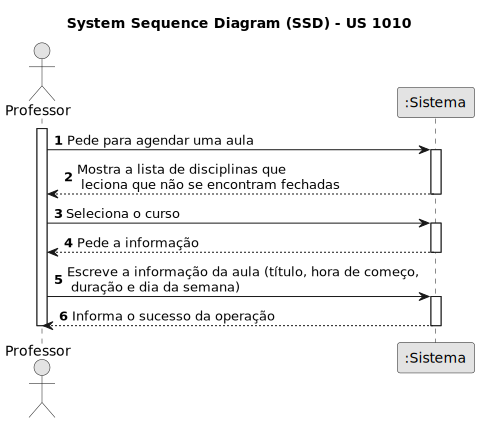
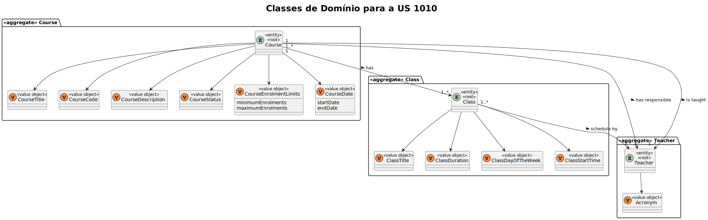
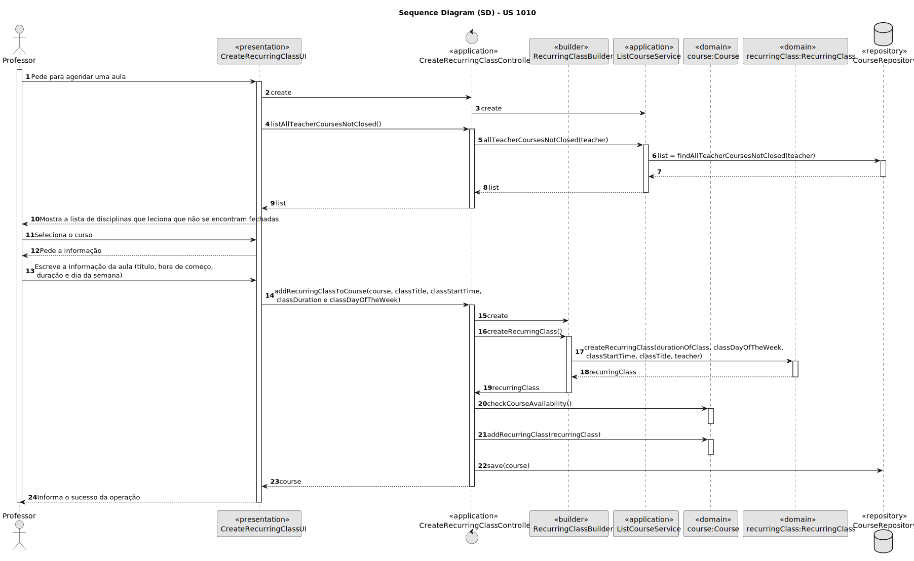
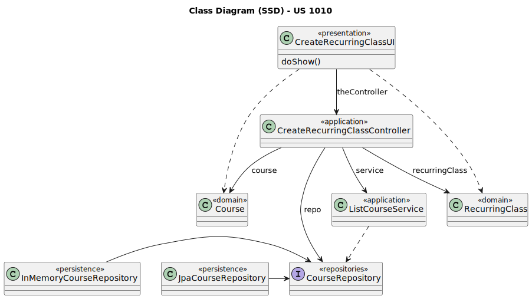

# US 1010

Este documento contém a documentação relativa à US 1010.

## 1. Contexto

- Esta *User Story (US)* está a ser introduzida neste *sprint* para ser desenvolvida seguindo as boas práticas de
  engenharia de *software*.
- Esta *US* faz parte da cadeira de **EAPLI**.

## 2. Requisitos

**US 1010** "As Teacher, I want to schedule a class."

A respeito deste requisito, temos que um professor pretende agendar uma aula, tendo em conta que cada aula terá que ter
um título, uma duração, uma hora de começo, em que dia da semana irá decorrer e a que curso pertence. Para isso, terá 
ser verificado se esse curso se encontra no estado open.

### 2.1 Complementos encontrados

Não existe *User Stories* complementares.

### 2.2 Dependências encontradas
- **US 1001** As Manager, I want to be able to register, disable/enable, and list users of the system (Teachers and 
Students, as well as Managers)

  **Explicação:** Existe uma dependência perante esta *US* pois para ser agendada uma aula é necessário que exista um 
professor, associado a esse mesmo curso e disciplina. 

- **US 1002** As Manager, I want to create courses.

**Explicação:** Se não existir um curso, não é possível agendar uma aula, pois não existem aulas relacionadas a um curso 
inexistente.

### 2.3 Critérios de aceitação

**CA 1:** Uma aula apenas poderá ser agendada se o curso ao qual ela pertence se encontrar no estado de progresso.

## 3. Análise

### 3.1. Respostas do cliente

- Ainda não foi necessário questionar o cliente acerca desta *US*.

### 3.2. Diagrama de Sequência do Sistema

### 3.3 Classes de Domínio

## 4. Design

### 4.1. Realização

#### 4.1.1. Diagrama de Sequência

### 4.2. Diagrama de Classes

### 4.3. Padrões Aplicados
|                               Questão: Que classe...                                |               Resposta               | Padrão               |                                                            Justificação                                                            |
|:-----------------------------------------------------------------------------------:|:------------------------------------:|----------------------|:----------------------------------------------------------------------------------------------------------------------------------:|
|                    é responsável por interagir com o utilizador?                    |        CreateRecurringClassUI        | *Pure Fabrication*   |                    Não há razão para atribuir esta responsabilidade a uma classe presente no Modelo de Domínio.                    |
|                    é responsável por coordenar a funcionalidade?                    |    CreateRecurringClassController    | *Controller*         |                                                                                                                                    |
|                é responsável por criar todas as classes Repository?                 |          RepositoryFactory           | *Factory*            |                           Quando uma entidade é demasiado complexa, as fábricas fornecem encapsulamento.                           |
|         conhece todas as disciplinas em progresso que o professor leciona?          |           CourseRepository           | *Information Expert* |                 Dado que é responsável pela persistência/reconstrução do *Course*, conhece todos os seus detalhes.                 |
|                      sabe as aulas recorrentes da disciplina?                       |                Course                | *Information Expert* |                                        Sabe toda a informação dos dados que lhe pertencem.                                         |

### 4.4. Testes

**Teste 1:** *Verifica se o curso se encontra no estado de progresso.*
@Test(expected = InvalidCourseStateChangeException.class)
public void ensureCourseWithPendingActivityIsNotOpenedOrClosed() {

## 5. Implementação

## 5.1. Arquitetura em Camadas
### Domínio

Na camada de domínio criou-se a entidade *Course* e *RecurringClass*. Além disso utilizou-se a entidade

### Aplicação

Na camada de aplicação criou-se o controller *CreateRecurringClassController*. Também utilizou-se o serviço *ListCourseService*.

### Repositório

Na camada de repositório foi utilizada a interface *CourseRepository* que é implementada em *JPA* e *InMemory* no módulo de *impl*.

### Apresentação

Nesta camada foi desenvolvida a *CreateRecurringClassClassUI* que faz a interação entre o professor e o sistema e permite
marcar aulas extras.

## 5.2. Commits Relevantes

[Listagem dos Commits realizados](https://github.com/Departamento-de-Engenharia-Informatica/sem4pi-22-23-20/issues/23)

## 6. Integração/Demonstração

* No menu de Professor foi adicionado no sub-menu **Classes** a opção *Schedule a recurring class*.

## 7. Observações

* Não existem observações relevantes a acrescentar.