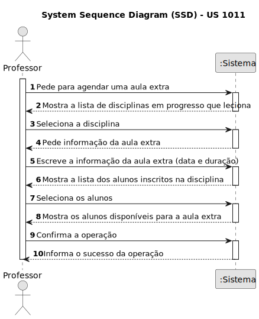
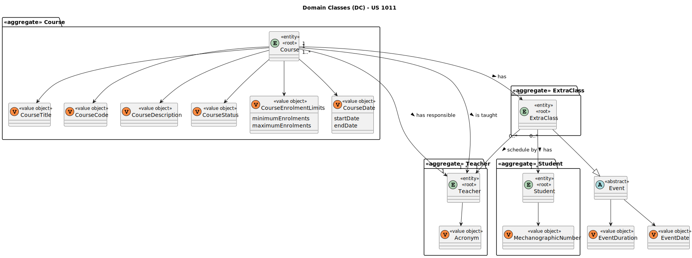
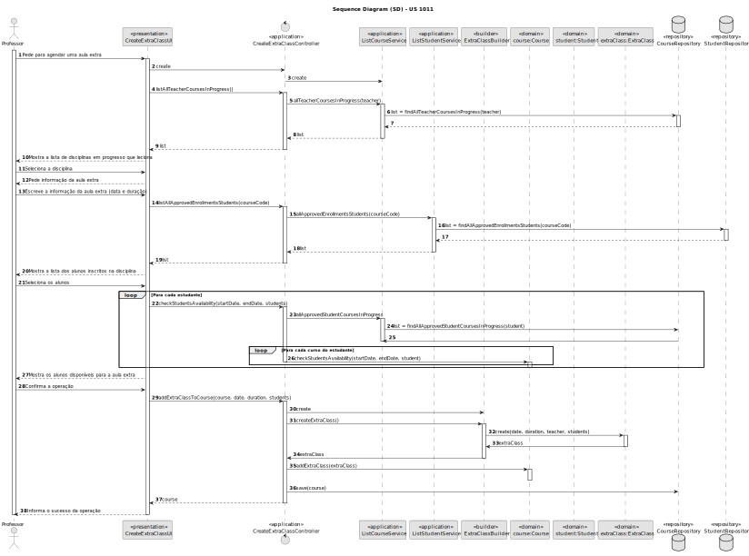
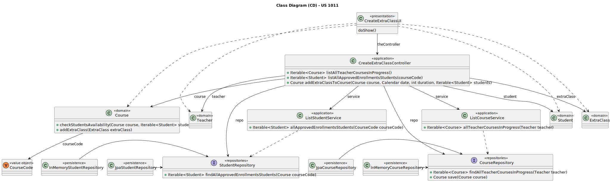

# US 1011

Este documento contém a documentação relativa à US 1011.

## 1. Contexto

Esta *User Story (US)* foi introduzida neste *sprint* para ser desenvolvida seguindo as boas práticas de engenharia de
*software*.
Esta *US* faz parte da disciplina de **EAPLI**.

## 2. Requisitos

**US 1011** - As Teacher, I want to schedule an extraordinary class.

A respeito deste requisito, entendemos que um professor deve selecionar uma das disciplinas que leciona para agendar a aula extra.
Além disso deve selecionar os participantes da aula extra, que devem-ser alunos inscritos na disciplina selecionada.

### 2.1. Complementos encontrados

Não existe *User Stories* complementares.

### 2.2. Dependências encontradas

- **US 1001** - As Manager, I want to be able to register, disable/enable, and list users of the system (Teachers and Students, as well as Managers).

  **Explicação:** Se não existir professores e alunos, não é possível agendar aulas extras.

- **US 1005** - As Manager, I want to set the teachers of a course.

  **Explicação:** Se um professor não lecionar nenhuma disciplina, não é possível agendar aulas extras.

### 2.3. Critérios de aceitação

**CA 1:** Uma aula extra é uma ocorrência única com um grupo específico de participantes (um subconjunto dos alunos da turma)

## 3. Análise

### 3.1. Respostas do cliente

>**Questão:** "...pretende que seja mostrada a lista de Class/ExtraClass que já estão agendadas para que o professor saiba onde pode agendar?"
>
>**Resposta:** "Em termos de requisitos é importante que o sistema garanta as regras que estão descritas em 5.1.2 relativo a aulas e aulas extra. Em termos de user interface para cada um desses casos de uso não existem requisitos específicos. Nesse aspeto de "user experience" devem seguir boas práticas. Mas isso já faz parte do desenho da solução. "O cliente não percebe muito disso :-)"

### 3.2. Diagrama de Sequência do Sistema



### 3.3. Classes de Domínio



## 4. Design

### 4.1. Diagrama de Sequência



### 4.2. Diagrama de Classes



### 4.3. Padrões Aplicados

|                               Questão: Que classe...                                |               Resposta               | Padrão               |                                                            Justificação                                                            |
|:-----------------------------------------------------------------------------------:|:------------------------------------:|----------------------|:----------------------------------------------------------------------------------------------------------------------------------:|
|                    é responsável por interagir com o utilizador?                    |          CreateExtraClassUI          | *Pure Fabrication*   |                    Não há razão para atribuir esta responsabilidade a uma classe presente no Modelo de Domínio.                    |
|                    é responsável por coordenar a funcionalidade?                    |      CreateExtraClassController      | *Controller*         |                                                                                                                                    |
|                é responsável por criar todas as classes Repository?                 |          RepositoryFactory           | *Factory*            |                           Quando uma entidade é demasiado complexa, as fábricas fornecem encapsulamento.                           |
|         conhece todas as disciplinas em progresso que o professor leciona?          |           CourseRepository           | *Information Expert* |                 Dado que é responsável pela persistência/reconstrução do *Course*, conhece todos os seus detalhes.                 |
| conhece todos os alunos que têm as incrições aprovadas numa determinada disciplina? | StudentRepository e CourseRepository | *Information Expert* | Dado que é responsável pela persistência/reconstrução do *Student* e do *Course*, respetivamente, conhecem todos os seus detalhes. |
|                      sabe as aulas recorrentes da disciplina?                       |                Course                | *Information Expert* |                                        Sabe toda a informação dos dados que lhe pertencem.                                         |

### 4.4. Testes

**Teste 1:** *Verifica que não é possível criar uma aula extra que se sobrepõem a outra aula da disciplina*

```
public void ensureExtraClassAvailability() {
	//...
}
```

## 5. Implementação

## 5.1. Arquitetura em Camadas
### Domínio

Na camada de domínio criou-se a entidade *ExtraClass* e a classe abrastacta *Event* e os respetivos *Value* *Objects*. Além disso utilizou-se a entidade
*Course* e *Student* que já tinha sido criada por outra *User Storie (US)*.

### Aplicação

Na camada de aplicação criou-se o controller *CreateExtraClassController*. Também utilizou-se o serviço *ListCourseService* e
*ListStudentService*.

### Repositório

Na camada de repositório foi utilizada a interface *CourseRepository* e *StudentRepository* que são implementadas
em *JPA* e *InMemory* no módulo de *impl*.

### Apresentação

Nesta camada foi desenvolvida a *CreateExtraClassUI* que faz a interação entre o professor e o sistema e permite
marcar aulas extras.

## 5.2. Commits Relevantes

[Listagem dos Commits realizados](https://github.com/Departamento-de-Engenharia-Informatica/sem4pi-22-23-20/issues/24)

## 6. Integração/Demonstração

* No menu de Professor foi adicionado no sub-menu **Classes** a opção *Schedule a extra class*.

## 7. Observações

* Não existem observações relevantes a acrescentar.