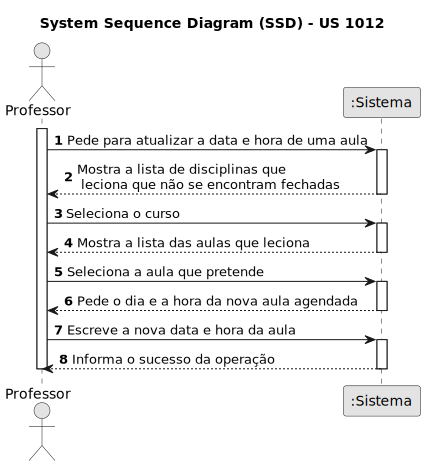
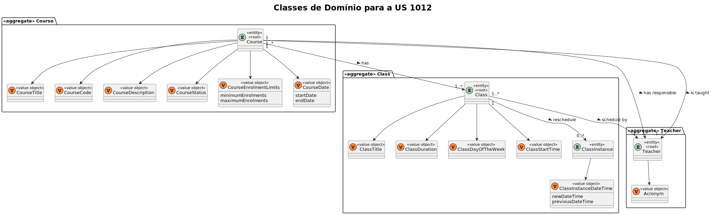
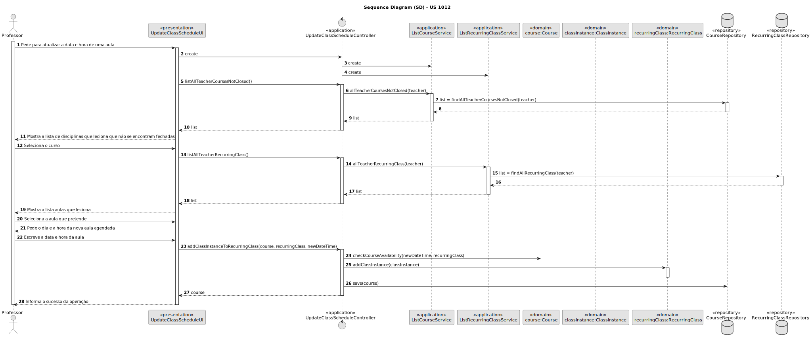
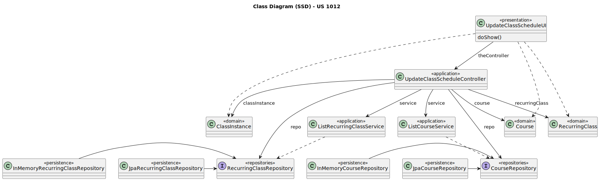

# US 1012

Este documento contém a documentação relativa à US 1012.

## 1. Contexto

- Esta *User Story (US)* está a ser introduzida neste *sprint* para ser desenvolvida seguindo as boas práticas de
  engenharia de *software*.
- Esta *US* faz parte da cadeira de **EAPLI**.

## 2. Requisitos

**US 1012** "As Teacher, I want to update the schedule of a class."

A respeito deste requisito, temos que um professor pretende atualizar o agendamento de uma determinada aula.

### 2.1 Complementos encontrados
- **US 1010:** As Teacher, I want to schedule a class.

  **Explicação:**
  Desta forma podemos observar que, a seguir à abertura de um curso é possível realizar as incrições.
  Temos ainda que, o curso será fechado após encerrar a possibilidade de efetuar inscrições no curso.

### 2.2 Dependências encontradas
- **US 1001** As Manager, I want to be able to register, disable/enable, and list users of the system (Teachers and
  Students, as well as Managers)

  **Explicação:** Existe uma dependência perante esta *US* pois para ser agendada uma aula é necessário que exista um
  professor, associado a esse mesmo curso e disciplina.

- **US 1010** As Teacher, I want to schedule a class.

**Explicação:** Esta dependência existe, pois para uma aula, anteriormente, agendada ser atualizada irá necessitar de
recorrer a uma lista de aulas que foram agendadas. Visto que, nesta *US* foram agendadas essas mesmas aulas, então
existirá uma dependência.

### 2.3 Critérios de aceitação

**CA 1:** A alteração do horário da aula não pode se sobrepor a outra aula marcada.

**CA 2:** A data da aula alterada não pode ser inferior à atual.

## 3. Análise

### 3.1. Respostas do cliente

- Ainda não foi necessário questionar o cliente acerca desta *US*.

### 3.2. Diagrama de Sequência do Sistema

### 3.3 Classes de Domínio

## 4. Design

### 4.1. Realização

#### 4.1.1. Diagrama de Sequência

### 4.2. Diagrama de Classes

### 4.3. Padrões Aplicados
|                            Questão: Que classe...                            |           Resposta            | Padrão               |                                                             Justificação                                                              |
|:----------------------------------------------------------------------------:|:-----------------------------:|----------------------|:-------------------------------------------------------------------------------------------------------------------------------------:|
|                é responsável por interagir com o utilizador?                 |     UpdateClassSechuldeUI     | *Pure Fabrication*   |                     Não há razão para atribuir esta responsabilidade a uma classe presente no Modelo de Domínio.                      |
|                é responsável por coordenar a funcionalidade?                 | UpdateClassSechuldeController | *Controller*         |                                                                                                                                       |
|             é responsável por criar todas as classes Repository?             |       RepositoryFactory       | *Factory*            |                            Quando uma entidade é demasiado complexa, as fábricas fornecem encapsulamento.                             |
|              conhece todos os cursos que um professor leciona?               |       CourseRepository        | *Information Expert* |                  Dado que é responsável pela persistência/reconstrução do *Course*, conhece todos os seus detalhes.                   |
| conhece todas as aulas agendadas pelo professor numa determinada disciplina? |   RecurringClassRepository    | *Information Expert* | Dado que é responsável pela persistência/reconstrução do *Enrollment* e do *Course*, respetivamente, conhecem todos os seus detalhes. |

### 4.4. Testes

**Teste 1:** *Verifica se o horário da aula não se sobrepõem a outra aula.*
@Test(expected = InvalidCourseStateChangeException.class)
public void ensureCourseWithPendingActivityIsNotOpenedOrClosed() {

**Teste 2:** *Verifica se a data da aula alterada não é inferior à atual.*
@Test(expected = InvalidCourseStateChangeException.class)
public void ensureCourseWithPendingActivityIsNotOpenedOrClosed() {

## 5. Implementação

## 5.1. Arquitetura em Camadas
### Domínio
Na camada de domínio criou-se a entidade *ClassInstance* e os respetivos *Value Objects*. 

### Aplicação
Na camada de aplicação criou-se o controller *UpdateClassScheduleController*. Também utilizou-se o serviço
*ListRecurringClassService*.

### Repositório
Na camada de repositório foi utilizada a interface *RecurringClassRepository* que é implementada em *JPA* e *InMemory*
no módulo de *impl*.

### Apresentação
Nesta camada foi desenvolvida a *UpdateClassScheduleUI* que faz a interação entre o professor e o sistema e, permite
atualizar o horário e data da aula.

## 5.2. Commits Relevantes

[Listagem dos Commits realizados](https://github.com/Departamento-de-Engenharia-Informatica/sem4pi-22-23-20/issues/25)

## 6. Integração/Demonstração

* No menu de Professor foi adicionado no sub-menu **Classes** a opção *Update schedule class*.

## 7. Observações

* Não existem observações relevantes a acrescentar.