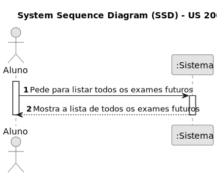
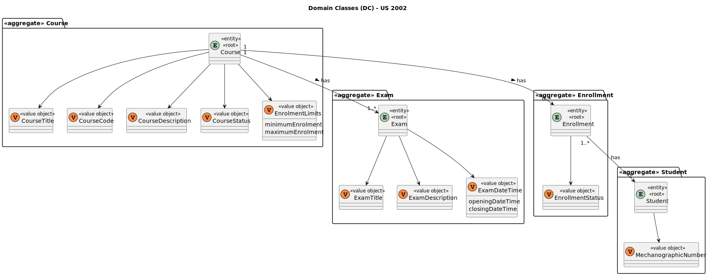
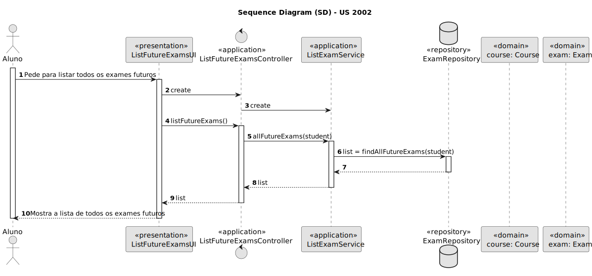
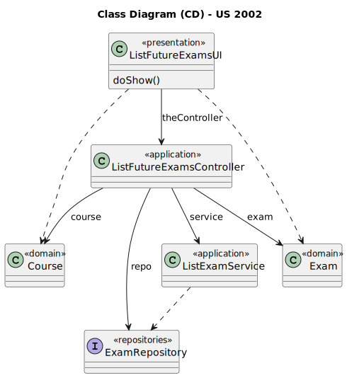

# US 2002

Este documento contém a documentação relativa à US 2002.

## 1. Contexto

Esta *User Story (US)* foi introduzida neste *sprint* para ser desenvolvida seguindo as boas práticas de engenharia de *software*.
Esta *US* faz parte da disciplina de **EAPLI**.

## 2. Requisitos

**US 2002** - As Student, I want to view a list of my future exams

A respeito deste requisito, entendemos que um Aluno quer ver os exames futuros.

### 2.1. Complementos encontrados

Não existe *User Stories* complementares.

### 2.2. Dependências encontradas

- **1001** - As Manager, I want to be able to register, disable/enable, and list users of the system (Teachers and Students, as well as Managers).

  **Explicação:** É preciso existir alunos para poderem listar os seus exames.

- **2001** - As Teacher, I want to create/update an exam.

  **Explicação:** É preciso existir um exame para poder ser listado.

### 2.3. Critérios de aceitação

Não existem critérios de aceitação nesta *User Stories*.

## 3. Análise

### 3.1. Respostas do cliente

Não foi necessário questionar o cliente em função da realização desta *User Story*.

### 3.2. Diagrama de Sequência do Sistema



### 3.3. Classes de Domínio



## 4. Design

### 4.1. Diagrama de Sequência



### 4.2. Diagrama de Classes



### 4.3. Padrões Aplicados

|                 Questão: Que classe...                  |     Resposta      | Padrão               |                                            Justificação                                            |
|:-------------------------------------------------------:|:-----------------:|----------------------|:--------------------------------------------------------------------------------------------------:|
|  é responsável por criar todas as classes Repository?   | RepositoryFactory | *Factory*            |           Quando uma entidade é demasiado complexa, as fábricas fornecem encapsulamento.           |
| conhece todos as disciplinas que o aluno está inscrito? | CourseRepository  | *Information Expert* | Dado que é responsável pela persistência/reconstrução do *Course*, conhece todos os seus detalhes. |
|          conhece todos os exames de um curso?           | CourseRepository  | *Information Expert* |  Dado que é responsável pela persistência/reconstrução do *Exam*, conhece todos os seus detalhes.  |

### 4.4. Testes

**Teste 1:** *Verifica se a lista de exames de um aluno é a pretendida*

```
public void checkTheListOfExamsByStudent() {
	//...
}
```

## 5. Implementação

## 5.1. Arquitetura em Camadas
### Domínio

Na camada de domínio utilizou-se a entidade *Course* e *Exam* que já tinham sido criadas para outras *User Storie (US)*.

### Aplicação

Na camada de aplicação criou-se o controller *ListFutureExamsController*.

### Repositório

Na camada de repositório foi utilizada a interface *ExamRepository* que é implementada em *JPA* e *InMemory* no módulo de *impl*.

### Apresentação

Nesta camada foi desenvolvida a *ListFutureExamsUI* que faz a interação entre o professor e o sistema e permite listar todos os futuros exames de um aluno.

## 5.2. Commits Relevantes

[Listagem dos Commits realizados](https://github.com/Departamento-de-Engenharia-Informatica/sem4pi-22-23-20/issues/29)

## 6. Integração/Demonstração

* No menu de Student foi adicionado no sub-menu **Exams** a opção *List all the future exams*.

## 7. Observações

* Não existem observações relevantes a acrescentar.