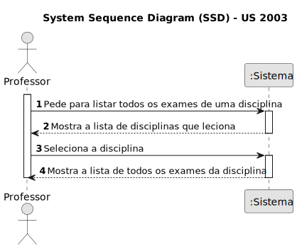
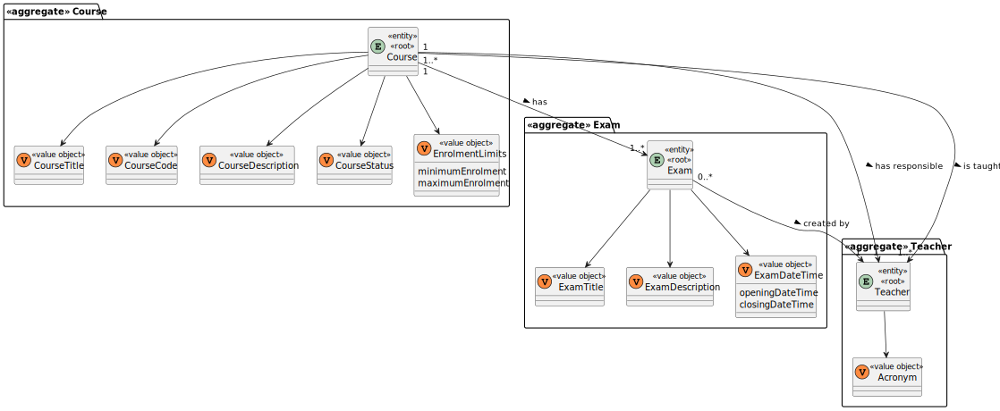
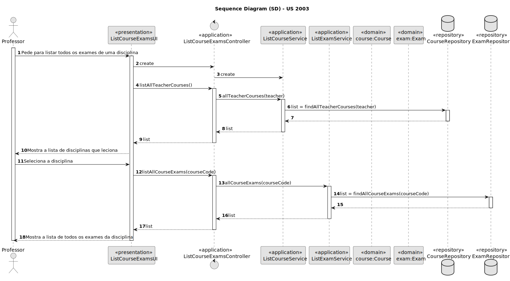
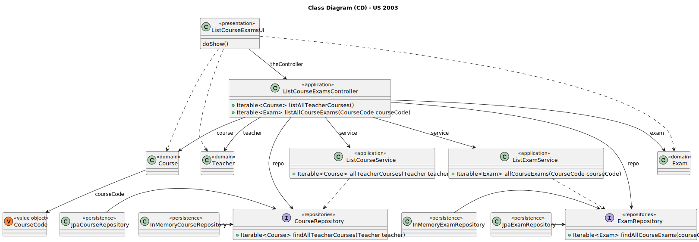

# US 2003

Este documento contém a documentação relativa à US 2003.

## 1. Contexto

Esta *User Story (US)* foi introduzida neste *sprint* para ser desenvolvida seguindo as boas práticas de engenharia de
*software*.
Esta *US* faz parte da disciplina de **EAPLI**.

## 2. Requisitos

**US 2003** - As Teacher, I want to view a list of all exams in a course

A respeito deste requisito, entendemos que um professor deve selecionar uma das disciplinas que leciona para visualizar 
os respetivos exames.

### 2.1. Complementos encontrados

Não existe *User Stories* complementares.

### 2.2. Dependências encontradas

- **1005** - As Manager, I want to set the teachers of a course.

  **Explicação:** Se um professor não lecionar nenhuma disciplina, não é possível listar os exames dessa disciplina.

- **2001** - As Teacher, I want to create/update an exam.

  **Explicação:** Se não existir exames criados para uma disciplina, não é possível listar os exames dessa disciplina.

### 2.3. Critérios de aceitação

Não existem critérios de aceitação nesta *User Stories*.

## 3. Análise

### 3.1. Respostas do cliente

Não foi necessário questionar o cliente em função da realização desta *User Story*.

### 3.2. Diagrama de Sequência do Sistema



### 3.3. Classes de Domínio



## 4. Design

### 4.1. Diagrama de Sequência



### 4.2. Diagrama de Classes



### 4.3. Padrões Aplicados

|                Questão: Que classe...                 |              Resposta              | Padrão               |                                                          Justificação                                                           |
|:-----------------------------------------------------:|:----------------------------------:|----------------------|:-------------------------------------------------------------------------------------------------------------------------------:|
|     é responsável por interagir com o utilizador?     |         ListCourseExamsUI          | *Pure Fabrication*   |                  Não há razão para atribuir esta responsabilidade a uma classe presente no Modelo de Domínio.                   |
|     é responsável por coordenar a funcionalidade?     |     ListCourseExamsController      | *Controller*         |                                                                                                                                 |
| é responsável por criar todas as classes Repository?  |         RepositoryFactory          | *Factory*            |                         Quando uma entidade é demasiado complexa, as fábricas fornecem encapsulamento.                          |
| conhece todos as disciplinas que o professor leciona? |          CourseRepository          | *Information Expert* |               Dado que é responsável pela persistência/reconstrução do *Course*, conhece todos os seus detalhes.                |
| conhece todos os exames numa determinada disciplina?  | ExamRepository  e CourseRepository | *Information Expert* | Dado que é responsável pela persistência/reconstrução do *Exam* e do *Course*, respetivamente, conhecem todos os seus detalhes. |
|              sabe os detalhes do exame?               |                Exam                | *Information Expert* |                                       Sabe toda a informação dos dados que lhe pertencem.                                       |

### 4.4. Testes

**Teste 1:** *Verifica se a lista de exames de uma disciplina é a pretendida*

```
public void checkTheListOfExamsForCourse() {
	//...
}
```

## 5. Implementação

## 5.1. Arquitetura em Camadas
### Domínio

Na camada de domínio criou-se a entidade *Exam* e os respetivos *Value* *Objects*. Além disso utilizou-se a entidade 
*Course* que já tinha sido criada por outra *User Storie (US)*.

### Aplicação

Na camada de aplicação criou-se o controller *ListCourseExamsController*. Também se utilizou o serviço *ListCourseService* e
*ListExamService*.

### Repositório

Na camada de repositório foi utilizada a interface *CourseRepository* e *ExamRepository* que são implementadas em *JPA* 
e *InMemory* no módulo de *impl*.

### Apresentação

Nesta camada foi desenvolvida a *ListCourseExamsUI* que faz a interação entre o professor e o sistema e permite listar 
todos os exames de uma disciplina.

## 5.2. Commits Relevantes

[Listagem dos Commits realizados](https://github.com/Departamento-de-Engenharia-Informatica/sem4pi-22-23-20/issues/30)

## 6. Integração/Demonstração

* No menu de Professor foi adicionado no sub-menu **Exams** a opção *List all exams in a course*.

## 7. Observações

* Não existem observações relevantes a acrescentar.