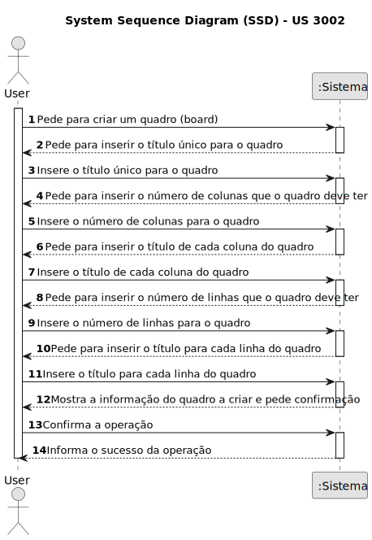
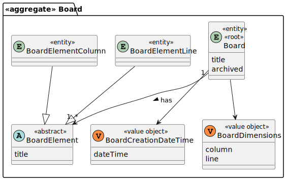
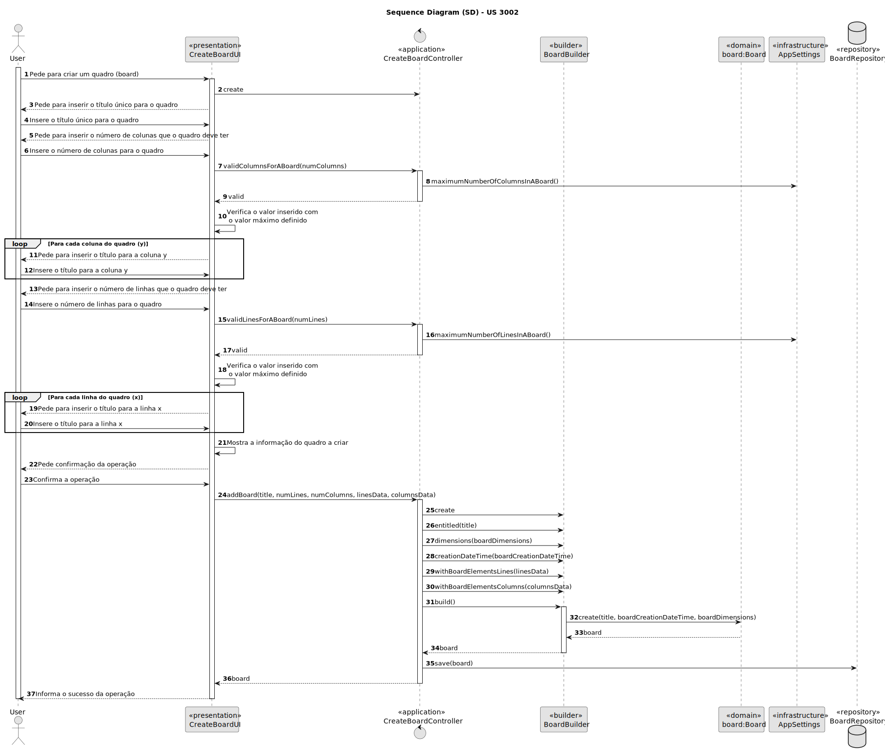
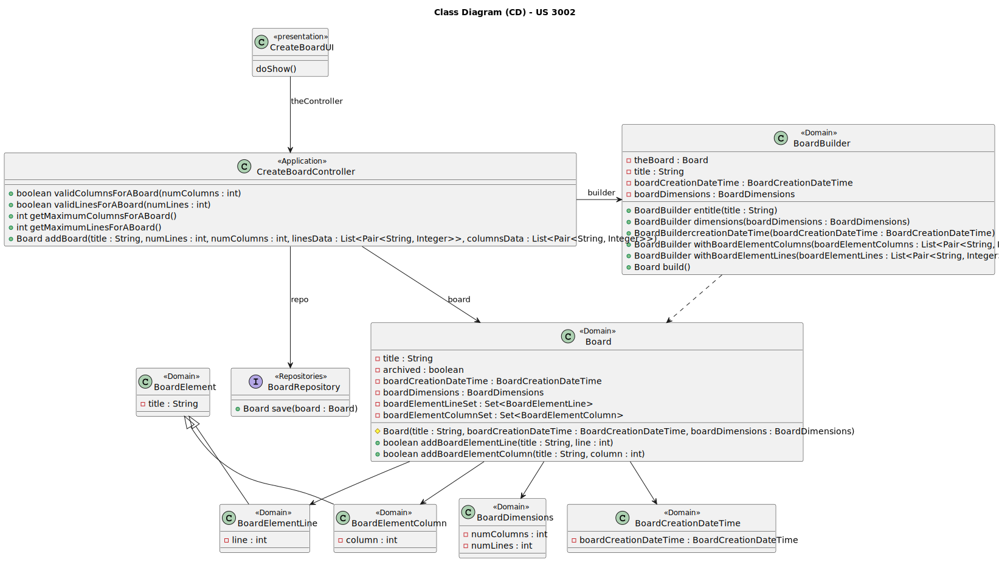

# US 3002

Este documento contém a documentação relativa à US 3002.

## 1. Contexto

Esta *User Story (US)* foi introduzida neste *sprint* para ser desenvolvida seguindo as boas práticas de engenharia de
*software*.
Esta *US* faz parte da disciplina de **EAPLI**.

## 2. Requisitos

**US 3002** - As User, I want to create a board

A respeito desta *User Storie (US)*, entendemos que ela se refere à funcionalidade de criar quadros partilhados onde se pode
colocar informação em género de post-its. Esta funcionalidade pode ser utilizada por todos os utilizadores do sistema 
(administradores, professores e alunos).

### 2.1. Complementos encontrados
*Todas as *US's* que farão uso de um quadro partilhado.*

### 2.2. Dependências encontradas
**US 1001** - As Manager, I want to be able to register, disable/enable, and list users of the system (Teachers and 
Students, as well as Managers)

**Explicação:** Se não existirem utilizadores no sistema, não é possível criar uma *shared board*.

### 2.3. Critérios de aceitação
**CA 1:** Tem um título único.
**CA 2:** Está dividido num dado número de colunas e linhas, desta forma tem um número certo de células.
**CA 3:** O número máximo de linhas e de colunas deve ser definido num ficheiro de configuração.
**CA 4:** As linhas e as colunas devem ter um título.
**CA 5:** As linhas e as colunas devem ser identificadas por um número inteiro de 1 até ao máximo.
**CA 6:** O utilizador que cria a *shared board* é o seu dono.

## 3. Análise

### 3.1. Respostas do cliente

Não foi necessário questionar o cliente em função da realização desta *User Story*.

### 3.2. Diagrama de Sequência do Sistema



### 3.3. Classes de Domínio



## 4. Design

### 4.1. Diagrama de Sequência



### 4.2. Diagrama de Classes



### 4.3. Padrões Aplicados

|                                   Questão: Que classe...                                   |       Resposta        | Padrão               |                                               Justificação                                               |
|:------------------------------------------------------------------------------------------:|:---------------------:|----------------------|:--------------------------------------------------------------------------------------------------------:|
|                       é responsável por interagir com o utilizador?                        |     CreateBoardUI     | *Pure Fabrication*   |       Não há razão para atribuir esta responsabilidade a uma classe presente no Modelo de Domínio        |
|                            é responsável por coordenar a *US*?                             | CreateBoardController | *Controller*         |                                                                                                          |
|                    é responsável por criar todas as classes Repository?                    |   RepositoryFactory   | *Factory*            |              Quando uma entidade é demasiado complexa, as fábricas fornecem encapsulamento.              |
|              é responsável por saber representar todos os dados de uma board?              |         Board         | *Information Expert* |                           Sabe toda a informação dos dados que lhe pertencem.                            |
|                    é responsável por guardar os dados da board criada?                     |    BoardRepository    | *Information Expert* |                         É responsável pela persistência/reconstrução do *Board*.                         |
|                     é responsável por saber criar uma instância Board?                     |     BoardBuilder      | *Creator*            | É mais fácil atribuir essa tarefa a uma classe específica sendo mais fácil de realizar a sua manutenção. |
|              é responsável por saber representar todos os dados de uma board?              |         Board         | *Information Expert* |                           Sabe toda a informação dos dados que lhe pertencem.                            |
|         é responsável por saber representar a data e hora de criação de uma board?         | BoardCreationDateTime | *Information Expert* |                           Sabe toda a informação dos dados que lhe pertencem.                            |
|               é responsável por saber representar as dimensões de uma board?               |    BoardDimensions    | *Information Expert* |                           Sabe toda a informação dos dados que lhe pertencem.                            |
| é responsável por saber representar todos os dados acerca de uma dada coluna de uma board? |  BoardElementColumn   | *Information Expert* |                           Sabe toda a informação dos dados que lhe pertencem.                            |
|    é responsável por saber representar todos os acerca de uma dada linha de uma board?     |   BoardElementLine    | *Information Expert* |                           Sabe toda a informação dos dados que lhe pertencem.                            |

### 4.4. Testes

**Teste 1:** *Verifica que não é possível criar uma board com o mesmo título de outra já criada.*

```
public void ensureBoardIntegrity() {
    //...
}
````

**Teste 2:** *Verifica que não é possível criar uma board que ultrapasse os limites de linhas máximas.*

```
public void ensureBoardCreationDontExceedLinesLimit() {
    //...
}
````

**Teste 3:** *Verifica que não é possível criar uma board que ultrapasse os limites de colunas máximas.*

```
public void ensureBoardCreationDontExceedColumnsLimit() {
    //...
}
````

## 5. Implementação

## 5.1. Arquitetura em Camadas
### Domínio

Na camada de domínio criou-se a entidade *Board* e os respetivos *Value Objects*, que são: *BoardCreationDateTime*,
*BoardDimensions*, *BoardElementColumn* e *BoardElementLine*.
Criou-se também a classe abstrata *BoardElement* e ainda um builder para a board, chamado *BoardBuilder*.

### Aplicação

Na camada de aplicação criou-se o controller *CreateBoardController*.

### Repositório

Na camada de repositório foi implementada a *interface* *BoardRepository* que é implementada em *JPA* e *InMemory* 
no módulo de *impl*.

### Apresentação

Nesta camada foi desenvolvida a *CreateBoardUI* que faz a interação entre o utilizador (gerente, professor e estudante) 
e o sistema. Aqui é possível criar um quadro (board).

## 5.2. Commits Relevantes

[Listagem dos Commits realizados](https://github.com/Departamento-de-Engenharia-Informatica/sem4pi-22-23-20/issues/32)

## 6. Integração/Demonstração

* No menu de Administrador foi adicionado no sub-menu **Boards** a opção *Create a board*.
* No menu de aluno foi adicionado no sub-menu **Boards** a opção *Create a board*.
* No menu de professor foi adicionado no sub-menu **Boards** a opção *Create a board*.

## 7. Observações

* Não existem observações relevantes a acrescentar.
