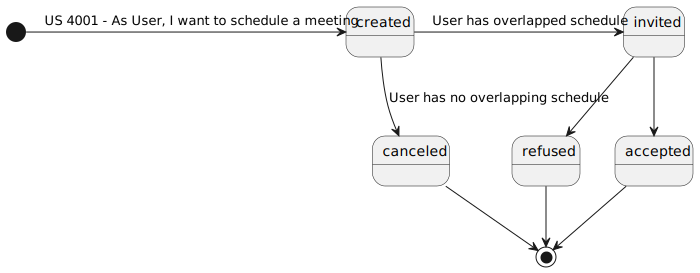
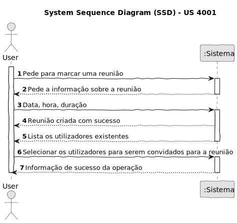
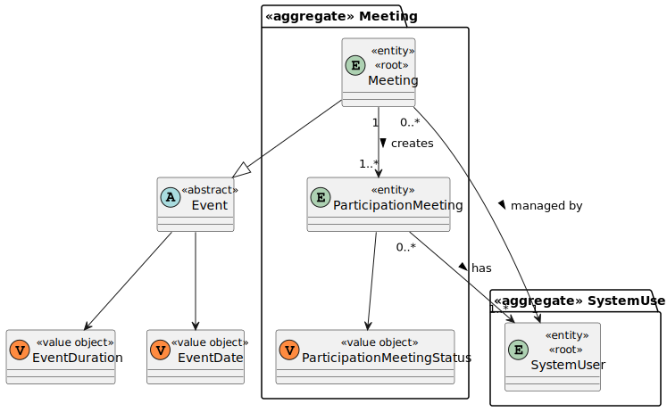
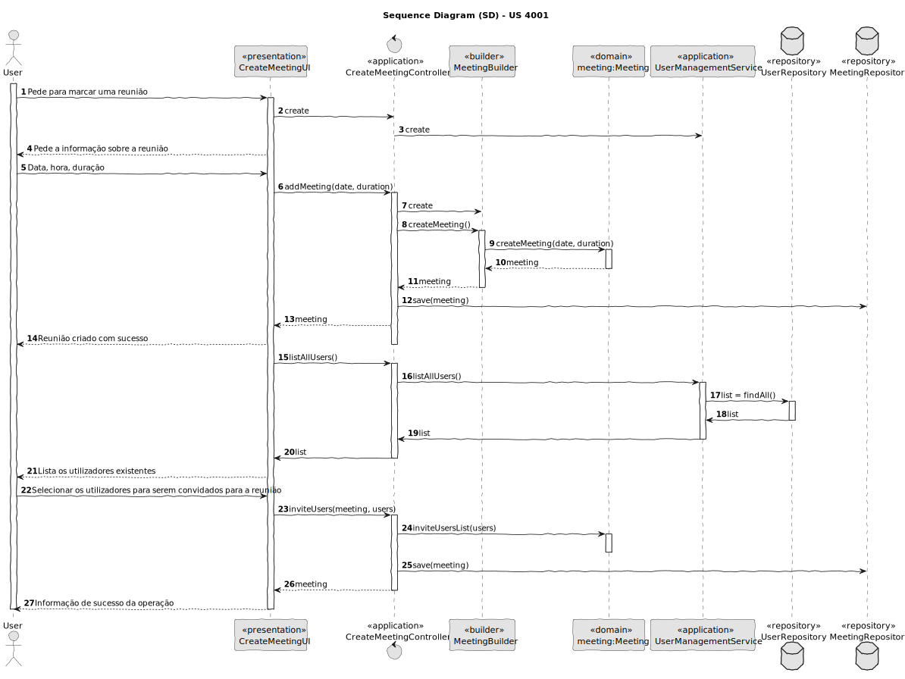
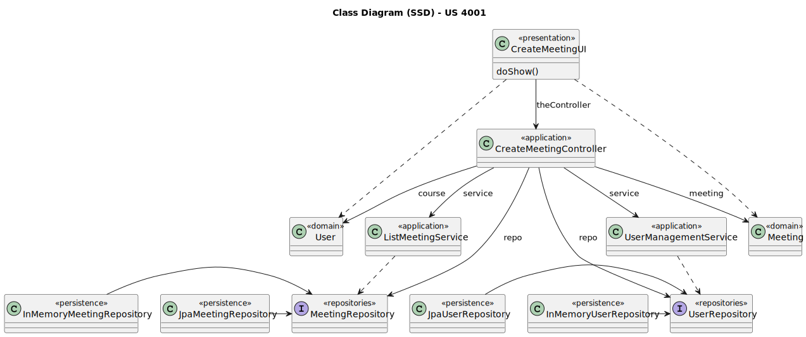

# US 4001

Este documento contém a documentação relativa à US 4001.

## 1. Contexto

Esta *User Story (US)* foi introduzida neste *sprint* para ser desenvolvida seguindo as boas práticas de engenharia de
*software*.
Esta *US* faz parte da disciplina de **EAPLI**.

## 2. Requisitos

**US 4001** - As User, I want to schedule a meeting.

### 2.1. Dependências encontradas

**Explicação:** Esta *US* complementa a futuras *US* a ser tratada devido a que o convite para a reunião tem o seguinte ciclo de
vida:



### 2.2. Critérios de aceitação

- **CA 1:** O sistema deve verificar se todos os participantes estão disponíveis e enviar convites aos participantes.

## 3. Análise

### 3.1. Respostas do cliente

- Não foi necessário questionar o cliente acerca desta *US*.

### 3.2. Diagrama de Sequência do Sistema



### 3.3. Classes de Domínio



## 4. Design

### 4.1. Diagrama de Sequência



### 4.2. Diagrama de Classes



### 4.3. Padrões Aplicados

|                Questão: Que classe...                |        Resposta         | Padrão               |                                                                Justificação                                                                 |
|:----------------------------------------------------:|:-----------------------:|----------------------|:-------------------------------------------------------------------------------------------------------------------------------------------:|
|    é responsável por interagir com o utilizador?     |     CreateMeetingUI     | *Pure Fabrication*   |                        Não há razão para atribuir esta responsabilidade a uma classe presente no Modelo de Domínio.                         |
|    é responsável por coordenar a funcionalidade?     | CreateMeetingController | *Controller*         |                                                                                                                                             |
| é responsável por criar todas as classes Repository? |    RepositoryFactory    | *Factory*            |                               Quando uma entidade é demasiado complexa, as fábricas fornecem encapsulamento.                                |
|            conhece todos os utilizadores?            |     UserRepository      | *Information Expert* |                   Dado que é responsável pela persistência/reconstrução do *SystemUser*, conhece todos os seus detalhes.                    |
|              conhece todas as reuniões?              |    MeetingRepository    | *Information Expert* |                     Dado que é responsável pela persistência/reconstrução do *Meeting*, conhece todos os seus detalhes.                     |
|        permite persistir as reuniões criadas?        |    MeetingRepository    | *Repository*         | Quando se pretende ocultar os detalhes de persistência/reconstrução de objetos cria-se uma classe Repository responsável por essas tarefas. |

### 4.4. Testes

**Teste 1:** *Verifica se não é possível criar uma instância da classe *Meeting* com valores nulos.*

```
@Test(expected = IllegalArgumentException.class)
public void ensureNullIsNotAllowedMeeting() {
	Meeting instance = new Meeting(null, null, null);
}
```  

## 5. Implementação

## 5.1. Arquitetura em Camadas
### Domínio

Na camada de domínio criou-se a entidade *Meeting* e os respetivos *Value* *Objects*. Além disso utilizou-se a entidade
*Student* que já tinha sido criada por outra *User Storie (US)*.

### Aplicação

Na camada de aplicação criou-se o controller *CreateMeetingController*.

### Repositório

Na camada de repositório foi utilizada a interface *UserRepository* e a interface *MeetingRepository* que é implementada em *JPA* e *InMemory* no módulo de *impl*.

### Apresentação

Nesta camada foi desenvolvida a *CreateMeetingUI* que faz a interação entre o user e o sistema e permite
criar um meeting e convidar os alunos disponiveis.

## 5.2. Commits Relevantes

[Listagem dos Commits realizados](https://github.com/Departamento-de-Engenharia-Informatica/sem4pi-22-23-20/issues/34)

## 6. Integração/Demonstração

* Em todos os menus foram adicionados no sub-menu **Meeting** a opção *Schedule a meeting*.

## 7. Observações

* Não existem observações relevantes a acrescentar.