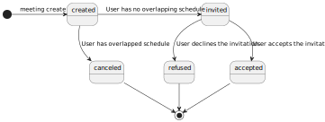

# US G002

Este documento contém a documentação relativa à US G002.

## 1. Contexto

Esta *User Story (US)* foi introduzida no *sprint* passado, ou seja, no *sprint A* para ser desenvolvida seguindo as 
boas práticas de engenharia de *software*. Esta *US* faz parte da disciplina de **EAPLI**.
Dado que esta é uma das principais *US*, pois aqui é onde se desenvolve o **Modelo de Domínio**, sendo que este tem um 
grande peso na forma como as classes e a comunicação entre elas irá ser realizada. Dessa forma, neste *sprint* a equipa
está/irá realizar a atualização deste mesmo modelo e de tudo o que diz respeito à documentação geral do projeto, como 
por exemplo, o glossário. Estas atualizações serão feitas em confurmidade com o feedback obtido na avaliação de 
**EAPLI**. Para além das atualizações que serão realizadas, também se terá de desenvolver os **Diagramas de Estados** 
necessários para que não exista espaço para dúvidas em função de estados de entidades.

## 2. Requisitos

**US G002** - As Project Manager, I want the team to elaborate a Domain Model using DDD

Esta *US* é relativa ao desenho do **Modelo de Dominio** entendido para responder às necessidades pedidas, e para servir 
de comunicação entre as pessoas interessadas.

### 2.1. Critérios de aceitação
1. O Modelo de Domínio deve ser criado e mantido atualizado.
2. O Modelo de Dominio deve ser incluído na documentação técnica do repositório.

## 3. Análise

### 3.1. Respostas do cliente

>**Questão:** "Looking at the users, they are to be given a short name and a full name. Should the short name be part of
the full name?"
>
>**Resposta:** "Usually my suggestion for this type of doubts is to search for the most common approach to solve the 
issue. I would say that it is part of the analysis of the problem. After that, you should take a decision and justify 
that decision. Having said that, as a client, I should say that my interpretation of short name is like a given name."

>**Questão:** " As for the course, there are 2 things bothering me: - The unique code is said to be input and the 
identifier is automated. Should they be different things, or was there any confusion? - It is mentioned a title for 
the course and a unique name. Are they the same?"
>
>**Resposta:** "Yes, I think the specification has some contradictory or confusing statements regarding courses. I 
should say that maybe the ideia is that a course: - has unique code inputed by the administrator, e.g., "JAVA-1, that 
is used to identify it; - it has a name (name and title may refer to the same property of courses, and I would say 
that there is no need for it to be unique)"

>**Questão:** "Can the same question be used in different exams? Or are the questions made for a specific exam?"
>
>**Resposta:** "At the present moment, when designing the exam, the user specifies all its structure (including the 
questions, as described in section 5.2.4). There is no "database" of questions.
NOTE: However, it is possible that new user stories regarding exams will be added (in sprint B and C) for teams/groups 
with an extended number of students enrolled in LPROG."

>**Questão:** "It is mentioned that only one teacher can be in charge of a course, but can the same teacher be in charge
of several other courses?"
>
>**Resposta:** "Yes, a teacher can be in charge of several courses."
 
>**Questão:** "Regarding weekly classes recurrence, should be considered as a recurrence class if it happens more than 
one day per week? For example, the same class can occur on mondays and wednesdays?"
>
>**Resposta:** "A class should be considered only one class ("aula"). This one class is always a recurring class. If a 
course has more than one class each week, then each class will be a recurring class."

## 4. Implementação

### 4.1. Modelo de Domínio

### 4.2. Diagramas de Estados

#### 4.2.1. Diagrama de Estados de Course

#### 4.2.2. Diagrama de Estados de ParticipationMeeting

#### 4.2.3. Diagrama de Estados de PostIt

#### 4.2.4. Diagrama de Estados de Enrollment

### 4.3. Glossário
Para ler o glossário, carregue [aqui](Glossary.md)!

## 5. Observações
Caso o **Modelo de Domínio** em PlantUml não esteja bem percetível, pode também ser visualizado no seguinte *link*:
https://miro.com/app/board/uXjVMYJKaqM=/?share_link_id=789214789138.
