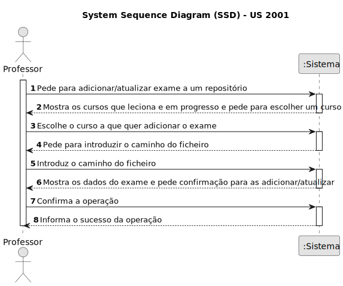
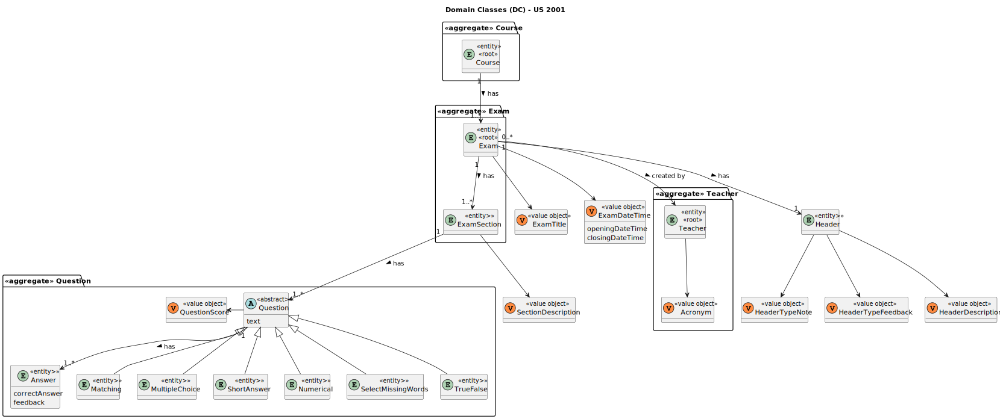
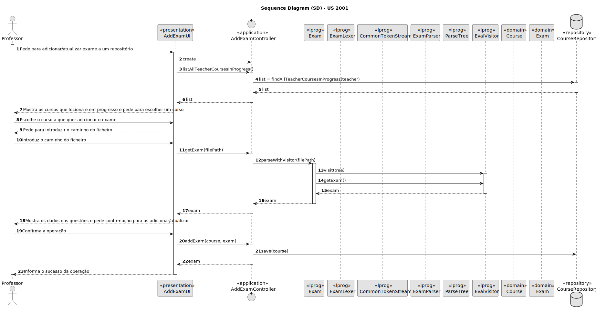
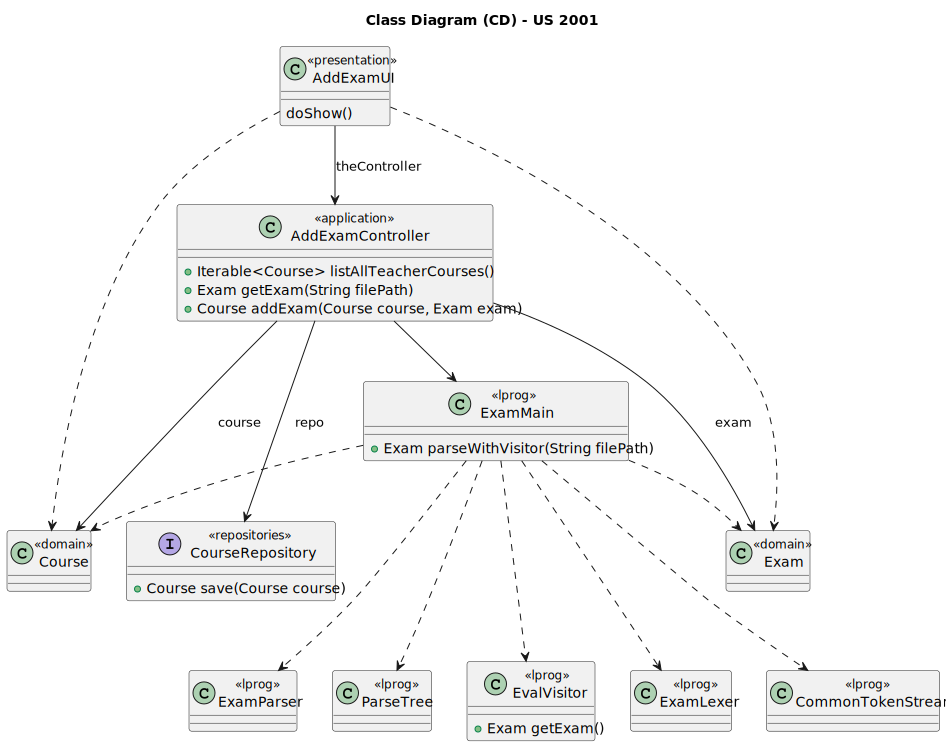

# US 2001

Este documento contém a documentação relativa à US 2001.

## 1. Contexto

Esta *User Story (US)* foi introduzida no *sprint* anterior para ser especificada uma gramática que possa validar vários 
tipos de exames. Neste sprint é necessário conectar a *US* ao restante projeto seguindo as boas práticas de engenharia de *software*.
Esta *US* faz parte da disciplina de **LPROG** e **EAPLI**.

## 2. Requisitos

**US 2001** - As Teacher, I want to create/update an exam.

A respeito deste requisito, entendemos que o professor deve indicar o caminho do ficheiro que contém o exame,
que após ser validado pela grámatica devem ser guardado no repositório.

### 2.1. Complementos encontrados

Não existem User Stories complementares.

### 2.2. Dependências encontradas

Não existem dependências encontradas.

### 2.3 Critérios de aceitação

**CA 1:** The support for exams (its design, feedback and grading) must follow specific technical requirements, specified in LPROG.
**CA 2:** The ANTLR tool should be used (https://www.antlr.org/).

## 3. Análise

### 3.1. Respostas do cliente

Não foi necessário questionar o cliente em função da realização desta *User Story (US)*.

### 3.2. Diagrama de Sequência do Sistema



### 3.3. Classes de Domínio



## 4. Design

### 4.1. Diagrama de Sequência



### 4.2. Diagrama de Classes



### 4.3. Padrões Aplicados
|                    Questão: Que classe...                     |                                          Resposta                                          | Padrão               |                                                                Justificação                                                                 |
|:-------------------------------------------------------------:|:------------------------------------------------------------------------------------------:|----------------------|:-------------------------------------------------------------------------------------------------------------------------------------------:|
|         é responsável por interagir com o utilizador?         |                                         AddExamUI                                          | *Pure Fabrication*   |                        Não há razão para atribuir esta responsabilidade a uma classe presente no Modelo de Domínio.                         |
|         é responsável por coordenar a funcionalidade?         |                                     AddExamController                                      | *Controller*         |                                                                                                                                             |
|     é responsável por criar todas as classes Repository?      |                                     RepositoryFactory                                      | *Factory*            |                               Quando uma entidade é demasiado complexa, as fábricas fornecem encapsulamento.                                |
|   é responsável por persistir os cursos criadas/utilizadas?   |                                      CourseRepository                                      | *Repository*         | Quando se pretende ocultar os detalhes de persistência/reconstrução de objetos cria-se uma classe Repository responsável por essas tarefas. |
|      é responsável por saber todos os dados de um exame?      |                                            Exam                                            | *Information Expert* |                                             Sabe toda a informação dos dados que lhe pertencem.                                             |
|    é responsável por saber todos os dados de um cabeçalho?    |                                           Header                                           | *Information Expert* |                                             Sabe toda a informação dos dados que lhe pertencem.                                             |
|     é responsável por saber todos os dados de uma secção?     |                                          Section                                           | *Information Expert* |                                             Sabe toda a informação dos dados que lhe pertencem.                                             |
|    é responsável por saber todos os dados de uma questão?     | Question, Matching, MultipleChoice, ShortAnswer, Numerical, SelectMissingWords e TrueFalse | *Information Expert* |                                             Sabe toda a informação dos dados que lhe pertencem.                                             |
| é responsável por saber a resposta e feedback de uma questão? |                                           Answer                                           | *Information Expert* |                                             Sabe toda a informação dos dados que lhe pertencem.                                             |

### 4.4. Testes

*Teste 1*: Garante que é possível construir um exame com o título, data de abertura, data de fecho, cabeçalho e secção.
```
@Test
public void ensureCanBuildExamWithTitleOpeningDateTimeClosingDateTimeHeaderSection() {
    final Exam subject = new ExamBuilder().with(TITLE, OPENING_DATE_TIME, CLOSING_DATE_TIME, HEADER).withSection(SECTION).build();
    assertNotNull(subject);
}
```

*Teste 2*: Garante que não é possível construir um exame com o título nulo.
```
    @Test
    public void ensureCannotBuildExamWithNullTitle() {
        assertThrows(IllegalArgumentException.class, () -> new ExamBuilder().withTitle(null).
                withDateTime(OPENING_DATE_TIME, CLOSING_DATE_TIME).withHeader(HEADER).withSection(SECTION).build());
    }
```

*Teste 3*: Garante que não é possível construir um exame sem título.
```
    @Test
    public void ensureCannotBuildExamWithoutTitle() {
        assertThrows(IllegalStateException.class, () -> new ExamBuilder().withDateTime(OPENING_DATE_TIME, CLOSING_DATE_TIME).
                withHeader(HEADER).withSection(SECTION).build());
    }
```

*Teste 8*: Garante que não é possível construir um exame com uma secção nula.
```
    @Test
    public void ensureCannotBuildExamWithNullSection() {
        assertThrows(IllegalArgumentException.class, () -> new ExamBuilder().withTitle(TITLE).
                withDateTime(OPENING_DATE_TIME, CLOSING_DATE_TIME).withHeader(HEADER).withSection(null).build());
    }
```

*Teste 9*: Garante que não é possível construir um exame sem secções.
```
    @Test
    public void ensureCannotBuildExamWithoutSections() {
        assertThrows(InvalidScoreException.class, () -> new ExamBuilder().withTitle(TITLE).
                withDateTime(OPENING_DATE_TIME, CLOSING_DATE_TIME).withHeader(HEADER).build());
    }
```

*Teste 10*: Garante que a data de abertura de um exame não deve ser nula.
```
    @Test
    void ensureExamOpeningDateTimeMustNotBeNull() {
        assertThrows(IllegalArgumentException.class, () -> ExamDateTime.valueOf(null,
                BuilderHelper.buildDateTime(3000, Calendar.AUGUST, 15, 23, 59)));
    }
```

*Teste 11*: Garante que a data de fecho de um exame é posterior a outra.
```
    @Test
    void ensureExamClosingDateTimeIsAfter() {
        assertTrue(subject.closingDateIsGreaterThan(BuilderHelper.buildDateTime(3000, Calendar.AUGUST, 10, 23, 59)));
    }
```

*Teste 12*: Garante que a data de fecho de um exame não é igual a outra.
```
    @Test
    void ensureSectionDescriptionNotEquals() {
        assertNotEquals(subject, ExamDateTime.valueOf(BuilderHelper.buildDateTime(3000, Calendar.AUGUST, 10, 10, 0),
                BuilderHelper.buildDateTime(3000, Calendar.AUGUST, 15, 20, 0)));
    }
```

*Teste 13*: Garante que é possível construir uma secção com a descrição e uma questão.
```
    @Test
    public void ensureCanBuildSectionWithDescriptionQuestion() {
        final ExamSection subject = new ExamSectionBuilder().withDescription("Secção sobre meteorologia").withQuestion(buildQuestion()).build();
        assertNotNull(subject);
    }
```

*Teste 14*: Garante que não é possível construir uma secção sem os dados necessários.
```
    @Test
    public void ensureCannotBuildSectionWithoutData() {
        assertThrows(IllegalStateException.class, () -> new ExamSectionBuilder().build());
    }
```

*Teste 15*: Garante que não é possível construir uma secção com a descrição nula.
```
    @Test
    public void ensureCannotBuildSectionWithNullDescription() {
        assertThrows(IllegalArgumentException.class, () -> new ExamSectionBuilder().withDescription(null).build());
    }
```

*Teste 16*: Garante que uma secção de um exame tem a descrição esperada.
```
    @Test
    void ensureExamSectionHasExpectedDescription() {
        final ExamSection subject = buildExamSection();

        assertEquals(DESCRIPTION, subject.description());
    }
```

*Teste 17*: Garante que duas secções de um exame não são iguais para questões diferentes.
```
    @Test
    void ensureTwoExamSectionWithDifferentQuestionsAreNotTheSame() {
        final ExamSection aExamSection = buildExamSection();
        final ExamSection anotherExamSection = new ExamSectionBuilder().withDescription("Jogadores").withQuestion(new TrueFalse(
                "Estamos no ano 2023?", QuestionScore.valueOf(10F), new Answer("true",
                "O ano atual é 2023"))).build();

        assertFalse(aExamSection.sameAs(anotherExamSection));
    }
```

*Teste 18*: Garante que não pode ser adicionada uma questão com valor nulo.
```
    @Test
    void ensureExamSectionQuestionCannotBeNull() {
        ExamSection subject = this.buildExamSection();
        assertThrows(IllegalArgumentException.class, () -> subject.addQuestion(null));
    }
```

*Teste 19*: Garante que uma secção é adicionada com sucesso.
```
    @Test
    void ensureExamSectionIsAddedWithSuccess() {
        Exam subject = this.buildExam();
        ExamSection section = new ExamSection(new SectionDescription("Esta é uma secção para teste."));
        subject.addSection(section);
    }
```

*Teste 20*: Garante que as secções de um exame são devolvidas corretamente.
```
    @Test
    void ensureExamSectionsAreCorrectlyReturned() {
        List<ExamSection> expectedSections = new ArrayList<>();
        expectedSections.add(this.SECTION);

        Exam subject = this.buildExam();
        List<ExamSection> resultSections = subject.sections();

        assertEquals(expectedSections.size(), resultSections.size());

        for (int i = 0; i < expectedSections.size(); i++) {
            assertEquals(expectedSections.get(i), resultSections.get(i));
        }
    }
```

*Teste 21*: Garante que um cabeçalho tem de possuir um tipo de nota.
```
    @Test
    void ensureHeaderHasTypeNote() {
        assertThrows(IllegalArgumentException.class, () -> new Header(DESCRIPTION, null, TYPE_FEEDBACK));
    }
```

*Teste 22*: Garante que dois cabeçalhos não são iguais para uma descrição diferente.
```
    @Test
    void ensureTwoHeaderWithDifferentDescriptionsAreNotTheSame() {
        final Header aHeader = buildHeader();
        final Header anotherHeader = new HeaderBuilder().withDescription("Primeiro exame sobre pedras").withTypeNote("after-closing").
                withTypeFeedback("on-submission").build();

        assertFalse(aHeader.sameAs(anotherHeader));
    }
```

*Teste 23*: Garante que um cabeçalho é o mesmo para a mesma instância.
```
    @Test
    void ensureHeaderAreTheSameForTheSameInstance() {
        final Header aHeader = new Header();

        assertTrue(aHeader.sameAs(aHeader));
    }
```

*Teste 24*: Garante que a descrição de uma secção pode ser vazia.
```
    @Test
    void ensureSectionDescriptionMustBeEmpty() {
        assertDoesNotThrow(() -> SectionDescription.valueOf(""));
    }
```

*Teste 25*: Garante que a descrição de uma secção não deve possuir mais de 150 caracteres.
```
    @Test
    void ensureSectionDescriptionMustNotContainMoreThanFiftyCharacters() {
        assertThrows(IllegalArgumentException.class, () -> SectionDescription.valueOf("A secção de rochas " +
                "do século XX é composta por uma variedade de formações rochosas notáveis, algumas das quais ultrapassam " +
                "os dez metros de altura e quinze metros de largura."));
    }
```

*Teste 26*: Garante que a descrição de uma secção não é igual a outra.
```
    @Test
    void ensureSectionDescriptionNotEquals() {
        assertNotEquals(subject, SectionDescription.valueOf("Secção de pedras"));
    }
```

*Teste 27*: Garante que a descrição de um cabeçalho pode deve ser vazia.
```
    @Test
    void ensureHeaderDescriptionMustBeEmpty() {
        assertDoesNotThrow(() -> HeaderDescription.valueOf(""));
    }
```

*Teste 28*: Garante que a descrição de um cabeçalho não deve possuir mais de 150 caracteres.
```
    @Test
    void ensureHeaderDescriptionMustNotContainMoreThanFiftyCharacters() {
        assertThrows(IllegalArgumentException.class, () -> HeaderDescription.valueOf("Primeiro exame sobre rochas " +
                "do século XX que são compostas por uma variedade de formações rochosas notáveis, algumas das quais ultrapassam " +
                "os dez metros de altura e quinze metros de largura."));
    }
```

*Teste 29*: Garante que a descrição de um cabeçalho não é igual a outra.
```
    @Test
    void ensureHeaderDescriptionNotEquals() {
        assertNotEquals(subject, HeaderDescription.valueOf("Primeiro exame sobre pedras"));
    }
```

## 5. Implementação

### 5.1. Gramática

Para visualizar a grámatica desenvolvida, clique [aqui](../../../antlr4/Exam.g4)

## 5.2. Arquitetura em Camadas
### Domínio

Na camada de domínio utilizou-se as entidades abstratas *Course* e a *Exam* e as entidades.

### Aplicação

Na camada de aplicação criou-se o controller *AddExamController*.

### Repositório

Na camada de repositório utilizou-se a interface *TeacherRepository* e a *CourseRepository* que são implementadas em *JPA* e *InMemory* no módulo de *impl*.

### Apresentação

Nesta camada foi desenvolvida a *AddExamUI* que faz a interação entre o professor e o sistema.
Aqui é possível adicionar/atualizar exames ao repositório.

## 5.3. Commits Relevantes

[Listagem dos Commits realizados](https://github.com/Departamento-de-Engenharia-Informatica/sem4pi-22-23-20/issues/54)

## 6. Integração/Demonstração

No menu de professor foi adicionado no sub-menu **Exams** a opção *Add/update exam to a repository*.

## 7. Observações

Não existem observações relevantes a acrescentar.
