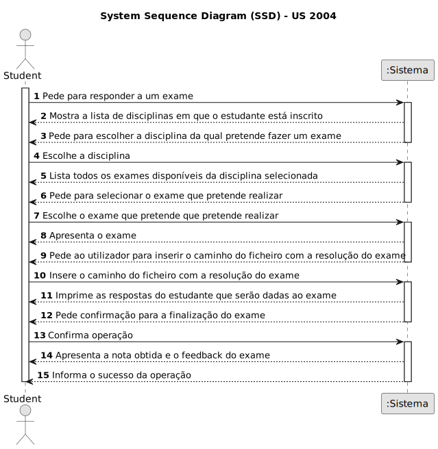
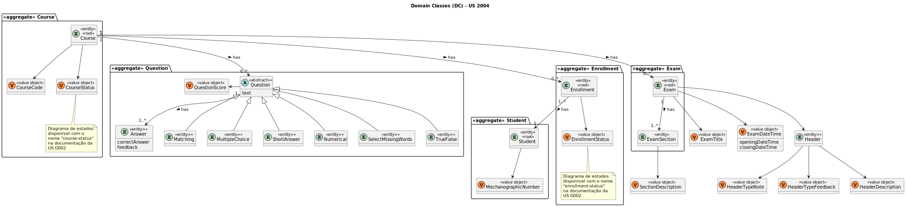
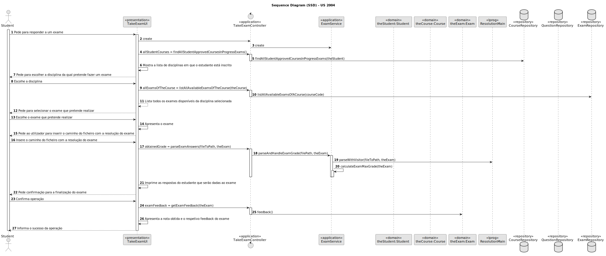
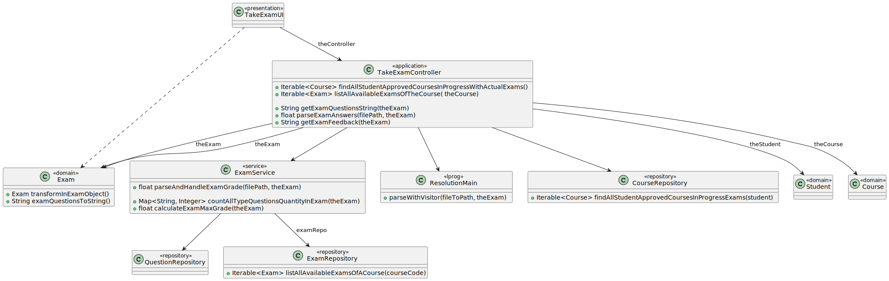

# US 2004

Este documento contém a documentação relativa à US 2004.

## 1. Contexto

Esta *User Story (US)* foi introduzida no *sprint* anterior para ser especificada uma gramática que possa validar vários
tipos de exames. Neste sprint é necessário conectar a *US* ao restante projeto seguindo as boas práticas de engenharia de *software*.
Esta *US* faz parte da disciplina de **LPROG** e **EAPLI**.

## 2. Requisitos

**US 2004** - As Student, I want to take an exam.

A respeito deste requisito, entendemos que um estudante poderá realizar um exame para uma dada disciplina, em que este 
exame foi criado préviamente por um professor.

### 2.1. Complementos encontrados

Não existem User Stories complementares.

### 2.2. Dependências encontradas

- **US 2001** - As Teacher, I want to create/update an exam.

**Explicação:** Esta US complementa a atual US porque é preciso existir um exame para este ser resolvido.

### 2.3 Critérios de aceitação

- **CA 1:** The ANTLR tool should be used (https://www.antlr.org/).

## 3. Análise

### 3.1. Respostas do cliente

> **Question:** Do we need to save the exam with the answers of a certain student to be able to show it later, or should 
> we just calculate the final grade and show feedback for each question?
>
> **Answer:** Just calculat the final grade and show feedback for each question. Unless saving of the answers is
> required as a technical solution for some other aspect of your solution you do not need to save the answers.

> **Question:** Another question is about types of feedback: on-submission means on submission of a question or the whole
> exame?
> 
> **Answer:** On submission of the whole exam.

> **Question:** Ao atualizar um exame é necessário calcular de novo a nota do aluno ou continua com a sua nota antiga?
> 
> **Answer:** Embora possa não estar explícito na especificação, não faz sentido fazer alterações a exames depois da 
> "open date" ou de já haver exames respondidos.

> **Question:** Em relação às perguntas "short answer" estas podem ser corrigidas automaticamente? (o utilizador teria 
> 100% da cotação se a resposta fosse igual e 0% caso seja diferente) 
> 
> **Answer:** Quanto às perguntas, todas elas (i.e., todos os tipos de perguntas) devem de ser passíveis de correção
> automática. É esse o objetivo.

### 3.2. Diagrama de Sequência do Sistema



### 3.3. Classes de Domínio



## 4. Design

### 4.1. Diagrama de Sequência



### 4.2. Diagrama de Classes



### 4.3. Padrões Aplicados
|                                  Questão: Que classe...                                  |      Resposta      | Padrão               |                                            Justificação                                            |
|:----------------------------------------------------------------------------------------:|:------------------:|----------------------|:--------------------------------------------------------------------------------------------------:|
|                      é responsável por interagir com o utilizador?                       |     TakeExamUI     | *Pure Fabrication*   |    Não há razão para atribuir esta responsabilidade a uma classe presente no Modelo de Domínio.    |
|                      é responsável por coordenar a funcionalidade?                       | TakeExamController | *Controller*         |                                                                                                    |
|                   é responsável por criar todas as classes Repository?                   | RepositoryFactory  | *Factory*            |           Quando uma entidade é demasiado complexa, as fábricas fornecem encapsulamento.           |
| conhece todos os cursos aprovados pelos alunos em andamento com exames formativos reais? |  CourseRepository  | *Information Expert* | Dado que é responsável pela persistência/reconstrução do *Course*, conhece todos os seus detalhes. |
|                conhece todos os exames formativos disponíveis de um curso                |   ExamRepository   | *Information Expert* |  Dado que é responsável pela persistência/reconstrução do *Exam*, conhece todos os seus detalhes.  |

### 4.4. Testes

*Teste 1*: Garante que a nota de um exame feito não é negativa. 
```
@Test
void ensureGradeMustNotBeNull() {
    assertThrows(IllegalArgumentException.class, () -> Grade.valueOf(null));
}
```

*Teste 2*: Garante que a nota tem de possuir um valor entre 0 e 20.
```
@ParameterizedTest
@ValueSource(floats = {-25F, -0.1F, 20.1F, 25F})
void ensureGradeIsBiggerOrEqualsThanZeroAndLessOrEqualThanTwenty(final float score) {
    assertThrows(IllegalArgumentException.class, () -> Grade.valueOf(score));
}
```

*Teste 3*: Garante que a nota é igual a outra.
```
@Test
void ensureGradeIsEquals() {
    assertEquals(expected, Grade.valueOf(5F));
}
```

*Teste 4*: Garante que a nota não é igual a outra.
```
@Test
void ensureGradeNotEquals() {
    assertNotEquals(expected, Grade.valueOf(1F));
}
```

*Teste 5*: Garante que é possível construir um exame feito com a nota, exame e aluno.
```
@Test
public void ensureCanBuildTakenExamWithStudentGradeAndExam() {
    final TakenExam subject = new TakenExamBuilder().with(buildStudent(), GRADE, buildExam()).build();
    assertNotNull(subject);
}
```

*Teste 6*: Garante que não é possível construir um exame formativo com o título nulo.
```
@Test
public void ensureCannotBuildTakenExamWithNullStudent() {
    assertThrows(IllegalArgumentException.class, () -> new TakenExamBuilder().withStudent(null).withGrade(GRADE).withExam(buildExam()).build());
}
```

*Teste 7*: Garante que não é possível construir um exame formativo sem título.
```
@Test
public void ensureCannotBuildTakenExamWithoutStudent() {
    assertThrows(IllegalArgumentException.class, () -> new TakenExamBuilder().withGrade(GRADE).withExam(buildExam()).build());
}
```

*Teste 8*: Garante que não é possível construir um exame formativo com a data de abertura nula.
```
@Test
public void ensureCannotBuildTakenExamWithNullGrade() {
    assertThrows(IllegalArgumentException.class, () -> new TakenExamBuilder().withStudent(buildStudent()).withGrade(null).withExam(buildExam()).build());
}
```

*Teste 9*: Garante que não é possível construir um exame formativo com a data de fecho nula.
```
@Test
public void ensureCannotBuildTakenExamWithoutGrade() {
    assertThrows(IllegalArgumentException.class, () -> new TakenExamBuilder().withStudent(buildStudent()).withExam(buildExam()).build());
}
```

*Teste 10*: Garante que não é possível construir um exame formativo com o cabeçalho nulo.
```
@Test
public void ensureCannotBuildTakenExamWithNullExam() {
    assertThrows(IllegalArgumentException.class, () -> new TakenExamBuilder().withStudent(buildStudent()).withGrade(GRADE).withExam(null).build());
}
```

*Teste 11*: Garante que não é possível construir um exame formativo sem cabeçalho.
```
@Test
public void ensureCannotBuildTakenExamWithoutExam() {
    assertThrows(IllegalArgumentException.class, () -> new TakenExamBuilder().withStudent(buildStudent()).withGrade(GRADE).build());
}
```

*Teste 12*: Garante que a nota é igual a outra.
```
@Test
public void ensureTakenExamReturnOfExamWorksIfExams() {
    assertEquals(buildTakenExam().exam(), buildExam());
}
```

*Teste 13*: Garante que a nota é igual a outra.
```
@Test
public void ensureTakenExamSameAsWorksWhileEqual() {
    assertTrue(buildTakenExam().sameAs(new TakenExam(GRADE, buildStudent(), buildExam())));
}
```

## 5. Implementação

### Gramática

Para visualizar a grámatica desenvolvida, clique [aqui](../../../antlr4/Resolution.g4).

## 5.1. Arquitetura em Camadas
### Domínio

Na camada de domínio utilizou-se as entidades abstratas *Course* e a *Resolution* e as entidades.

### Aplicação

Na camada de aplicação criou-se o controller *TakeExamController*.

### Repositório

Na camada de repositório utilizou-se a interface *CourseRepository*, *CourseRepository* e *ExamRepository* que são 
implementadad em *JPA* e *InMemory* no módulo de *impl*.

### Apresentação

Nesta camada foi desenvolvida a *TakeExamUI* que faz a interação entre o aluno e o sistema.

## 5.2. Commits Relevantes

[Listagem dos Commits realizados](https://github.com/Departamento-de-Engenharia-Informatica/sem4pi-22-23-20/issues/45)

## 6. Integração/Demonstração

No menu do aluno foi adicionado no sub-menu **Exam** a opção *Take Exam*.

## 7. Observações

Não existem observações relevantes a acrescentar.
