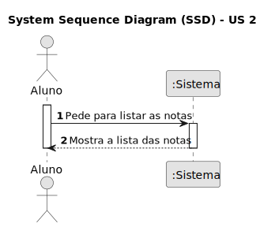
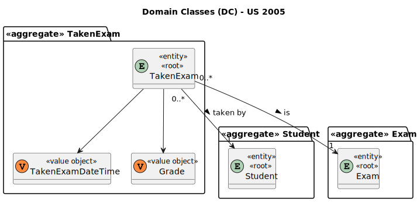
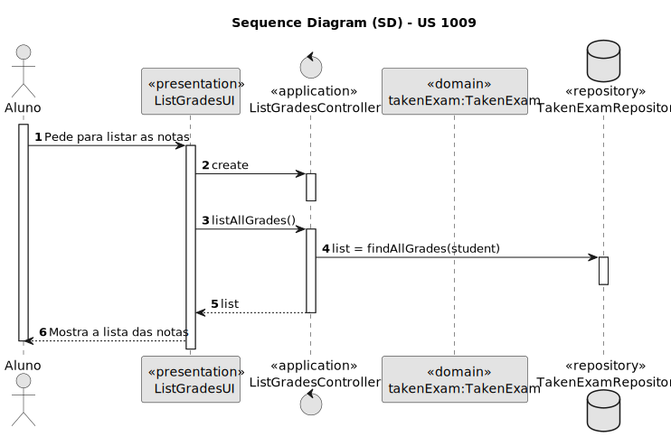
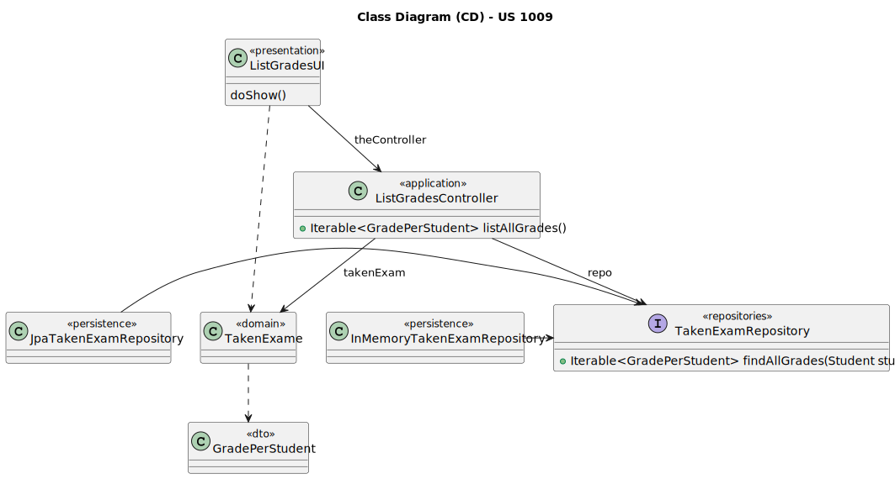

# US 2005

Este documento contém a documentação relativa à US 2005.

## 1. Contexto

Esta *User Story (US)* foi introduzida neste *sprint* para ser desenvolvida seguindo as boas práticas de engenharia de
*software*.
Esta *US* faz parte da disciplina de **EAPLI**.

## 2. Requisitos

**US 2005** - As Student, I want to view a list of my grades

A respeito deste requisito, entendemos que o estudante deve conseguir ver a lista das suas notas.

### 2.1. Dependências encontradas

- **US 2004** - As Student, I want to take an exam.

**Explicação:** Esta *US* complementa a atual *US* a ser tratada devido a que os exames precisam 
de ser realizados para poder listar as notas.

### 2.2. Critérios de aceitação
 

## 3. Análise

### 3.1. Respostas do cliente
.Não foi necessário questionar o cliente em função da realização desta User Story (US).

### 3.2. Diagrama de Sequência do Sistema

### 3.3. Classes de Domínio

## 4. Design

### 4.1. Diagrama de Sequência

### 4.2. Diagrama de Classes

### 4.3. Padrões Aplicados

|                            Questão: Que classe...                             |                Resposta                 | Padrão               |                                                             Justificação                                                              |
|:-----------------------------------------------------------------------------:|:---------------------------------------:|----------------------|:-------------------------------------------------------------------------------------------------------------------------------------:|
|                 é responsável por interagir com o utilizador?                 |              ListGradesUI               | *Pure Fabrication*   |                     Não há razão para atribuir esta responsabilidade a uma classe presente no Modelo de Domínio.                      |
|                 é responsável por coordenar a funcionalidade?                 |          ListGradesController           | *Controller*         |                                                                                                                                       |
|             é responsável por criar todas as classes Repository?              |            RepositoryFactory            | *Factory*            |                            Quando uma entidade é demasiado complexa, as fábricas fornecem encapsulamento.                             |
|                       conhece todas as notas do aluno?                        |           TakenExamRepository           | *Information Expert* |                 Dado que é responsável pela persistência/reconstrução do *TakenExam*, conhece todos os seus detalhes.                 |

### 4.4. Testes

## 5. Implementação

## 5.1. Arquitetura em Camadas
### Domínio

Na camada de domínio criou-se a entidade *TakenExame* e os respetivos *Value* *Objects*. 

### Aplicação

Na camada de aplicação criou-se o controller *ListGradesController*. Também utilizou-se o serviço *ListGradesService*.

### Repositório

Na camada de repositório foi utilizada a interface *TakenExamRepository* que é implementada 
em *JPA* e *InMemory* no módulo de *impl*.

### Apresentação

Nesta camada foi desenvolvida a *ListGradesUI* que faz a interação entre o aluno e o sistema e permite listar as notas de um aluno.

## 5.2. Commits Relevantes

[Listagem dos Commits realizados](https://github.com/Departamento-de-Engenharia-Informatica/sem4pi-22-23-20/issues/46)

## 6. Integração/Demonstração

* No menu de Aluno foi adicionado no sub-menu **Exame** a opção *View a list of my grade*.

## 7. Observações

* Não existem observações relevantes a acrescentar.