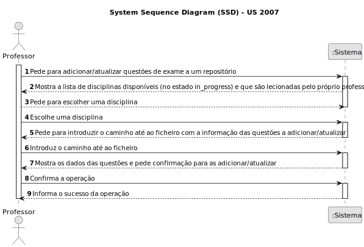
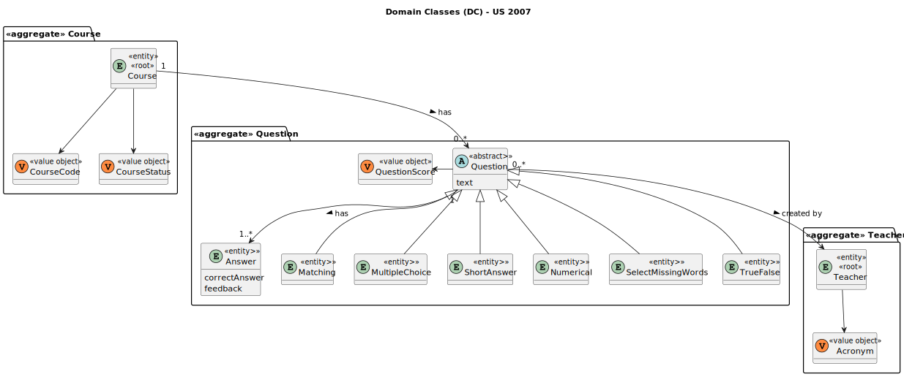
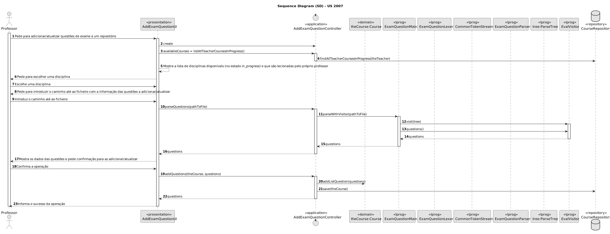
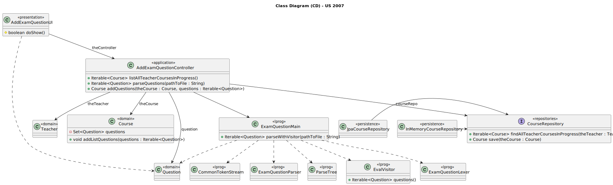

# US 2007

Este documento contém a documentação relativa à US 2007.

## 1. Contexto

Esta *User Story (US)* foi introduzida no *sprint* anterior para ser especificada uma gramática que possa validar vários 
tipos de exames. Neste sprint é necessário conectar a *US* ao restante projeto seguindo as boas práticas de engenharia de 
*software*.
Esta *US* faz parte da disciplina de **LPROG** e **EAPLI**.

## 2. Requisitos

**US 2007** - As Teacher I want to add/update exam questions to a repository of exam questions to be used in automatic
formative exams

A respeito deste requisito, entendemos que um professor pode criar/atualizar questões de exame a um repositório para uma dada
disciplina, para serem utilizadas nos exames formativos automáticos.

### 2.1. Complementos encontrados

- **US 2008** - As Teacher, I want to create/update automatic formative exams.

  **Explicação:** A *US 2008* irá complementar a *US* da documentação atual, pois utilizará as questões criadas/atualizadas 
do repositório para criar os exames formativos automáticos.

### 2.2. Dependências encontradas

Não existem dependências encontradas.

### 2.3 Critérios de aceitação

**CA 1:** This includes only the specification of single questions to be used only in automatic formative exams, not on
regular exams.
The support for exams (its design, feedback and grading) must follow specific technical requirements, specified in LPROG.
The ANTLR tool should be used (https://www.antlr.org/).

## 3. Análise

### 3.1. Respostas do cliente

Não foi necessário questionar o cliente em função da realização desta *User Story (US)*.

### 3.2. Diagrama de Sequência do Sistema

### 3.3. Classes de Domínio

## 4. Design

### 4.1. Diagrama de Sequência

### 4.2. Diagrama de Classes

### 4.3. Padrões Aplicados
|                               Questão: Que classe...                                |                                          Resposta                                          | Padrão               |                                                                Justificação                                                                 |
|:-----------------------------------------------------------------------------------:|:------------------------------------------------------------------------------------------:|----------------------|:-------------------------------------------------------------------------------------------------------------------------------------------:|
|                    é responsável por interagir com o utilizador?                    |                                     AddExamQuestionUI                                      | *Pure Fabrication*   |                        Não há razão para atribuir esta responsabilidade a uma classe presente no Modelo de Domínio.                         |
|                    é responsável por coordenar a funcionalidade?                    |                                 AddExamQuestionController                                  | *Controller*         |                                                                                                                                             |
|                é responsável por criar todas as classes Repository?                 |                                     RepositoryFactory                                      | *Factory*            |                               Quando uma entidade é demasiado complexa, as fábricas fornecem encapsulamento.                                |
| é responsável por persistir as questões criadas/atualizadas de um determinado curso |                                      CourseRepository                                      | *Repository*         | Quando se pretende ocultar os detalhes de persistência/reconstrução de objetos cria-se uma classe Repository responsável por essas tarefas. |
|               é responsável por saber todos os dados de uma questão?                | Question, Matching, MultipleChoice, ShortAnswer, Numerical, SelectMissingWords e TrueFalse | *Information Expert* |                                             Sabe toda a informação dos dados que lhe pertencem.                                             |
|            é responsável por saber a resposta e feedback de uma questão?            |                                           Answer                                           | *Information Expert* |                                             Sabe toda a informação dos dados que lhe pertencem.                                             |

### 4.4. Testes

## 5. Implementação

### 5.1. Gramática

Para visualizar a grámatica desenvolvida, clique [aqui](../../../antlr4/ExamQuestion.g4)

## 5.2. Arquitetura em Camadas
### Domínio

Na camada de domínio utilizou-se a entidade abstrata *Question* e os respetivos *Value* *Objects*. Além disso utilizou-se 
as entidades *Matching*, *MultipleChoice*, *ShortAnswer*, *Numerical*, *SelectMissingWords* e *TrueFalse* que extendem da 
entidade *Question*. Além disso, utilizaram-se as entidades *Teacher* e *Course*.

### Aplicação

Na camada de aplicação criou-se o controller *AddExamQuestionController*.

### Repositório

Na camada de repositório utilizou-se a interface *CourseRepository* que é implementada em *JPA* e *InMemory* no módulo 
de *impl*.

### Apresentação

Nesta camada foi desenvolvida a *AddExamQuestionUI* que faz a interação entre o professor e o sistema. Aqui é possível 
adicionar/atualizar questões de exame ao repositório.

## 5.3. Commits Relevantes

[Listagem dos Commits realizados](https://github.com/Departamento-de-Engenharia-Informatica/sem4pi-22-23-20/issues/55)

## 6. Integração/Demonstração

No menu de professor foi adicionado no sub-menu **Exams** a opção *Add/update exam questions to a repository*.

## 7. Observações

No *sprint* anterior, desenvolvemos a gramática necessária para a *US* e, neste sprint, realizámos algumas melhorias com 
base no *feedback* do professor de *LPROG*. Além disso, integramos esta funcionalidade ao resto do projeto.
