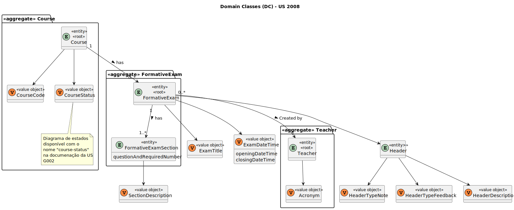

# US 2008

Este documento contém a documentação relativa à *US* 2008.

## 1. Contexto

Esta *User Story (US)* foi introduzida neste *sprint* para ser desenvolvida seguindo as boas práticas de engenharia de
*software*.
Esta *US* faz parte das disciplinas de **LPROG e EAPLI**.

## 2. Requisitos

**US 2008** - As Teacher, I want to create/update automatic formative exams.

A respeito deste requisito, entendemos que um professor pode criar/atualizar um exame formativo para uma dada 
disciplina, em que este exame poderá ser respondido pelos alunos.

### 2.1. Complementos encontrados

- **US 2009** - As Student, I want to take an automatic formative exam
  
    **Explicação:** A *US 2009* irá complementar a *US* da documentação atual, pois torna possível ao aluno responder a 
    um exame formativo criado por um professor nesta presente funcionalidade.

### 2.2. Dependências encontradas

- **US 2007** - As Teacher I want to add/update exam questions to a repository of exam questions to be used in automatic 
formative exams

    **Explicação:** Para que seja possível criar um exame formativo, é necessário que existam questões disponíveis no 
    repositório de questões, para serem apresentadas ao aluno aquando do pedido para responder ao exame formativo.

### 2.3. Critérios de aceitação

- **CA 1:** O exame formativo deve seguir obrigatóriamente a gramática que será criada, para poder ser criado.
- **CA 2:** Não pode ser criado um exame formativo caso alguma das quantidades requeridas de algum tipo de questão, não 
exista no repositório de questões. Deve ser tomado em consideração que as questões de um exame devem ser todas 
diferentes.
- **CA 3:** Apenas é possível criar exames formativos para disciplinas em progresso.
- **CA 4:** O professor apenas pode criar exames formativos para as disciplinas que leciona.

## 3. Análise

### 3.1. Respostas do cliente

Não foi necessário questionar o cliente em função da realização desta *User Story*.

### 3.2. Diagrama de Sequência do Sistema


### 3.3. Classes de Domínio



## 4. Design

### 4.1. Diagrama de Sequência


### 4.2. Diagrama de Classes


### 4.3. Padrões Aplicados

|                                                    Questão: Que classe...                                                     |                Resposta                 | Padrão                                               |                                                                                   Justificação                                                                                   |
|:-----------------------------------------------------------------------------------------------------------------------------:|:---------------------------------------:|------------------------------------------------------|:--------------------------------------------------------------------------------------------------------------------------------------------------------------------------------:|
|                                         é responsável por interagir com o utilizador?                                         |     CreateAutomaticFormativeExamsUI     | *Pure Fabrication*                                   |                                           Não há razão para atribuir esta responsabilidade a uma classe presente no Modelo de Domínio.                                           |
|                                              é responsável por coordenar a *US*?                                              | CreateAutomaticFormativeExamsController | *Controller*                                         |                                                                                                                                                                                  |
|                                     é responsável por criar todas as classes Repository?                                      |            RepositoryFactory            | *Factory*                                            |                                                  Quando uma entidade é demasiado complexa, as fábricas fornecem encapsulamento.                                                  |
|                é responsável por saber todos os cursos em atividade que são lecionados por um dado professor?                 |            CourseRepository             | *Pure Fabrication* e *Information Expert*            |                           Não há razão para atribuir esta responsabilidade a uma classe existente. Sabe toda a informação dos dados que lhe pertencem.                           |
|                    é responsável por saber fazer o parse do ficheiro com os dados para o exame formativo?                     |            FormativeExamMain            | *Pure Fabrication*                                   |                                           Não há razão para atribuir esta responsabilidade a uma classe presente no Modelo de Domínio                                            |
|                   é responsável por saber se existem questões suficientes para construir o exame formativo?                   |           QuestionRepository            | *Pure Fabrication*  e *Information Expert*           |                           Não há razão para atribuir esta responsabilidade a uma classe existente. Sabe toda a informação dos dados que lhe pertencem.                           |
| é responsável por pedir para o repositório de questões validar se existe o número de questões necessárias para um dados tipo? |          FormativeExamService           | *Pure Fabrication* *Single Responsibility Principle* | É mais fácil colocarmos esta responsabilidade num só lado para mantermos o código "limpo" e não correr o risco de ser necessário alterar algo em várias partes do nosso sistema. |
|                             é responsável por saber a que disciplina pertence o exame formativo?                              |                 Course                  | *Information Expert*                                 |                                                               Sabe toda a informação dos dados que lhe pertencem.                                                                |
|                         é responsável por guardar os dados da disciplina com o novo exame formativo?                          |            CourseRepository             | *Pure Fabrication* e *Information Expert*            |                                                               Sabe toda a informação dos dados que lhe pertencem.                                                                |

### 4.4. Testes

**Teste 1:** Verifica que não é possível criar uma instância da classe FormativeExam com valores nulos.
```
@Test
public void ensureFormativeExamNullIsNotAllowed() {
    assertThrows(IllegalArgumentException.class, () -> new FormativeExam(null, null, null));
}
````

**Teste 2:** Verifica que um exame formativo tem de possuir um título.
```
@Test
void ensureFormativeExamHasTitle() {
    assertThrows(IllegalArgumentException.class, () -> new FormativeExam(null, DATE_TIME, HEADER));
}
````

**Teste 3:** Verifica que um exame formativo tem de possuir uma data de abertura e fecho.
```
@Test
void ensureFormativeExamHasDateTime() {
    assertThrows(IllegalArgumentException.class, () -> new FormativeExam(TITLE, null, HEADER));
}
````

**Teste 4:** Verifica que um exame formativo tem de possuir um cabeçalho.
```
@Test
void ensureFormativeExamHasHeader() {
    assertThrows(IllegalArgumentException.class, () -> new FormativeExam(TITLE, DATE_TIME, null));
}
````

**Teste 5:** Garante que não pode ser adicionada uma secção com valor nulo.
```
@Test
void ensureCannotAddNullSectionToFormativeExam() {
    final FormativeExam subject = buildFormativeExam();
    assertThrows(IllegalArgumentException.class, () -> subject.addFormativeExamSection(null));
}
```

**Teste 6:** Garante que uma secção é adicionada com sucesso ao exame formativo.
```
@Test
void ensureSuccessfulAddSectionToFormativeExam() {
    final FormativeExam subject = buildFormativeExam();
    subject.addFormativeExamSection(this.SECTION);
}
```

**Teste 7:** Verifica que não é possível juntar dois exames formativos caso seja passado um exame formativo por 
parâmetro com valor nulo.
```
@Test
void ensureFormativeExamToMergeCannotBeNull() {
    final FormativeExam subject = buildFormativeExam();
    assertThrows(IllegalArgumentException.class, () -> subject.merge(null));
}
```

**Teste 8:** Verifica que é possível juntar dois exames formativos com sucesso.
```
@Test
void ensureFormativeExamIsSuccessfulMerged() {
    final FormativeExam subject = buildFormativeExam();

    // Novo exame formativo
    ExamDateTime dateTime = ExamDateTime.valueOf(buildDateTime(3000, 1, 31, 8, 30),
            buildDateTime(3001, 2, 25, 22, 55));

    Header header = new HeaderBuilder().withDescription("Primeiro exame sobre programação")
            .withTypeNote("after-closing").withTypeFeedback("on-submission").build();

    final FormativeExam expected = new FormativeExam(TITLE, dateTime, header);
    expected.addFormativeExamSection(SECTION);
    FormativeExamSection newSection = new FormativeExamSectionBuilder().withDescription("Secção sobre programação").
            withQuestionAndRequiredNumber(Pair.of("True/False", 2)).build();
    expected.addFormativeExamSection(newSection);
    // --------------------

    subject.merge(expected);

    assertTrue(subject.sameAs(expected));
}
```

## 5. Implementação

### 5.1. Gramática

Para visualizar a gramática desenvolvida, clique [aqui](../../../antlr4/FormativeExam.g4).

## 5.2. Arquitetura em Camadas
### Domínio

Na camada de domínio utilizaram-se as entidades *FormativeExam* e *FormativeExamSection* com os respetivos *value 
objects*. Além disso, utilizaram-se as entidades *Teacher* e *Course*.

### Aplicação

Na camada de aplicação criou-se o controller *CreateAutomaticFormativeExamsController*. Também criou-se e utilizou-se o
serviço *FormativeExamService*.

### Repositório

Na camada de repositório foram utilizadas as *interfaces* *CourseRepository* e *QuestionRepository* que são 
implementadas em *JPA* e *InMemory* no módulo de *impl*.

### Apresentação

Nesta camada foi desenvolvida a *CreateAutomaticFormativeExamsUI* que faz a interação entre o professor e o sistema e 
permite fazer a criação de um exame formativo automático, através da importação de dados de um ficheiro.

## 5.2. Commits Relevantes

[Listagem dos Commits realizados](https://github.com/Departamento-de-Engenharia-Informatica/sem4pi-22-23-20/issues/56)

## 6. Integração/Demonstração

* No menu de professor foi adicionado no sub-menu **exams** a opção *Create/update automatic formative exam*.

## 7. Observações

* Não existem observações relevantes a acrescentar.
