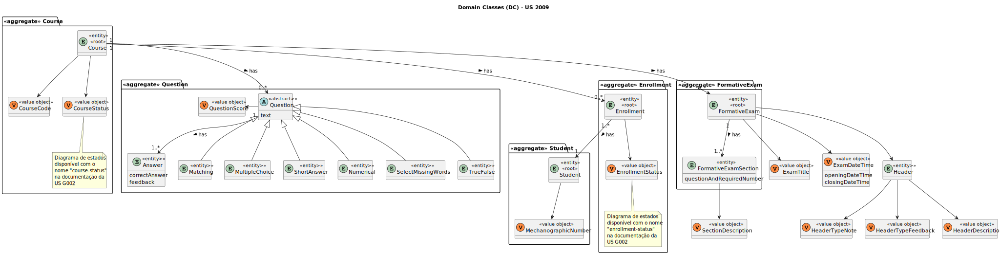
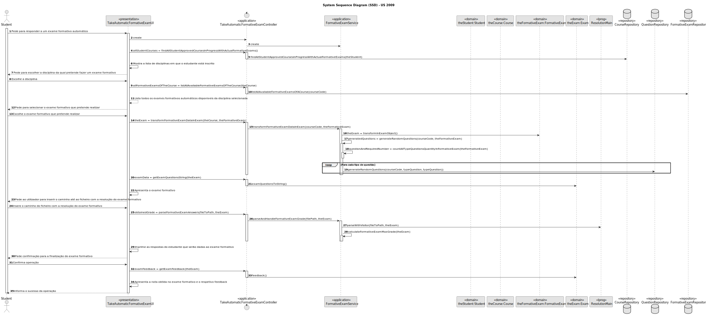
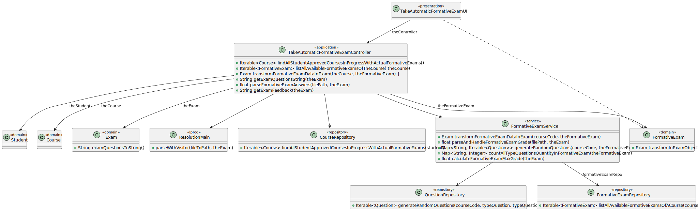

# US 2009

Este documento contém a documentação relativa à *US* 2009.

## 1. Contexto

Esta *User Story (US)* foi introduzida neste *sprint* para ser desenvolvida seguindo as boas práticas de engenharia de
*software*.
Esta *US* faz parte das disciplinas de **LPROG e EAPLI**.

## 2. Requisitos

**US 2009** - As Student, I want to take an automatic formative exam.

A respeito deste requisito, entendemos que um estudante poderá realizar um exame formativo automático para uma dada 
disciplina, em que este exame foi criado préviamente por um professor.

### 2.1. Complementos encontrados

Não existem *User Stories* complementares.

### 2.2. Dependências encontradas

- **US 2008** - As Teacher, I want to create/update automatic formative exams.
    
    **Explicação:** É necessário que exista algum exame formativo automático criado, para que seja possível proceder à 
    sua resolução.

### 2.3. Critérios de aceitação

- **CA 1:** As perguntas de um exame formativo devem ser geradas aleatóriamente em cada pedido de resposta ao exame, em
que estas perguntas são baseadas na base de dados de questões e nas especificações do exame.
- **CA 2:** No final do exame, o sistema deve mostrar o *feedback* e o resultado obtido no exame.
- **CA 3:** O *feedback* e a nota do exame deve ser calculada automáticamente por um *parser* baseado na gramática 
definida para a estrutura dos exames.
- **CA 4:** Não devem ser apresentadas questões repetidas no mesmo exame formativo.

## 3. Análise

### 3.1. Respostas do cliente

Não foi necessário questionar o cliente em função da realização desta *User Story*.

### 3.2. Diagrama de Sequência do Sistema


### 3.3. Classes de Domínio



## 4. Design

### 4.1. Diagrama de Sequência



### 4.2. Diagrama de Classes



### 4.3. Padrões Aplicados

|                                                         Questão: Que classe...                                                          |               Resposta               | Padrão                                                 | Justificação                                                                                                                                                                                                                |
|:---------------------------------------------------------------------------------------------------------------------------------------:|:------------------------------------:|--------------------------------------------------------|-----------------------------------------------------------------------------------------------------------------------------------------------------------------------------------------------------------------------------|
|                                              é responsável por interagir com o utilizador?                                              |     TakeAutomaticFormativeExamUI     | *Pure Fabrication*                                     | Não há razão para atribuir esta responsabilidade a uma classe presente no Modelo de Domínio.                                                                                                                                |
|                                                   é responsável por coordenar a *US*?                                                   | TakeAutomaticFormativeExamController | *Controller*                                           |                                                                                                                                                                                                                             |
|                                   é responsável por saber representar os dados de um exame formativo?                                   |            FormativeExam             | *Information Expert*                                   | Sabe toda a informação dos dados que lhe pertencem.                                                                                                                                                                         |
|                                é responsável por saber representar um exame para o estudante responder?                                 |                 Exam                 | *Information Expert*                                   | Sabe como representar um exame.                                                                                                                                                                                             |
|                              é responsável por fornecer serviços necessários em função do exame formativo?                              |         FormativeExamService         | *Pure Fabrication*                                     | Não há razão para atribuir esta responsabilidade a uma classe presente no Modelo de Domínio.                                                                                                                                |
|                                          é responsável por criar todas as classes Repository?                                           |          RepositoryFactory           | *Factory*                                              | Quando uma entidade é demasiado complexa, as fábricas fornecem encapsulamento.                                                                                                                                              |
| é responsável por saber todas as disciplinas que se encontram em progresso e com exame(s) formativo(s), e em que o aluno está inscrito? |           CourseRepository           | *Pure Fabrication* e *Information Expert*              | Não há razão para atribuir esta responsabilidade a uma classe existente. Dado que é responsável pela persistência/reconstrução do *Course*, conhece todos os seus detalhes.                                                 |
|                             é responsável por conhecer todos os exames formativos disponíveis de um curso?                              |       FormativeExamRepository        | *Pure Fabrication* e *Information Expert*              | Não há razão para atribuir esta responsabilidade a uma classe existente. Dado que é responsável pela persistência/reconstrução do *FormativeExam*, conhece todos os seus detalhes.                                          |
|                                     é responsável por saber todas as questões existentes (criadas)?                                     |          QuestionRepository          | *Pure Fabrication* e *Information Expert*              | Não há razão para atribuir esta responsabilidade a uma classe existente. Dado que é responsável pela persistência/reconstrução do *Question*, conhece todos os seus detalhes.                                               |
|         é responsável por saber fazer o parse do ficheiro com os dados escritos pelo aluno, para responder ao exame formativo?          |            ResolutionMain            | *Pure Fabrication*                                     | Não há razão para atribuir esta responsabilidade a uma classe presente no domínio                                                                                                                                           |
|                             é responsável por saber transformar o exame formativo num objeto do tipo Exam?                              |            FormativeExam             | *Information Expert*                                   | Sabe toda a informação dos dados que lhe pertencem.                                                                                                                                                                         |
|                       é responsável por saber quantas questões de cada tipo devem ser trazidas da base de dados?                        |         FormativeExamService         | *Pure Fabrication* e *Single Responsibility Principle* | É mais fácil colocarmos esta responsabilidade num só lado para mantermos o código "limpo" e não correr o risco de ser necessário alterar algo em várias partes do nosso sistema.                                            |
|                                      é responsável por calcular a nota obtida no exame formativo?                                       |         FormativeExamService         | *Pure Fabrication*                                     | Visto que o exame formativo utiliza um objeto Exam para ser representado, temos de delegar a funcionalidade de realizar os cálculos necessários para obter uma nota fiável, em concordância com o exame normal, ao serviço. |

### 4.4. Testes

*Teste 1*: Garante que um exame formativo tem a data válida.
```
@Test
void ensureFormativeExamDateIsValid() {
final FormativeExam subject = buildFormativeExam();
    assertTrue(subject.validAnswerFormativeExamDate(buildDateTime(2021, 6, 16, 0, 0)));
}
```

*Teste 2:* Garante que um exame formativo não tem a data válida.
```
@Test
void ensureFormativeExamDateIsNotValid() {
    final FormativeExam subject = buildFormativeExam();
    assertFalse(subject.validAnswerFormativeExamDate(buildDateTime(3000, 8, 15, 0, 0)));
}
```

**Teste 3:** Garante que um exame formativo é transformado com sucesso num objeto do tipo exame.
```
@Test
void ensureFormativeExamIsSuccessfulTransformedInExam() {
final FormativeExam formativeExam = buildFormativeExam();
Exam subject = formativeExam.transformInExamObject();
    Exam expected = new ExamBuilder().withTitle(this.TITLE.toString()).withDateTime(OPENING_DATE, CLOSE_DATE)
            .withHeader(this.HEADER).buildWithoutCheckScore();
  
    assertEquals(expected.title(), subject.title());
    assertEquals(expected.header(), subject.header());
}
```

*Teste 4:* Garante que as secções de um exame formativo são devolvidas com sucesso.
```
@Test
void ensureExamFormativeSectionsAreReturnedCorrectly() {
    final FormativeExam subject = buildFormativeExam();
    FormativeExamSection newSection = new FormativeExamSectionBuilder().withDescription("Secção sobre programação").
    withQuestionAndRequiredNumber(Pair.of("True/False", 2)).build();
    subject.addFormativeExamSection(newSection);

    List<FormativeExamSection> expectedList = new ArrayList<>();
    expectedList.add(this.SECTION);
    expectedList.add(newSection);

    List<FormativeExamSection> formativeExamSections = subject.formativeExamSections();

    int expectedSize = expectedList.size();
    assertEquals(expectedSize, formativeExamSections.size());

    for (int i = 0; i < expectedSize; i++) {
        assertTrue(formativeExamSections.get(i).sameAs(expectedList.get(i)));
    }
}
```

*Teste 5:* Garante que uma secção de um exame tem as questões esperadas.
```
@Test
void ensureExamSectionHasExpectedQuestions() {
final ExamSection subject = buildExamSection();
    List<Question> expected = new ArrayList<>();
    expected.add(new ShortAnswer("Em que ano nasceu Cristiano Ronaldo?", QuestionScore.valueOf(10F),
            new Answer("1985", "Cristiano Ronaldo nasceu em 1985 na Madeira")));

    assertEquals(expected, subject.questions());
}
```

*Teste 6:* Garante que a descrição de uma secção de um exame formativo é devolvida com sucesso
```
@Test
void ensureFormativeExamSectionDescriptionIsCorrectlyReturned() {
assertEquals(this.DESCRIPTION, this.buildFormativeExamSection().sectionDescription());
}
```

*Teste 7:* Garante que uma secção de um exame formativo tem o tipo de perguntas e número necessário esperado.
```
@Test
void ensureFormativeExamSectionHasExpectedQuestionAndRequiredNumber() {
final FormativeExamSection subject = buildFormativeExamSection();
    Map<String, Integer> expected = new HashMap<>();
    expected.put("Numerical", 1);

    assertEquals(expected, subject.questionAndRequiredNumbers());
}
```

*Teste 8:* Garante que uma questão é adicionada com sucesso.
```
@Test
void ensureExamSectionQuestionIsAddedWithSuccess() {
ExamSection subject = this.buildExamSection();
Question question = new Numerical("Quanto é 1 + 1?", QuestionScore.valueOf(2.0F),
new Answer("2.0", "É resposta direta!"), 0.0f);
subject.addQuestion(question);
}
```

*Teste 9:* Garante que não pode ser adicionada uma questão com valor nulo.
```
@Test
void ensureExamSecionQuestionCannotBeNull() {
    ExamSection subject = this.buildExamSection();
    assertThrows(IllegalArgumentException.class, () -> subject.addQuestion(null));
}
```

*Teste 10:* Garante que uma secção é adicionada com sucesso.
```
@Test
void ensureExamSectionIsAddedWithSuccess() {
Exam subject = this.buildExam();
ExamSection section = new ExamSection(new SectionDescription("Esta é uma secção para teste."));
subject.addSection(section);
}
```

*Teste 11:* Garante que não pode ser adicionada uma secção com valor nulo.
```
@Test
void ensureExamSectionCannotBeNull() {
    Exam subject = this.buildExam();
    assertThrows(IllegalArgumentException.class, () -> subject.addSection(null));
}
```

*Teste 12:* Garante que o exame é impresso corretamente para o aluno poder ver as suas questões e responder a  este 
mesmo exame.
```
@Test
void ensureExamIsCorrectlyPrintToStudentAnswerItQuestions() {
    String expected = "Title: " + this.TITLE.toString()
    + "\nSection description: Secção sobre golos\n"
    + "Short Answer\n" + "Em que ano nasceu Cristiano Ronaldo?\n\n"
    + "\n";

    Exam subject = this.buildExam();
    String result = subject.examQuestionsToString();

    assertEquals(expected, result);
}
```

*Teste 13:* Garante que o *feedback* do exame é impresso corretamente.
```
@Test
void ensureExamFeedbackIsCorrectlyPrinted() {
    String expected = "Section description: Secção sobre golos\n"
    + "Question: Em que ano nasceu Cristiano Ronaldo?\nFeedback: Cristiano Ronaldo nasceu em 1985 na " +
    "Madeira\n\n";

    Exam subject = this.buildExam();
    String result = subject.feedback();

    assertEquals(expected, result);
}
```

*Teste 14:* Garante que as secções de um exame são devolvidas corretamente.
```
@Test
void ensureExamSectionsAreCorrectlyReturned() {
    List<ExamSection> expectedSections = new ArrayList<>();
    expectedSections.add(this.SECTION);
    Exam subject = this.buildExam();
    List<ExamSection> resultSections = subject.sections();

    assertEquals(expectedSections.size(), resultSections.size());

    for (int i = 0; i < expectedSections.size(); i++) {
        assertEquals(expectedSections.get(i), resultSections.get(i));
    }
}
```

## 5. Implementação
## 5.1. Arquitetura em Camadas
### Domínio

Na camada de domínio utilizou-se a entidade Student ,Exam e Course que já tinham sido criadas por outras User Storie (US) e FormativeExam.

### Aplicação

Na camada de aplicação criou-se o controller TakeAutomaticFormativeExamController.

### Repositório

Na camada de repositório utilizou-se a interface CourseRepository, CourseRepository e FormativeExamRepository que sã0 implementadad em JPA e InMemory no módulo de impl.

### Apresentação

Nesta camada foi desenvolvida a TakeAutomaticFormativeExamUI que faz a interação entre o utilizador (aluno) e o sistema. 

## 5.2. Commits Relevantes

[Listagem dos Commits realizados](https://github.com/Departamento-de-Engenharia-Informatica/sem4pi-22-23-20/issues/48)

## 6. Integração/Demonstração

* No menu de aluno foi adicionado no sub-menu *Exam* a opção *Take automatic formative exam*.

## 7. Observações

* Não existem observações relevantes a acrescentar.
