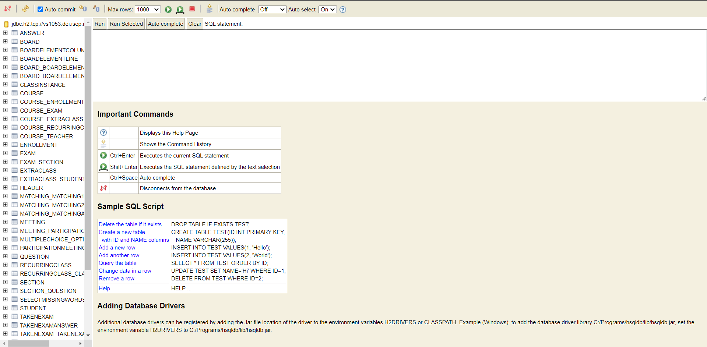

# US 3001

Este documento contém a documentação relativa à *US* 3001.

## 1. Contexto

Esta *User Story (US)* foi introduzida neste *sprint* para ser desenvolvida seguindo as boas práticas de engenharia de
*software*.
Esta *US* faz parte da disciplina de **RCOMP**.

## 2. Requisitos

**US 3001** - As Project Manager, I want the team to prepare the communication infrastruture for the Shared Boards and 
the depoyment of the solution.

### 2.1 Critérios de aceitação

- **CA 1:** Os requisitos presentes neste [ficheiro](./RCOMP-2022-2023-integrative-project-application-protocol.pdf) 
devem ser todos seguidos e cumpridos.
- **CA 2:** A solução a desenvolver deve seguir uma arquitetura cliente-servidor.
- **CA 3:** A solução deve ser implantada utilizando vários nodes de rede, em que um deve conter a base de dados 
relacional e outro a aplicação servidora.
- **CA 4:** A aplicação cliente não pode aceder diretamente a base de dados relacional, apenas pode aceder a aplicação
servidora.

## 3. Implementação da infraestrutura para as Shared Boards

### 3.1 Descrição
A descrição da implementação realizada encontra-se descrita num documento, em que este contém informação sobre o 
protocolo de RCOMP para a implementação da Shared Board Application, e pode ser visualizado 
[aqui](./RCOMP-2022-2023-integrative-project-application-protocol.pdf).

### 3.2 Aplicação servidora

A aplicação servidora, tem um *socket* sempre a escutar novas conexões que possam ser feitas. Sempre que é feita uma 
conexão com o servidor a partir de uma nova aplicação cliente, é criada uma *Thread* que fica responsável por atender 
aos próximos pedidos que serão feitos pelo cliente agora conectado ao servidor, e específicamente a comunicar com o 
servidor através dessa *Thread* criada.

**Nota:**
Sempre que for necessário criar uma mensagem *SBP*, deve ser criada uma classe no *package* "csvprotocol.server",
em que esta classe será responsável por saber como tratar esse pedido. Depois deve ainda ser adicionado a parte 
necessária na classe *CsvSharedBoardProtocolMessageParser*, para que este pedido seja tratado corretamente.

### 3.3 Aplicação cliente

**Nota:**
Sem que for necessário criar um pedido *SBP*, deve ser adicionada uma nova opção na classe *MainMenu*. Deve também
ser criado um método na classe *CsvSharedBoardProtocolProxy* responsável por enviar e receber esse pedido e 
tratá-lo da forma correta. Na class *MarshlerUnmarshler* é onde é feito o parse da resposta recebida, em que esta foi 
enviada pela aplicação servidora.

## 4. Deploy da solução da infraestrutura para as Shared Boards

A solução desenvolvida foi implementada em servidores virtuais do DEI.
Foram criados dois servidores:
- Um para guardar os dados da base de dados H2;
- Outro onde a aplicação servidora se encontra em execução à espera de pedidos dos clientes.

Para a implementação do servidor onde a aplicação servidora se encontra em execução, foi utilizado o *template* número 
57, disponibilizado pelo DEI. Já para o servidor virtual da base de dados H2 foi utilizado o *template* com o número 79.

### 4.1 Servidor virtual com a aplicação servidora

Foi criado um servidor virtual com capacidade para suportar a execução da aplicação servidora requerida.

#### 4.1.1 Visualização da organização do servidor

Como podemos ver na imagem acima, o servidor contém atualmente 3 ficheiros e uma pasta.

#### 4.1.2 Explicação dos ficheiros/pastas presentes no servidor:

##### Pasta target

Nesta pasta estão presentes todos os executáveis necessários para colocar a aplicação servidora em funcionamento.
Esta pasta inclui já inclui todas as dependências requeridas pelo programa. 

---

##### Ficheiro run-sharedboard-daemon.sh

Este executável é responsável por colocar a aplicação em funcionamento, em que o terminal fica sempre a apresentar as 
mensagens de log do servidor. Nesta versão do executável, o terminal deixa de poder ser utilizado, pois fica limitado à
apresentação dos logs.

---

##### Ficheiro run-sharedboard-daemon-in-background.sh

Já este executável é responsável por colocar a aplicação em funcionamento, mas com a particularidade em que esta a 
aplicação é corrida em *background*, deixando assim a linha de comandos livre para que seja possível continuar a 
utilizar o servidor para outros fins que sejam necessários. 
Contudo, é razoável saber o que acontece nesta aplicação, para serem detetadas possíveis falhas ou acontecimentos não 
esperados. Este conhecimento vem através dos logs efetuados pela aplicação. Então, desta forma, quando a aplicação é 
colocada em execução, é configurado para que os logs desta mesma aplicação sejam redirecionados e colocados para o 
ficheiro log.log. Desta forma, os logs não são perdidos e é possível continuar a utilizar a linha de comandos do 
servidor.
Outra particularidade é que é utilizado o comando *nohup* para que a aplicação continue a ser executada mesmo após 
ser efetuado o logout da conexão ssh com o servidor.

---

##### Ficheiro log.log

Este ficheiro é responsável por guardar os logs feitos pela aplicação servidora em execução.

#### 4.1.3 Implementação da configuração da comunicação entre o servidor e o cliente

**Aplicação servidora**

A **aplicação servidora** encontra-se configurada para ser iniciada e acessível pela porta número 23 em produção, e na 
porta 8890 enquanto está em desenvolvimento. Esta configuração encontra-se descrita num ficheiro de configuração.

Como é possível visualizar pela imagem acima, existem as 2 configurações, uma para quando estamos em ambiente de 
desenvolvimento e outra para quando a aplicação está em produção no servidor. A configuração adequada deve ser utilizada.

Para mudar entre configurações, basta comentar a que não queremos e descomentar a que queremos.

---

**Aplicação cliente**

A **aplicação cliente** encontra-se configurada para aceder ao servidor pelo seu endereço e pela porta configurada. 
Estas configurações encontram-se também num ficheiro de configurações, como é possível visualizar pela imagem seguinte.

Aqui, podemos observar que, a aplicação em ambiente de desenvolvimento deve ser executada localmente, e para isso existe
a configuração adequada indicando um endereço e porta local. Em ambiente de produção deve ser utilizada a outra
configuração em que temos o endereço do servidor virtual criado, vs1051.dei.isep.ipp.pt, e a porta em que devemos aceder 
(porta número 23).

Para mudar entre configurações, basta comentar a que não queremos e descomentar a que queremos.

### 4.2 Servidor virtual com a base de dados H2

Foi criado um servidor virtual com capacidade para suportar a execução da base de dados H2 para as aplicações 
desenvolvidas.

#### 4.2.1 Dados sobre a implementação da base de dados no servidor
A base de dados implementada tem o nome de "base".
O acesso a esta aplicação é realizado com os seguintes dados:
- *Driver class*: org.h2.Driver
- *JDBC URL*: jdbc:h2:tcp://vs1053.dei.isep.ipp.pt:1521/base
- *User name*: admin
- *Password*: GreenCode

#### 4.2.2 Configuração da base de dados no projeto

Esta base de dados foi configurada no projeto através da alteração do ficheiro "persistence.xml" presente no package 
base.persistence.impl na pasta "src/main/resources/META-INF".

Para que a base de dados seja gerada no servidor com possíveis alterações, deve ser executado o ficheiro 
run-bootstrap.bat (ou run-boostrap.sh, em sistemas linux/MACos).

Como podemos ver na imagem anterior, existem as duas configurações:
- Configuração para quando o servidor estiver em desenvolvimento;
- Configuração para quando o servidor estiver em produção.

Ao desenvolver novas funcionalidades, deve ser utilizada a configuração de desenvolvimento, para depois realizar os 
testes necessários e não estar a colocar um possível erro na base de dados de produção.

Para trocar entre configurações, basta comentar a que não queremos e descomentar a que queremos.
