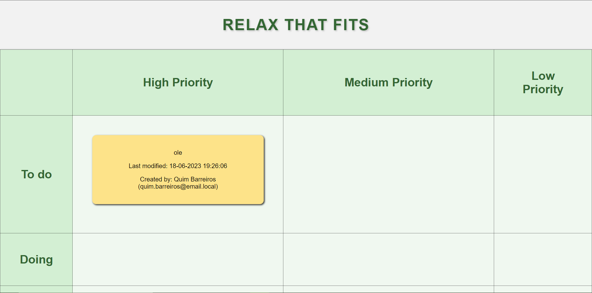
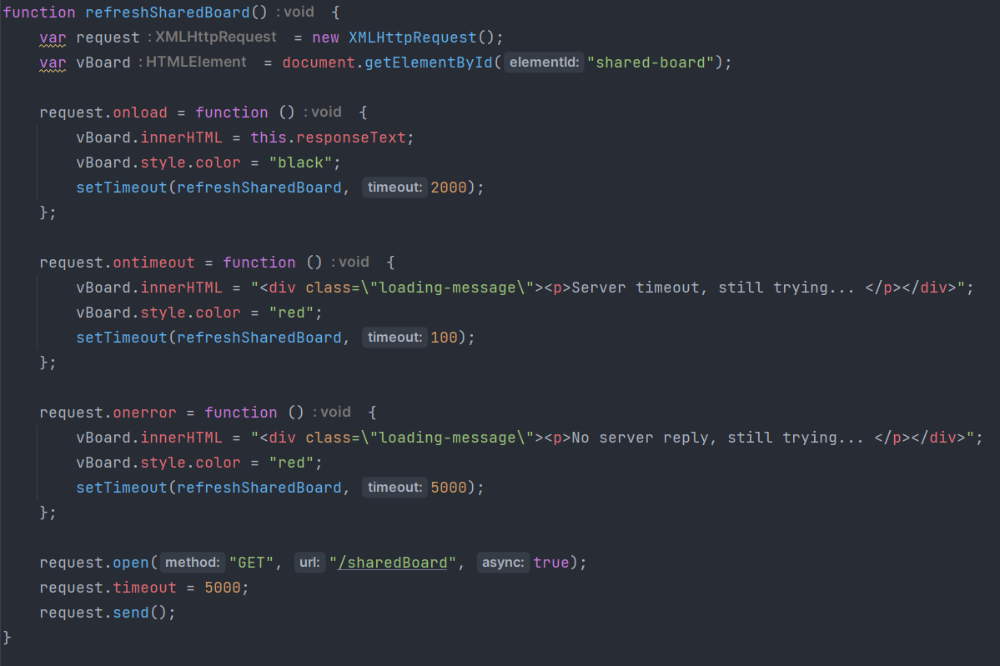
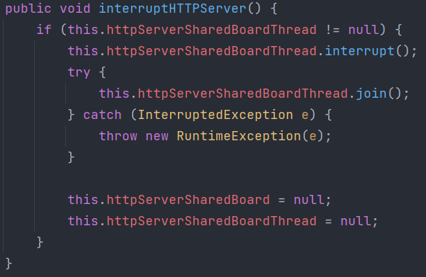
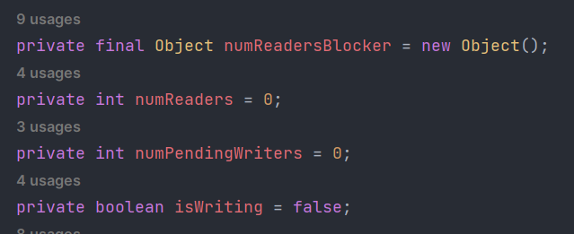
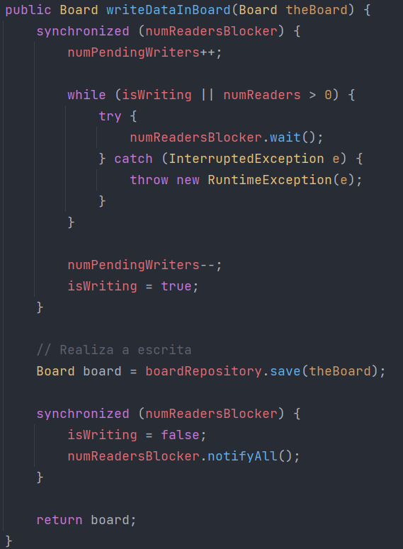
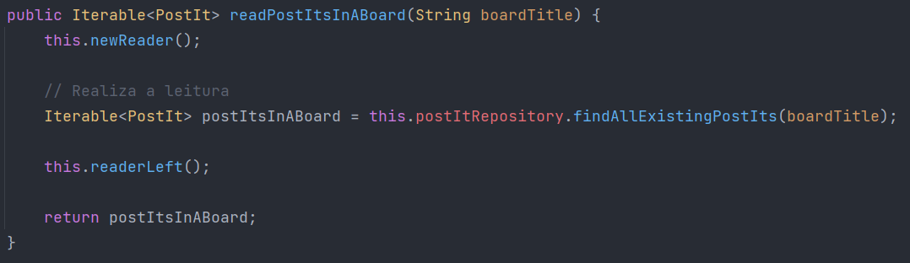

# US 3005

Este documento contém a documentação relativa à *US* 3005.

## 1. Contexto

Esta *User Story (US)* foi introduzida neste *sprint* para ser desenvolvida seguindo as boas práticas de engenharia de
*software*.
Esta *US* faz parte da disciplina de **RCOMP** e de **SCOMP**.

## 2. Requisitos

**US 3005** - As User, I want to view, in real-time, the updates in the shared boards.

### 2.1 Critérios de aceitação

- **CA 1:** Devem ser levados em consideração os problemas de sincronização que podem existir.
- **CA 2:** Como vários cliente irão tentar atualizar as *boards* de forma concorrente, o desenho e a implementação da 
solução devem ser baseadas em Threads, variáveis de condição e *mutexes*.
- **CA 3:** A aplicação cliente deve implementar um servidor HTTP capaz de gerar uma vista das *boards*. Isto deve ser 
feito automáticamente, sem a intervenção dos utilizadores (como por exemplo, sem dar *reload* à página web), utilizando
*AJAX*.

## 3. HTTP Server

Nesta *US* foi implementado um servidor HTTP na aplicação do cliente, que é responsável por receber pedidos AJAX de uma
página *web*. Este servidor, posteriormente realiza pedidos à aplicação servidora para que esta devolva código HTML com
os dados de uma *board*, de forma a que este servidor HTTP atualize a página do utilizador da aplicação cliente.

Todos os ficheiros utilizados para representar a página *web*, encontram-se neste [ficheiro](../../../www)!

### 3.1 Ativação do servidor HTTP

O servidor HTTP é criado assim que o utilizador pede para visualizar os dados de uma dada *board*. O servidor após isto,
cria um *socket* que fica responsável por receber os pedidos AJAX provenientes da página *web*. Este servidor fica em 
execução numa nova *Thread* não afetando o normal funcionamento da aplicação cliente, permitindo que esta seja utilizada
sem qualquer limitação.

### 3.2 HTML e CSS

O servidor HTTP, utiliza HTML e CSS para a construção da página *web*. O HTML é construído de forma dinâmica.

### 3.3 Construção dinâmica do HTML

A página HTML é construída dinâmicamente com informação atualizada referente àquela *board*.

### 3.4 Pedidos AJAX

Os pedidos AJAX são feitos da página *web* para o servidor HTTP através da utilização de JavaScript. Os pedidos são 
feitos de 2 em 2 segundos.

### 3.5 Pedidos ao servidor

Os pedidos AJAX chegam ao servidor HTTP através da utilização de AJAX. Contudo, é preciso que estes pedidos sejam 
tratados. O servidor HTTP envia pedidos à aplicação servidor de forma autónoma, em que estes pedidos são tratados no 
servidor e posteriormente o servidor envia o código HTML representativo da *board* que o cliente se encontra a 
visualizar.

Se um pedido ao servidor falhar, o utilizador não permanece com a página *web* representativa da board, pois isto 
poderia levar a que ele pensasse que estava a visualizar a versão mais atual da *board* e tal não seria verdade.
Para isso, sempre não exista a resposta do servidor, ou algum erro aconteça, é mostrada uma mensagem na página *web* que
informa o acontecimento, como é possível visualizar na imagem seguinte.

O pedido ao servidor que requer informação da *board* representada em HTML é tratado no ficheiro com o nome 
*HTTPBoardPresentationRequest*.

### 3.6 Pedido de visualização de uma *board* diferente

Sempre que o utilizador deseja visualizar uma página *web* com informação acerca de uma *board* diferente da que se 
encontra a visualizar atualmente, a Thread responsável pelo servidor HTTP é interrompida e a aplicação aguarda que esta 
Thread finalize para poder prosseguir, voltando a criar uma nova Thread na mesma porta da anterior, mas agora a mostrar a
informação da *board* agora requerida.

## 4. Threads e sincronização de pedidos

Nesta *US* é implementada a utilização de mais uma Thread, em que esta será responsável por representar o servidor HTTP.
Esta Thread fica a ser executada em background como mencionado no tópico **3.1** deste documento.

Para a sincronização dos pedidos, foi criada uma classe responsável por saber quantos processos estão atualmente a 
ler informação da tabela *Board* da base de dados, ou se algum processo se encontra a escrever nessa mesma tabela 
(operações de update também incluídas). Esta classe sincroniza os acessos à tabela *Board* da base de dados tomando em 
conta os seguintes aspetos:
- Apenas se pode estar a ler ou a escrever na base de dados;
- Apenas um processo de cada vez pode escrever na base de dados;
- Vários processos podem ler simultaneamente da base de dados;
- Sempre que exista um processo à espera de escrever, este tem prioridade sobre novos processos de leitura que possam 
surgir. Os processos que ainda se encontram a ler após a chegada de um processo escritor, terminam de ler até ao final.

Existe a necessidade de sincronizar a leitura e escrita de dados, para evitar que os clientes visualizem dados 
desatualizados apenas porque o pedido de leitura deles "passou por cima" de um pedido de escrita. Também é necessário 
evitar a inconsistência de dados, que podem acontecer quando dois processos tentam escrever dados.

A classe responsável por realizar esta sincronização tem o nome de *ReadWriteBoardsData*.

Foi utilizado um mutex com o nome *numReadersBlocker* para realizar o lock à informação sensível. A informação sensível
é constituída por uma variável responsável por saber quantos processos se encontram atualmente a ler, outra para saber 
quantos processos se encontram à espera de escrever, e outra para saber se algum processo se encontra atualmente a 
escrever.

O método responsável por realizar a escrita de forma sincronizada na tabela *Board*, é o método presente na imagem 
seguinte.

Os dois seguintes métodos são responsáveis por controlar a leitura da tabela *Board* da base de dados. Eles devem ser 
utilizados em pedidos de leitura feitos à base de dados. Como queremos que sejam devolvidos resultados diferentes, estes 
métodos têm a necessidade de ficarem separados para serem reutilizados, em leituras que requerem a devolução de 
informação em diferentes estruturas de dados.

Estes dois métodos devem ser utilizados quando é realizado um pedido de leitura de dados da base de dados, seguindo a
ordem mostrada no exemplo da imagem abaixo.

