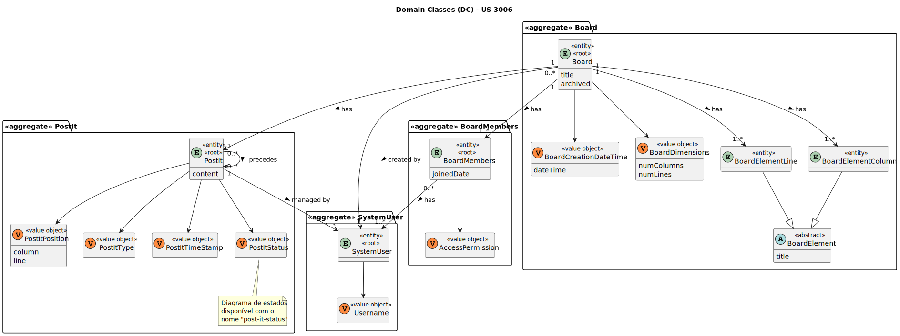

# US 3006

Este documento contém a documentação relativa à US 3006.

## 1. Contexto

Esta *User Story (US)* foi introduzida neste *sprint* para ser desenvolvida seguindo as boas práticas de engenharia de
*software*, além disso o desenho e a implementação da solução devem ser baseados em *threads*, variáveis de condição e
*mutexes*.
Esta *US* faz parte da disciplina de **EAPLI** e **SCOMP**.

## 2. Requisitos

**US 3006** - As User, I want to create a post-it on a board

A respeito deste requisito, entendemos que o utilizador deve selecionar uma das board ativas em que é dono ou contenha
permissões de escrita.

### 2.1. Complementos encontrados

- **US 3007** - As User, I want to change a post-it.

  **Explicação:** Esta *US* complementa a atual *US* a ser tratada devido a que o *post-it* tem o seguinte ciclo de
  vida:
  

  Desta forma podemos observar que, a seguir à criação do *post-it*, é possível removê-lo.

### 2.2. Dependências encontradas

- **US 3002** - As User, I want to create a board.

  **Explicação:** Se não existir uma *board*, não é possível criar um *post-it*.

- **US 3004** - As User, I want to share a board.

  **Explicação:** Se uma *board* não for partilhada, apenas o dono poderá criar um *post-it*.

### 2.3. Critérios de aceitação

**CA 1:** This functional part of the system has very specific technical requirements, particularly some concerns about
synchronization problems.
In fact, several clients will try to concurrently update boards.
As such, the solution design and implementation must be based on threads, condition variables and mutexes. Specific
requirements will be provided in SCOMP.
**CA 2:** Apenas é possível criar um *post-it* numa board ativa em que é utilizador é dono ou contenha permissões de
escrita.
**CA 3:** A posição inicial de um *post-it* deve estar dentro dos limites da *board*.

## 3. Análise

### 3.1. Respostas do cliente

Não foi necessário questionar o cliente em função da realização desta *User Story (US)*.

### 3.2. Diagrama de Sequência do Sistema


### 3.3. Classes de Domínio



## 4. Design

### 4.1. Diagrama de Sequência


### 4.2. Diagrama de Classes


### 4.3. Padrões Aplicados

|                      Questão: Que classe...                       |        Resposta        | Padrão               |                                               Justificação                                               |
|:-----------------------------------------------------------------:|:----------------------:|----------------------|:--------------------------------------------------------------------------------------------------------:|
|           é responsável por interagir com o utilizador?           |     CreatePostItUI     | *Pure Fabrication*   |       Não há razão para atribuir esta responsabilidade a uma classe presente no Modelo de Domínio        |
|                é responsável por coordenar a *US*?                | CreatePostItController | *Controller*         |                                                                                                          |
|       é responsável por criar todas as classes Repository?        |   RepositoryFactory    | *Factory*            |              Quando uma entidade é demasiado complexa, as fábricas fornecem encapsulamento.              |
|         é responsável por guardar um post-it numa board?          |    BoardRepository     | *Information Expert* |                         É responsável pela persistência/reconstrução do *Board*.                         |
| é responsável por saber representar todos os dados de uma board?  |         Board          | *Information Expert* |                           Sabe toda a informação dos dados que lhe pertencem.                            |
| é responsável por saber representar todos os dados de um post-it? |         PostIt         | *Information Expert* |                           Sabe toda a informação dos dados que lhe pertencem.                            |
|        é responsável por saber criar uma instância PostIt?        |     PostItBuilder      | *Creator*            | É mais fácil atribuir essa tarefa a uma classe específica sendo mais fácil de realizar a sua manutenção. |

### 4.4. Testes

**Teste 1:** Verificar que não é possível criar uma instância da classe *PostIt* com valores nulos.

```
@Test
public void ensurePostItNullIsNotAllowed() {
    assertThrows(IllegalArgumentException.class, () -> new PostItBuilder().with(null, 0, 0, null, null));
}
```

**Teste 2:** Verifica que um *post-it* tem de possuir um conteúdo.

```
@Test
void ensurePostItHasContent() {
    assertThrows(IllegalArgumentException.class, () -> new PostItBuilder().with(null, LINE, COLUMN, TYPE, null).build());
}
```

**Teste 3:** Verifica que um *post-it* tem de possuir uma linha válida.

```
@Test
void ensurePostItHasValidLine() {
    assertThrows(IllegalArgumentException.class, () -> new PostItBuilder().with(CONTENT, -1, COLUMN, TYPE, CREATOR).build());
}
```

**Teste 4:** Verifica que um *post-it* tem de possuir uma coluna válida.

```
@Test
void ensurePostItHasValidColumn() {
    assertThrows(IllegalArgumentException.class, () -> new PostItBuilder().with(CONTENT, LINE, -1, TYPE, CREATOR).build());
}
```

**Teste 5:** Verifica que um *post-it* tem de possuir um tipo.

```
@Test
void ensurePostItHasType() {
    assertThrows(IllegalArgumentException.class, () -> new PostItBuilder().with(CONTENT, LINE, COLUMN, null, CREATOR).build());
}
````

**Teste 6:** Verifica que um *post-it* tem de possuir um criador.

```
@Test
void ensurePostItHasCreator() {
    assertThrows(IllegalArgumentException.class, () -> new PostItBuilder().with(CONTENT, LINE, COLUMN, TYPE, null).build());
}
````

**Teste 7:** Verifica que não é possível adicionar um *post-it* à board fora dos limites da board.

```
@Test
void ensureIsNotPossibleAddPostItTheBoardOutsideTheBoardLimits() {
    final Board subject = buildBoard();

    assertThrows(IllegalArgumentException.class, () -> subject.addPostIt(new PostItBuilder().withContent("Criar power point")
            .withPosition(25, 2)
            .withType(PostItType.IMAGE)
            .withCreator(UserBuilderHelper.builder().with("luisa", "Password1",
                    "Luísa", "Sobral", "luisa@gmail.com").build()).build()));
}
```

## 5. Implementação

## 5.1. Arquitetura em Camadas

### Domínio

Na camada de domínio criou-se a entidade *PostIT* e os respetivos *Value Objects*, que são: *PostItTimeStamp*,
*PostItPosition*,
*PostItType* e *PostItStatus*.
Utilizou-se também a entidade *Board* e os respetivos *Value Objects* desenvolvidos noutra *US*.

### Aplicação

Na camada de aplicação criou-se o controller *CreatePostItController*.

### Repositório

Na camada de repositório foi utilizada a *interface* *BoardRepository* que é implementada em *JPA* e *InMemory*
no módulo de *impl*.

### Apresentação

Nesta camada foi desenvolvida a *CreatePostItUI* que faz a interação entre o utilizador (gerente, professor e aluno)
e o sistema. Aqui é possível criar um *post-it* num quadro *(board)*.

## 5.2. Commits Relevantes

[Listagem dos Commits realizados](https://github.com/Departamento-de-Engenharia-Informatica/sem4pi-22-23-20/issues/40)

## 6. Integração/Demonstração

No menu da aplicação cliente foi adicionado a opção *Create a post-it on a board*.

## 7. Observações

Não existem observações relevantes a acrescentar.