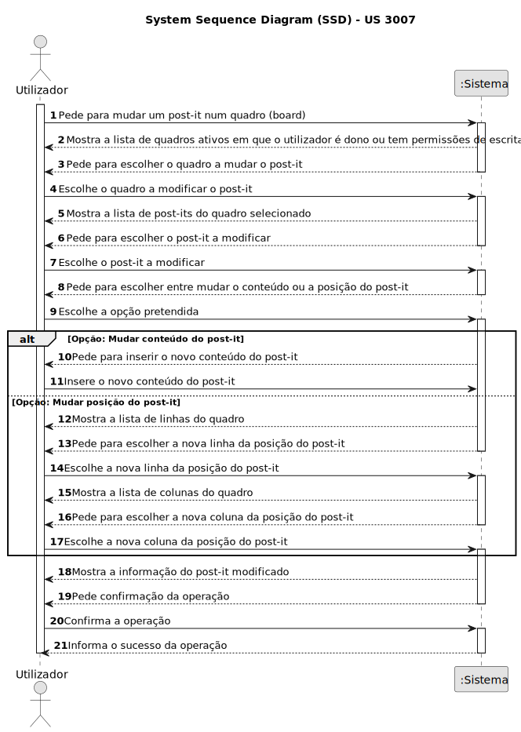
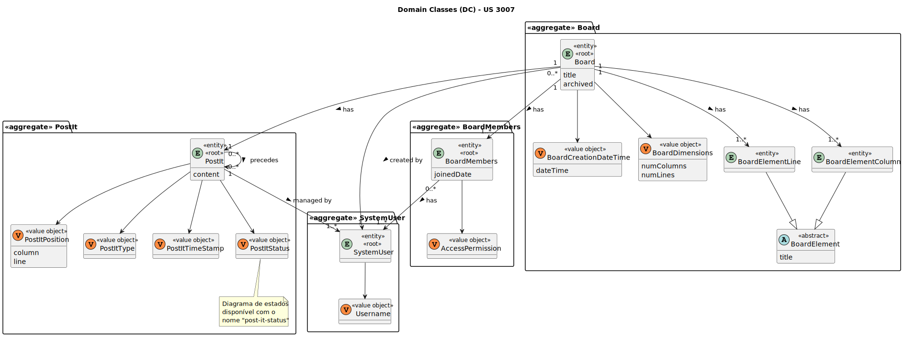
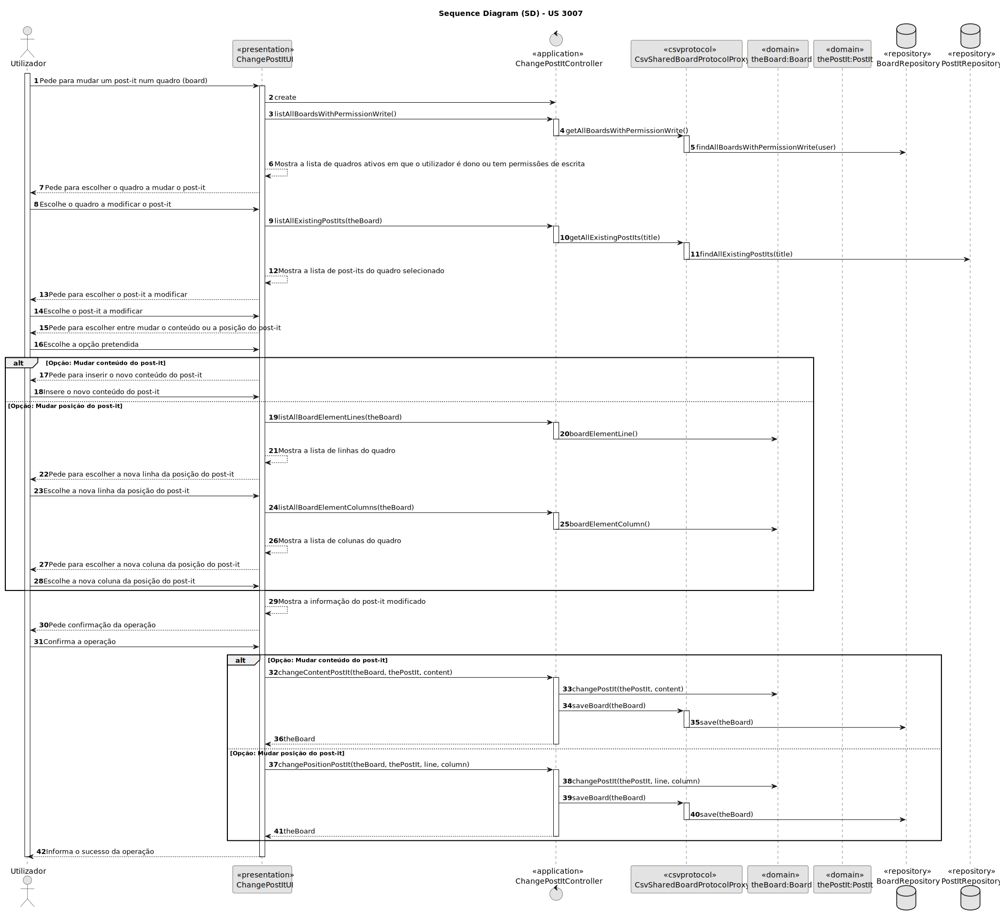
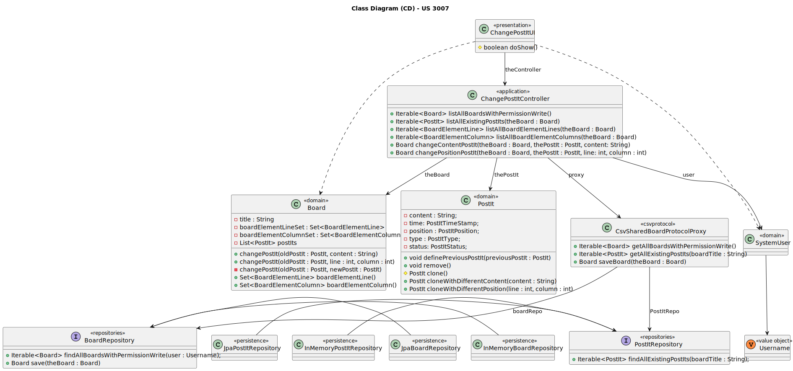

# US 3007

Este documento contém a documentação relativa à US 3007.

## 1. Contexto

Esta *User Story (US)* foi introduzida neste *sprint* para ser desenvolvida seguindo as boas práticas de engenharia de
*software*, além disso o desenho e a implementação da solução devem ser baseados em *threads*, variáveis de condição e
mutexes.
Esta *US* faz parte da disciplina de **EAPLI** e **SCOMP**.

## 2. Requisitos

**US 3007** - As User, I want to change a post-it

A respeito deste requisito, entendemos que o utilizador deve selecionar uma das *board* ativas em que é dono ou contenha
permissões de escrita para selecionar um dos *post-its* que pretende mudar.

### 2.1. Complementos encontrados

Não existem *User Stories* complementares.

### 2.2. Dependências encontradas

- **US 3002** - As User, I want to create a board.

  **Explicação:** Se não existir uma *post-it*, não é possível mudá-lo.

### 2.3. Critérios de aceitação

**CA 1:** This functional part of the system has very specific technical requirements, particularly some concerns about
synchronization problems.
In fact, several clients will try to concurrently update boards.
As such, the solution design and implementation must be based on threads, condition variables and mutexes. Specific
requirements will be provided in SCOMP.

## 3. Análise

### 3.1. Respostas do cliente

> **Questão:** "Perante a US3007, o cliente pretende que seja disponibilizada a função de alterar o conteúdo de uma
> célula, a função de trocar o conteúdo de uma célula com o conteúdo de outra ou, ambas as opções?"
>
>**Resposta:** "...remeto para o seguinte texto da especificação: "The user who created a post in a cell can change that
> post. It may change its contents or move the post into a free cell.""

### 3.2. Diagrama de Sequência do Sistema



### 3.3. Classes de Domínio



## 4. Design

### 4.1. Diagrama de Sequência



### 4.2. Diagrama de Classes



### 4.3. Padrões Aplicados

|                                                 Questão: Que classe...                                                 |        Resposta        | Padrão               |                                        Justificação                                         |
|:----------------------------------------------------------------------------------------------------------------------:|:----------------------:|----------------------|:-------------------------------------------------------------------------------------------:|
|                                     é responsável por interagir com o utilizador?                                      |     ChangePostItUI     | *Pure Fabrication*   | Não há razão para atribuir esta responsabilidade a uma classe presente no Modelo de Domínio |
|                                          é responsável por coordenar a *US*?                                           | ChangePostItController | *Controller*         |                                                                                             |
|                                  é responsável por criar todas as classes Repository?                                  |   RepositoryFactory    | *Factory*            |       Quando uma entidade é demasiado complexa, as fábricas fornecem encapsulamento.        |
|                             é responsável por guardar um mudança de um post-it numa board?                             |    BoardRepository     | *Information Expert* |                  É responsável pela persistência/reconstrução do *Board*.                   |
| é responsável por saber representar todos os dados de uma board e saber todo o histórico de atualizações dos post-its? |         Board          | *Information Expert* |                     Sabe toda a informação dos dados que lhe pertencem.                     |
|                           é responsável por saber representar todos os dados de um post-it?                            |         PostIt         | *Information Expert* |                     Sabe toda a informação dos dados que lhe pertencem.                     |

### 4.4. Testes

**Teste 1:** *Verifica que um post-it é clonado com sucesso para um conteúdo diferente*

```
@Test
void ensurePostItIsClonedWithDifferentContent() {
    final PostIt subject = buildPostIt();

    assertEquals("Fazer a sopa", subject.cloneWithDifferentContent("Fazer a sopa").content());
}
```

**Teste 2:** *Verifica que um post-it é clonado com sucesso para uma linha diferente*

```
@Test
void ensurePostItIsClonedWithDifferentLine() {
    final PostIt subject = buildPostIt();

    assertEquals(10, subject.cloneWithDifferentPosition(10, 2).line());
}
```

**Teste 3:** *Verifica que um post-it é clonado com sucesso para uma coluna diferente*

```
@Test
void ensurePostItIsClonedWithDifferentColumn() {
    final PostIt subject = buildPostIt();

    assertEquals(3, subject.cloneWithDifferentPosition(5, 3).column());
}
```

## 5. Implementação

## 5.1. Arquitetura em Camadas

### Domínio

Na camada de domínio utilizou-se a entidade *PostIT* e *Board* e os respetivos *value objects* desenvolvidos noutra
*US*.

### Aplicação

Na camada de aplicação criou-se o controller *ChangePostItController*.

### Repositório

Na camada de repositório foi utilizada a *interface* *BoardRepository* que é implementada em *JPA* e *InMemory*
no módulo de *impl*.

### Apresentação

Nesta camada foi desenvolvida a *ChangePostItUI* que faz a interação entre o utilizador (gerente, professor e aluno)
e o sistema. Aqui é possível mudar o conteúdo ou posição de um *post-it* num quadro *(board)*.

## 5.2. Commits Relevantes

[Listagem dos Commits realizados](https://github.com/Departamento-de-Engenharia-Informatica/sem4pi-22-23-20/issues/41)

## 6. Integração/Demonstração

No menu da aplicação cliente foi adicionado a opção *Change a post-it on a board*.

## 7. Observações

Quando é mudado o contéudo ou a posição a um *post-it* é criada uma nova instância do *post-it* anterior com a
informação pretendida mudada, sendo que o *post-it* mudado é colocado no estado "removido". Este mecanismo é utilizado
para existir um histórico de todas as atualizações na *board*.