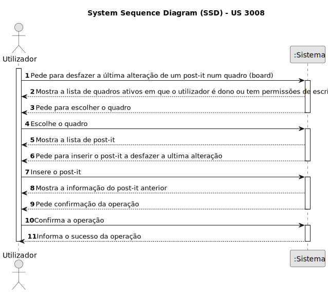
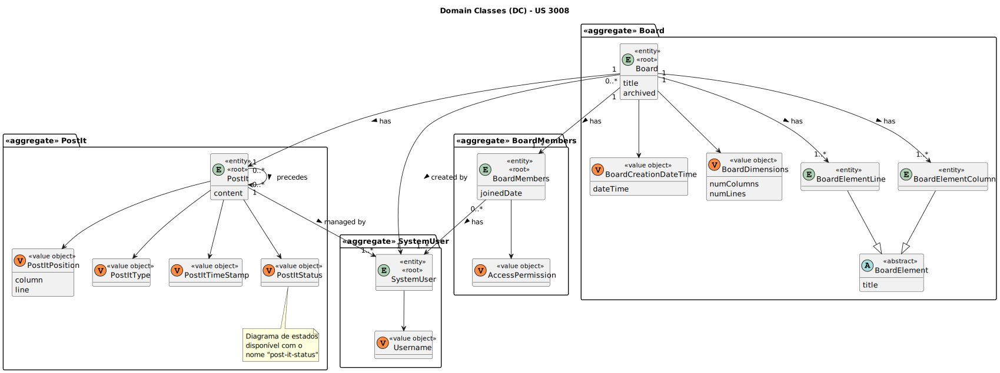
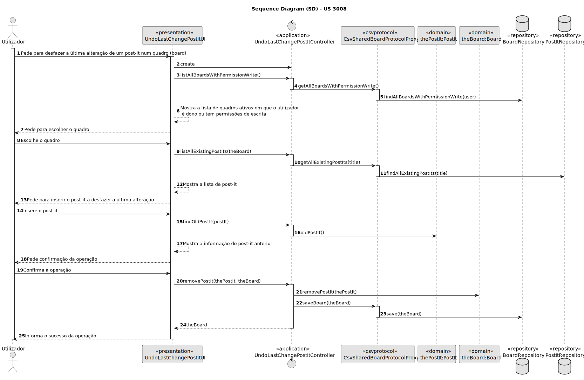
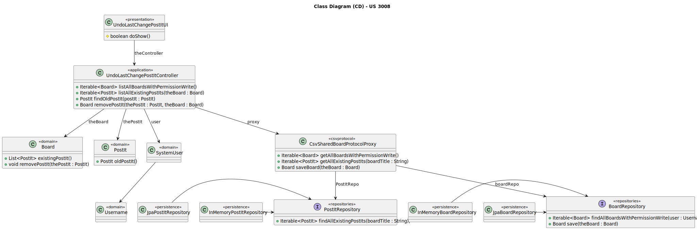

# US 3008

Este documento contém a documentação relativa à US 3008.

## 1. Contexto

Esta *User Story (US)* foi introduzida neste *sprint* para ser desenvolvida seguindo as boas práticas de engenharia de
*software*, além disso o desenho e a implementação da solução devem ser baseados em *threads*, variáveis de condição e
*mutexes*.
Esta *US* faz parte da disciplina de **EAPLI** e **SCOMP**.

## 2. Requisitos

**US 3008** - As User, I want to undo the last change in a post-it

A respeito deste requisito, entendemos que o utilizador deve selecionar uma post-it e desfazer a última alteração.

### 2.1. Complementos encontrados

### 2.2. Dependências encontradas

- **US 3006**  - As User, I want to create a post-it on a board

**Explicação:** Para esta *US* funcionar é necessário existir um post-it.

- **US 3007** - As User, I want to change a post-it

**Explicação:** Para esta *US* funcionar é necessário haver uma versão anterior.

### 2.3. Critérios de aceitação

**CA 1:** This functional part of the system has very specific technical requirements, particularly some concerns about
synchronization problems.
In fact, several clients will try to concurrently update boards.
As such, the solution design and implementation must be based on threads, condition variables and mutexes. Specific
requirements will be provided in SCOMP.

## 3. Análise

### 3.1. Respostas do cliente

Não foi necessário questionar o cliente em função da realização desta *User Story (US)*.

### 3.2. Diagrama de Sequência do Sistema

### 3.3. Classes de Domínio

## 4. Design

### 4.1. Diagrama de Sequência

### 4.2. Diagrama de Classes

### 4.3. Padrões Aplicados

|                      Questão: Que classe...                       |            Resposta            |        Padrão        |                                        Justificação                                         |
|:-----------------------------------------------------------------:|:------------------------------:|:--------------------:|:-------------------------------------------------------------------------------------------:|
|           é responsável por interagir com o utilizador?           |     UndoLastChangePostItUI     |  *Pure Fabrication*  | Não há razão para atribuir esta responsabilidade a uma classe presente no Modelo de Domínio |
|                é responsável por coordenar a *US*?                | UndoLastChangePostItController |     *Controller*     |                                                                                             |
|       é responsável por criar todas as classes Repository?        |       RepositoryFactory        |      *Factory*       |       Quando uma entidade é demasiado complexa, as fábricas fornecem encapsulamento.        |
|         é responsável por guardar um post-it numa board?          |        BoardRepository         | *Information Expert* |                  É responsável pela persistência/reconstrução do *Board*.                   |
| é responsável por saber representar todos os dados de uma board?  |             Board              | *Information Expert* |                     Sabe toda a informação dos dados que lhe pertencem.                     |
| é responsável por saber representar todos os dados de um post-it? |             PostIt             | *Information Expert* |                     Sabe toda a informação dos dados que lhe pertencem.                     |

### 4.4. Testes

## 5. Implementação

## 5.1. Arquitetura em Camadas

### Domínio

Na camada de domínio criou-se a entidade *PostIT* e os respetivos *Value Objects* desenvolvidos noutra *US*.

Utilizou-se também a entidade *Board* e os respetivos *Value Objects* desenvolvidos noutra *US*.

### Aplicação

Na camada de aplicação criou-se o controller *UndoLastChangePostItController*.

### Repositório

Na camada de repositório foi utilizada a *interface* *BoardRepository* e a *PostItRepository* que é implementada em
*JPA* e *InMemory* no módulo de *impl*.

### Apresentação

Nesta camada foi desenvolvida a *UndoLastChangePostItUI* que faz a interação entre o utilizador e o sistema.
Aqui é possível recuperar a última alteração de um *post-it* num quadro *(board)*.

## 5.2. Commits Relevantes

[Listagem dos Commits realizados](https://github.com/Departamento-de-Engenharia-Informatica/sem4pi-22-23-20/issues/42)

## 6. Integração/Demonstração

No menu da aplicação cliente foi adicionado a opção *Undo the last change in a post-it*.

## 7. Observações

Não existem observações relevantes a acrescentar.