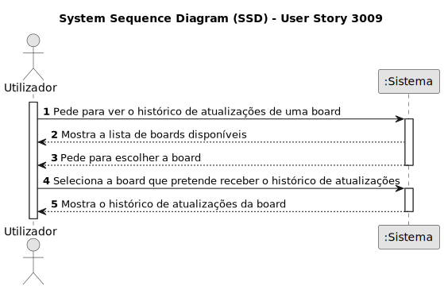
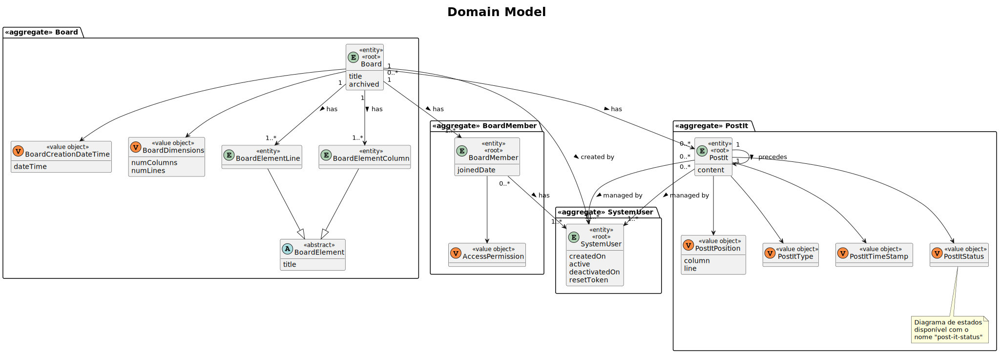
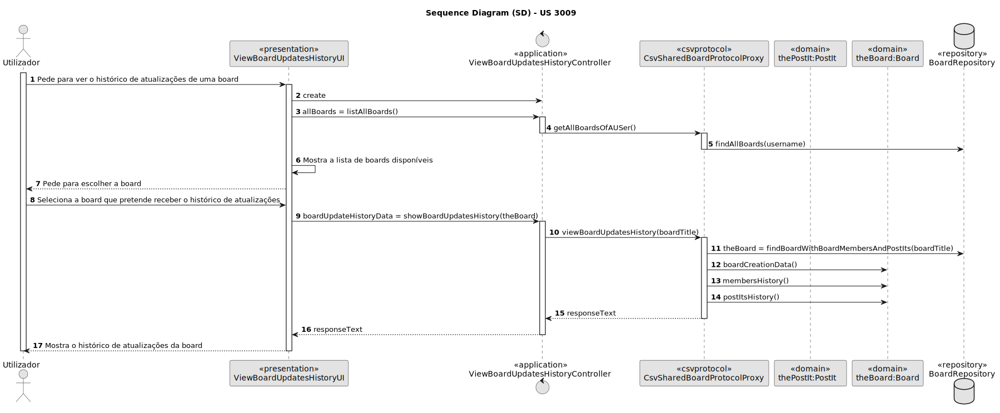
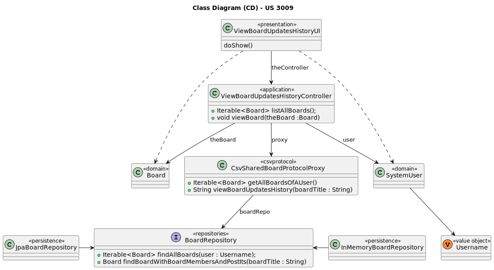

# US 3009

Este documento contém a documentação relativa à US 3009.

## 1. Contexto

Esta *User Story (US)* foi introduzida neste *sprint* para ser desenvolvida seguindo as boas práticas de engenharia de
*software*, além disso o desenho e a implementação da solução devem ser baseados em *threads*, variáveis de condição e
*mutexes*.
Esta *US* faz parte da disciplina de **EAPLI** e **SCOMP**.

## 2. Requisitos

**US 3009** - As User, I want to view the history of updates on a board.

A respeito deste requisito, entendemos que o utilizador pretende ver o histórico de atualizações numa board. Para isso,
este deve de selecionar qual é a board da qual pretende receber esse mesmo histórico.

### 2.1. Complementos encontrados

- Não foram encontrados complementos para esta *User Storie*.

### 2.2. Dependências encontradas

- **US 3006** - As User, I want to create a post-it on a board.

A respeito deste requisito entedemos que não conseguimos aceder ao histórico de atualiações de uma board, se esta não
tiver *post-its*.

- **US 3004** - As User, I want to share a board

A respeito deste requisisto entedemos que não conseguimos aceder ao histórico de atualizações de uma board, se esta não
tiver membros.

### 2.3. Critérios de aceitação

**CA 1:** Esta parte funcional do sistema tem requisitos técnicos muito específicos, particularmente algumas 
preocupações sobre problemas de sincronização.
Na verdade, vários clientes tentarão atualizar as placas simultaneamente. Como tal, o desenho e a implementação da 
solução devem ser baseados em threads, variáveis de condição e mutexes. Requisitos específicos serão fornecidos de SCOMP.

**CA 2:** Apenas é possível ver o histórico de atualizações de uma board havendo post-its ou membros.

## 3. Análise

### 3.1. Respostas do cliente

Não foi necessário questionar o cliente em função da realização desta *User Story (US)*.

### 3.2. Diagrama de Sequência do Sistema

### 3.3. Classes de Domínio

## 4. Design

### 4.1. Diagrama de Sequência

### 4.2. Diagrama de Classes

### 4.3. Padrões Aplicados

|                           Questão: Que classe...                            |             Resposta              | Padrão               |                                        Justificação                                         |
|:---------------------------------------------------------------------------:|:---------------------------------:|----------------------|:-------------------------------------------------------------------------------------------:|
|                é responsável por interagir com o utilizador?                |     ViewBoardUpdatesHistoryUI     | *Pure Fabrication*   | Não há razão para atribuir esta responsabilidade a uma classe presente no Modelo de Domínio |
|                     é responsável por coordenar a *US*?                     | ViewBoardUpdatesHistoryController | *Controller*         |                                                                                             |
|            é responsável por criar todas as classes Repository?             |         RepositoryFactory         | *Factory*            |       Quando uma entidade é demasiado complexa, as fábricas fornecem encapsulamento.        |
|                 é responsável por conhecer todas as boards?                 |          BoardRepository          | *Information Expert* |                  É responsável pela persistência/reconstrução do *Board*.                   |
|           é responsável por saber todo o histórico de uma board?            |               Board               | *Information Expert* |                     Sabe toda a informação dos dados que lhe pertencem.                     |
|      é responsável por saber representar todos os dados de um post-it?      |              PostIt               | *Information Expert* |                     Sabe toda a informação dos dados que lhe pertencem.                     |
| é responsável por saber representar todos os dados de um elemento da board? |           BoardMembers            | *Information Expert* |                     Sabe toda a informação dos dados que lhe pertencem.                     |

### 4.4. Testes

## 5. Implementação

## 5.1. Arquitetura em Camadas

### Domínio

Na camada de domínio utilizou-se a entidade *Board*, *PostIt* e *BoardMembers* e os respetivos *Value Objects* 
desenvolvidos noutra *US*.

### Aplicação

Na camada de aplicação criou-se o controller *ViewBoardUpdatesHistoryController*.

### Repositório

Na camada de repositório foi utilizada a *interface* *BoardRepository* que é implementada em *JPA* e *InMemory*
no módulo de *impl*.

### Apresentação

Nesta camada foi desenvolvida a *ViewBoardUpdatesHistoryUI* que faz a interação entre o utilizador (gerente, professor e aluno)
e o sistema.

## 5.2. Commits Relevantes

[Listagem dos Commits realizados](https://github.com/Departamento-de-Engenharia-Informatica/sem4pi-22-23-20/issues/43)

## 6. Integração/Demonstração

No menu da aplicação cliente foi adicionado a opção *View board updates history*.

## 7. Observações

Não existem observações relevantes a acrescentar.