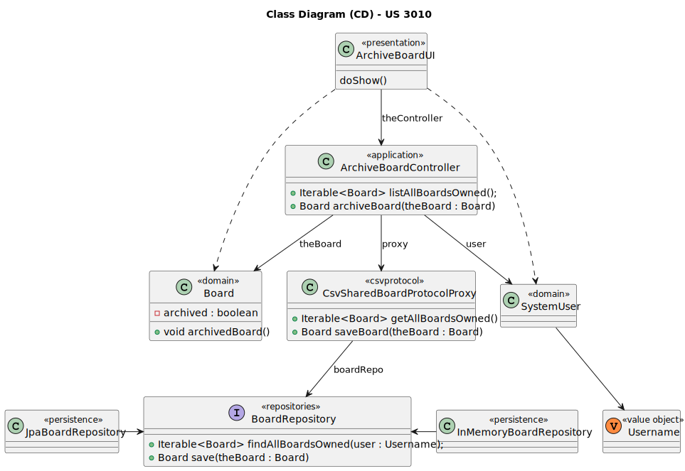

# US 3010

Este documento contém a documentação relativa à US 3010.

## 1. Contexto

Esta *User Story (US)* foi introduzida neste *sprint* para ser desenvolvida seguindo as boas práticas de engenharia de
*software*, além disso o desenho e a implementação da solução devem ser baseados em *threads*, variáveis de condição e
mutexes.
Esta *US* faz parte da disciplina de **EAPLI** e **SCOMP**.

## 2. Requisitos

**US 3010** - As User, I want to archive a board I own

A respeito deste requisito, entendemos que o utilizador deve selecionar uma das board ativas em que é dono para
arquivá-la.

### 2.1. Complementos encontrados

Não existem *User Stories* complementares.

### 2.2. Dependências encontradas

- **US 3002** - As User, I want to create a board.

  **Explicação:** Se não existir uma *board*, não é possível arquivá-la.

### 2.3. Critérios de aceitação

**CA 1:** This functional part of the system has very specific technical requirements, particularly some concerns about
synchronization problems.
In fact, several clients will try to concurrently update boards.
As such, the solution design and implementation must be based on threads, condition variables and mutexes. Specific
requirements will be provided in SCOMP.

## 3. Análise

### 3.1. Respostas do cliente

Não foi necessário questionar o cliente em função da realização desta *User Story (US)*.

### 3.2. Diagrama de Sequência do Sistema


### 3.3. Classes de Domínio


## 4. Design

### 4.1. Diagrama de Sequência


### 4.2. Diagrama de Classes



### 4.3. Padrões Aplicados

|                         Questão: Que classe...                          |        Resposta        | Padrão               |                                           Justificação                                            |
|:-----------------------------------------------------------------------:|:----------------------:|----------------------|:-------------------------------------------------------------------------------------------------:|
|              é responsável por interagir com o utilizador?              |     ArchiveBoardUI     | *Pure Fabrication*   |   Não há razão para atribuir esta responsabilidade a uma classe presente no Modelo de Domínio.    |
|              é responsável por coordenar a funcionalidade?              | ArchiveBoardController | *Controller*         |                                                                                                   |
|          é responsável por criar todas as classes Repository?           |   RepositoryFactory    | *Factory*            |          Quando uma entidade é demasiado complexa, as fábricas fornecem encapsulamento.           |
| conhece todas as boards ativas em que um determinado utilizador é dono? |    BoardRepository     | *Information Expert* | Dado que é responsável pela persistência/reconstrução do *Board*, conhece todos os seus detalhes. |
|                sabe se um boards encontra-se arquivado?                 |         Board          | *Information Expert* |                        Sabe toda a informação dos dados que lhe pertencem.                        |

### 4.4. Testes

**Teste 7:** Verifica que é possível arquivar uma *board*.

```
@Test
void ensureIsPossibleArchivedBoard() {
    final Board subject = buildBoard();
    subject.archiveBoard();

    assertTrue(subject.isArchived());
}
```

## 5. Implementação

## 5.1. Arquitetura em Camadas

### Domínio

Na camada de domínio utilizou-se a entidade *Board* que já tinha sido criada por outra *User Storie (US)*.

### Aplicação

Na camada de aplicação criou-se o controller *ArchiveBoardController*.

### Repositório

Na camada de repositório utilizou-se a interface *BoardRepository* que é implementada em *JPA* e *InMemory* no módulo de
*impl*.

### Apresentação

Nesta camada foi desenvolvida a *ArchiveBoardUI* que faz a interação entre o utilizador (gerente, professor e aluno)
e o sistema. Aqui é possível arquivar um quadro (*board*).

## 5.2. Commits Relevantes

[Listagem dos Commits realizados](https://github.com/Departamento-de-Engenharia-Informatica/sem4pi-22-23-20/issues/44)

## 6. Integração/Demonstração

No menu da aplicação cliente foi adicionado a opção *Archive a board*.

## 7. Observações

Não existem observações relevantes a acrescentar.