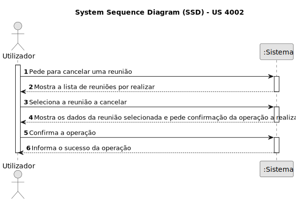
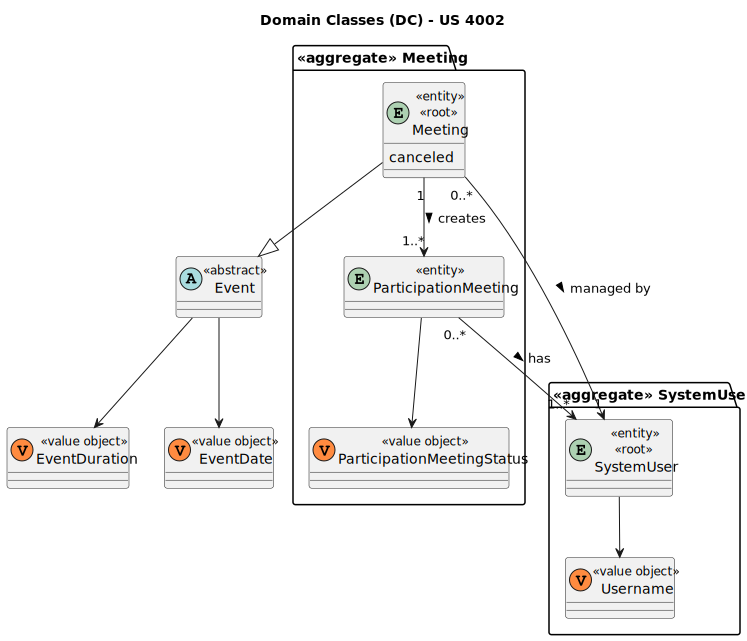
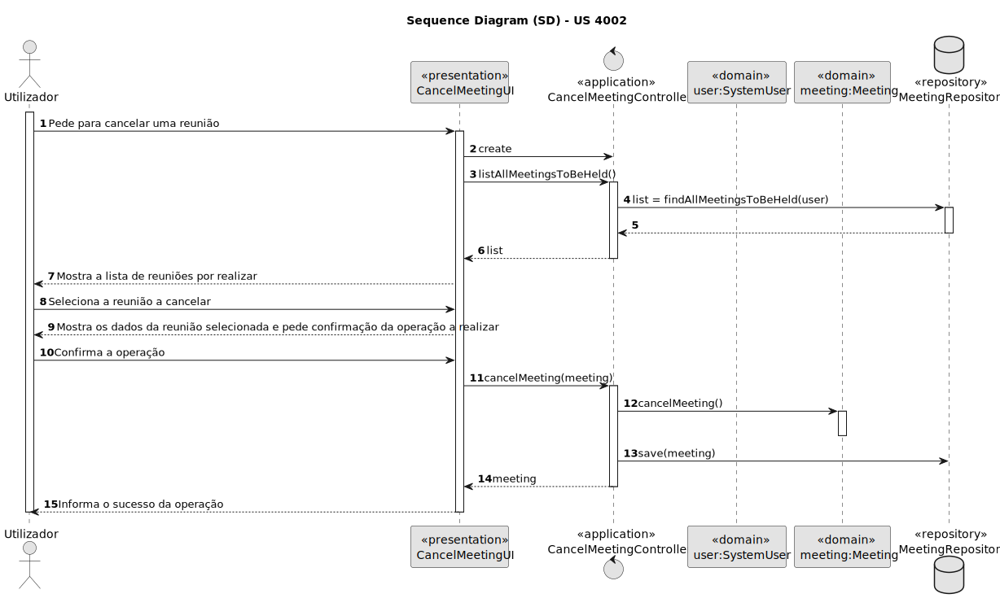
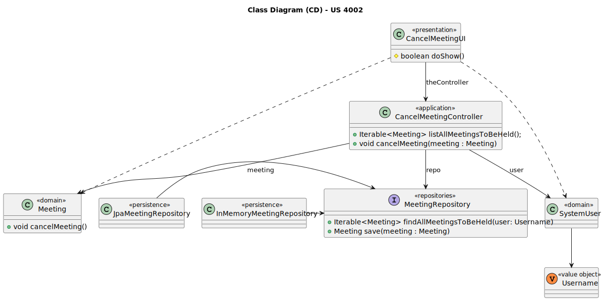

# US 4002

Este documento contém a documentação relativa à US 4002.

## 1. Contexto

Esta *User Story (US)* foi introduzida neste *sprint* para ser desenvolvida seguindo as boas práticas de engenharia de
*software*.
Esta *US* faz parte da disciplina de **EAPLI**.

## 2. Requisitos

**US 4002** - As User, I want to cancel a meeting

A respeito deste requisito, entendemos que o utilizador deve selecionar umas das reuniões que vai realizar para a poder
cancelar.

### 2.1. Complementos encontrados

*Não existem User Stories complementares.*

### 2.2. Dependências encontradas

- **US 4001** - As User, I want to schedule a meeting.

  **Explicação:** Se não existir uma reunião marcada, não é possível cancelá-la.

### 2.3. Critérios de aceitação

**CA 1:** Apenas é possível cancelar uma reunião que ainda não tenha sido realizada.

## 3. Análise

### 3.1. Respostas do cliente

Não foi necessário questionar o cliente em função da realização desta *User Story (US)*.

### 3.2. Diagrama de Sequência do Sistema



### 3.3. Classes de Domínio



## 4. Design

### 4.1. Diagrama de Sequência



### 4.2. Diagrama de Classes



### 4.3. Padrões Aplicados
|                        Questão: Que classe...                        |        Resposta         | Padrão               |                                                            Justificação                                                            |
|:--------------------------------------------------------------------:|:-----------------------:|----------------------|:----------------------------------------------------------------------------------------------------------------------------------:|
|            é responsável por interagir com o utilizador?             |     CancelMeetingUI     | *Pure Fabrication*   |                    Não há razão para atribuir esta responsabilidade a uma classe presente no Modelo de Domínio.                    |
|            é responsável por coordenar a funcionalidade?             | CancelMeetingController | *Controller*         |                                                                                                                                    |
|         é responsável por criar todas as classes Repository?         |    RepositoryFactory    | *Factory*            |                           Quando uma entidade é demasiado complexa, as fábricas fornecem encapsulamento.                           |
| conhece todas as reuniões por realizar de um determinado utilizador? |    MeetingRepository    | *Information Expert* |                Dado que é responsável pela persistência/reconstrução do *Meeting*, conhece todos os seus detalhes.                 |
|              sabe se uma reunião encontra-se cancelada?              |         Meeting         | *Information Expert* |                                        Sabe toda a informação dos dados que lhe pertencem.                                         |

### 4.4. Testes

**Teste 1:** *Verifica que não é possível cancelar uma reunião que já tenha sido realizada.*

```
@Test(expected = MeetingNotHeldException.class)
public void ensureCannotCancelMeetingThatHasAlreadyTakenPlace() {
	//...
}
````

**Teste 2:** *Verifica que é possível cancelar uma reunião que ainda não tenha sido realizada.*

```
public void ensurePossibleCancelMeetingThatHasNotYetTakenPlace() {
	//...
}
````

## 5. Implementação

## 5.1. Arquitetura em Camadas
### Domínio

Na camada de domínio utilizou-se a entidade *Meeting* que já tinha sido criada por outra *User Storie (US)*.

### Aplicação

Na camada de aplicação criou-se o controller *CancelMeetingController*.

### Repositório

Na camada de repositório utilizou-se a interface *MeetingRepository* que é implementada em *JPA* e *InMemory* no módulo de *impl*.

### Apresentação

Nesta camada foi desenvolvida a *CancelMeetingUI* que faz a interação entre o utilizador (gerente, professor e aluno)
e o sistema. Aqui é possível cancelar uma reunião.

## 5.2. Commits Relevantes

[Listagem dos Commits realizados](https://github.com/Departamento-de-Engenharia-Informatica/sem4pi-22-23-20/issues/49)

## 6. Integração/Demonstração

No menu de administrador, professor e aluno foi adicionado no sub-menu **Meeting** a opção *Cancel a meeting*.

## 7. Observações

Não existem observações relevantes a acrescentar.