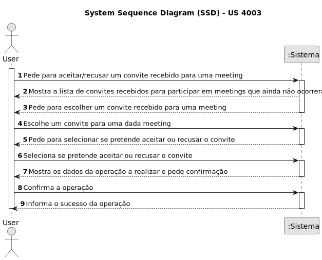
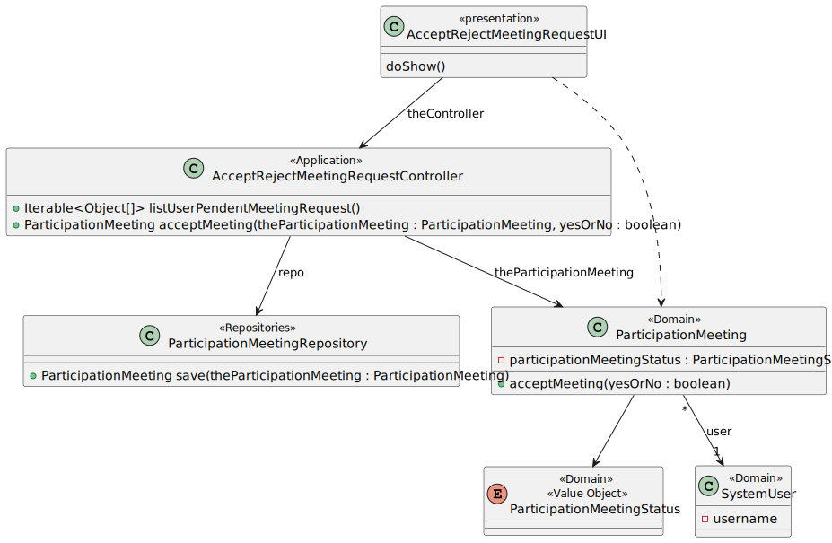

# US 4003

Este documento contém a documentação relativa à *US* 4003.

## 1. Contexto

Esta *User Story (US)* foi introduzida neste *sprint* para ser desenvolvida seguindo as boas práticas de engenharia de
*software*.
Esta *US* faz parte da disciplina de **EAPLI**.

## 2. Requisitos

**US 4003** - As User, I want to accept or reject a meeting request.

A respeito deste requisito, entendemos que qualquer utilizador do sistema poderá aceitar ou recusar um convite para
participar numa reunião (*meeting*), para a qual foi convidado.

### 2.1. Complementos encontrados

Não existe *User Stories* complementares.

### 2.2. Dependências encontradas

- **US 4001** - As User, I want to schedule a meeting.

  **Explicação:** Para que seja possível aceitar ou cancelar um convite para uma *meeting*, é preciso primeiro que a 
  *meeting* seja criada e o convite por sua vez enviado.
  Como podemos ver pelo diagrama de máquina de estados seguinte, torna-se possivel ao utilizador aceitar/recusar a 
  participação numa *meeting* após esta ser criada e o sistema verificar, para cada utilizador a convidar, se não tem
  nada marcado para a hora da reunião.

  

### 2.3. Critérios de aceitação

**CA 1:** Apenas deve ser possível aceitar/recusar um convite para uma *meeting* antes da sua data de realização.
**CA 2:** Apenas é possível alterar o estado do convite quando está no estado *invited*.

## 3. Análise

Como podemos analisar pelo diagrama de máquina de estados presente no ponto 2.2, a funcionalidade a desenvolver nesta 
*US* vai passar um dado convite para um dos seus estados finais. Estes estados são, "refused" ou "accepted".
"Refused" é quando o utilizador recusa o pedido de participação na reunião. Já o "accepted" é quando o utilizador aceita
o pedido.

### 3.1. Respostas do cliente

Não foi necessário questionar o cliente em função da realização desta *User Story*.

### 3.2. Diagrama de Sequência do Sistema



### 3.3. Classes de Domínio


## 4. Design

### 4.1. Diagrama de Sequência

*Alternativa 1*


*Alternativa 2 **(escolhida)***


### 4.2. Diagrama de Classes



### 4.3. Padrões Aplicados

|                                           Questão: Que classe...                                            |               Resposta               | Padrão                            |                                                                                   Justificação                                                                                   |
|:-----------------------------------------------------------------------------------------------------------:|:------------------------------------:|-----------------------------------|:--------------------------------------------------------------------------------------------------------------------------------------------------------------------------------:|
|                                é responsável por interagir com o utilizador?                                |     AcceptRejectMeetingRequestUI     | *Pure Fabrication*                |                                           Não há razão para atribuir esta responsabilidade a uma classe presente no Modelo de Domínio                                            |
|                                     é responsável por coordenar a *US*?                                     | AcceptRejectMeetingRequestController | *Controller*                      |                                                                                                                                                                                  |
|                            é responsável por criar todas as classes Repository?                             |          RepositoryFactory           | *Factory*                         |                                                  Quando uma entidade é demasiado complexa, as fábricas fornecem encapsulamento.                                                  |
|          é responsável por saber o estado de um convite para uma *meeting* de um dado utilizador?           |      ParticipationMeetingStatus      | *Information Expert*              |                                                               Sabe toda a informação dos dados que lhe pertencem.                                                                |
|       é responsável por saber todos os dados de um convite para uma *meeting* de um dado utilizador?        |         ParticipationMeeting         | *Information Expert*              |                                                               Sabe toda a informação dos dados que lhe pertencem.                                                                |
|       é responsável por saber todos os convites para *meetings* que existem para um dado utilizador?        |    ParticipationMeetingRepository    | *Pure Fabrication*                |                                                     Não há razão para atribuir esta responsabilidade a uma classe existente.                                                     |
| é responsável por pedir uma lista de todos os convites para *meetings* que existem para um dado utilizador? |   ListParticipationMeetingService    | *Single Responsibility Principle* | É mais fácil colocarmos esta responsabilidade num só lado para mantermos o código "limpo" e não correr o risco de ser necessário alterar algo em várias partes do nosso sistema. |

### 4.4. Testes

**Teste 1:** Verifica se o pedido para participação na meeting é aceite com sucesso se estiver no estado invited.
````
@Test
void ensureParticipationMeetingIsSuccessfullyAccepted() {
  ParticipationMeeting subject = this.buildParticipationMeeting();
  subject.acceptMeeting(true);
  assertTrue(subject.isAccepted());
}
````

**Teste 2:** Verifica se o pedido para participação na meeting é recusado com sucesso se estiver no estado invited.
````
@Test
void ensureParticipationMeetingIsSuccessfullyRejected() {
    ParticipationMeeting subject = this.buildParticipationMeeting();
    subject.acceptMeeting(false);
    assertTrue(subject.isRefused());
}
````

**Teste 3:** Verifica que não é possível aceitar um convite se este ainda estiver no estado created.
````
@Test
void ensureParticipationMeetingCannotBeAcceptedWhenInCreatedState() {
ParticipationMeeting subject = this.buildParticipationMeeting();
assertThrows(IllegalStateException.class, () -> subject.acceptMeeting(true));
}
````

**Teste 4:** Verifica que não é possível recusar um convite se este ainda estiver no estado created.
````
    @Test
    void ensureParticipationMeetingCannotBeRefusedWhenInCreatedState() {
        ParticipationMeeting subject = this.buildParticipationMeeting();
        assertThrows(IllegalStateException.class, () -> subject.acceptMeeting(false));
    }
````

**Teste 5:** Verifica que não é possível aceitar um convite se este já tiver sido aceite.
````
@Test
void ensureParticipationMeetingCannotBeAcceptAfterBeingAccepted() {
    ParticipationMeeting subject = this.buildParticipationMeeting();
    subject.acceptMeeting(true);
    assertThrows(IllegalStateException.class, () -> subject.acceptMeeting(true));
}
````

**Teste 6:** Verifica que não é possível recusar um convite se este já tiver sido aceite.
````
@Test
void ensureParticipationMeetingCannotBeRefusedAfterBeingAccepted() {
    ParticipationMeeting subject = this.buildParticipationMeeting();
    subject.acceptedParticipation();
    assertThrows(IllegalStateException.class, () -> subject.acceptMeeting(false));
}
````
    
**Teste 7:** Verifica que não é possível aceitar um convite se este já tiver sido recusado.
````
@Test
void ensureParticipationMeetingCannotBeAcceptAfterBeingRefused() {
    ParticipationMeeting subject = this.buildParticipationMeeting();
    subject.refusedParticipation();
    assertThrows(IllegalStateException.class, () -> subject.acceptMeeting(true));
}
````

**Teste 8:** Verifica que não é possível recusar um convite se este já tiver sido recusado.
````
@Test
void ensureParticipationMeetingCannotBeRefusedAfterBeingRefused() {
    ParticipationMeeting subject = this.buildParticipationMeeting();
    subject.refusedParticipation();
    assertThrows(IllegalStateException.class, () -> subject.acceptMeeting(false));
}
````

**Teste 9:** Verifica que não é possível aceitar um convite se este já tiver sido cancelado.
````
@Test
void ensureParticipationMeetingCannotBeAcceptAfterBeingCancelled() {
    ParticipationMeeting subject = this.buildParticipationMeeting();
    subject.canceledParticipation();
    assertThrows(IllegalStateException.class, () -> subject.acceptMeeting(true));
}
````

**Teste 10:** Verifica que não é possível recusar um convite se este já tiver sido cancelado.
````
@Test
void ensureParticipationMeetingCannotBeRefusedAfterBeingCancelled() {
    ParticipationMeeting subject = this.buildParticipationMeeting();
    subject.canceledParticipation();
    assertThrows(IllegalStateException.class, () -> subject.acceptMeeting(false));
}
````

## 5. Implementação

## 5.1. Arquitetura em Camadas
### Domínio

Na camada de domínio utilizaram-se as entidades *ParticipationMeeting* e *Meeting* e os respetivos *Value Objects* de 
cada entidade.

### Aplicação

Na camada de aplicação criou-se o controller *AcceptRejectMeetingRequestController*.
Também se utilizou o serviço *ListParticipationMeetingService*.

### Repositório

Na camada de repositório foi utilizada a *interface* *ParticipationMeetingRepository* que é implementada em *JPA* e 
*InMemory* no módulo de *impl*.

### Apresentação

Nesta camada foi desenvolvida a *AcceptRejectMeetingRequestUI* que faz a interação entre o utilizador e o sistema. 
Est UI permite aceitar/recusar um convite de participação numa *meeting* (reunião).

## 5.2. Commits Relevantes

[Listagem dos Commits realizados](https://github.com/Departamento-de-Engenharia-Informatica/sem4pi-22-23-20/issues/50)

## 6. Integração/Demonstração

* No menu de Administrador foi adicionado no sub-menu **Meeting** a opção *Accept/Reject meeting request*.
* No menu de professor foi adicionado no sub-menu **Meeting** a opção *Accept/Reject meeting request*.
* No menu de aluno foi adicionado no sub-menu **Meeting** a opção *Accept/Reject meeting request*.

## 7. Observações

A alternativa do diagrama de sequência escolhida foi a segunda, pois em relação à primeira tem uma implementação mais 
simples. Na segunda opção apenas é necessário realizar a implementação de um método do lado da classe de domínio, e 
também o código torna-se de leitura mais fácil ao eliminar a redundância de ter dois métodos quando é possível realizar 
essa operação com apenas um.
