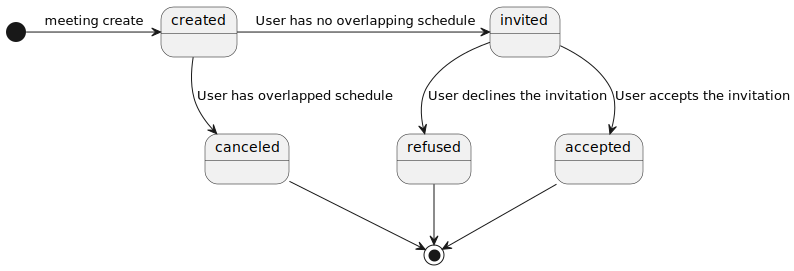
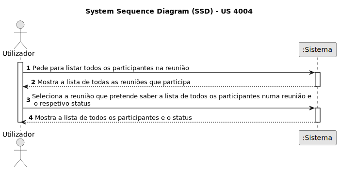
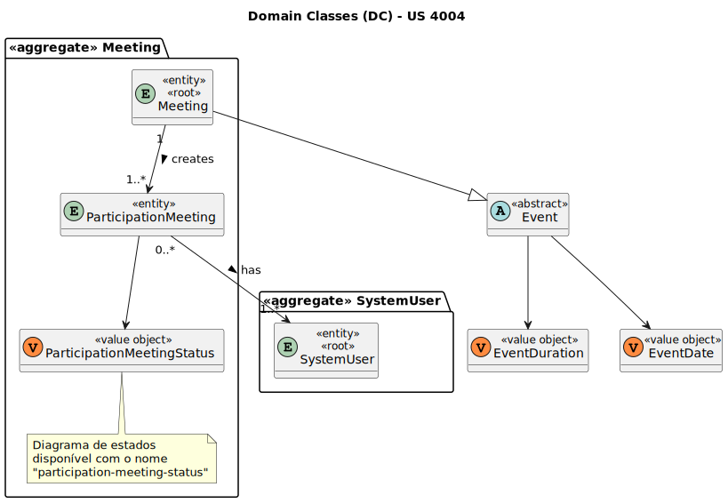
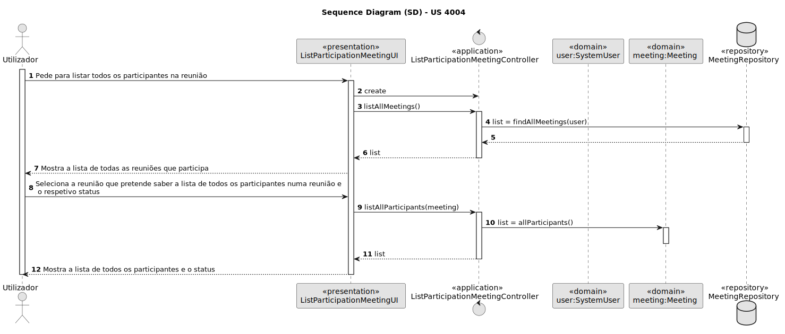
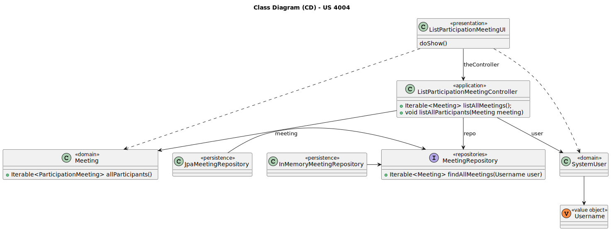

# US 4004

Este documento contém a documentação relativa à US 4004.

## 1. Contexto

Esta *User Story (US)* foi introduzida neste *sprint* para ser desenvolvida seguindo as boas práticas de engenharia de
*software*.
Esta *US* faz parte da disciplina de **EAPLI**.

## 2. Requisitos

**US 4004** - As User, I want to view a list of participants in my meeting and their status (accept or reject). 

A respeito deste requisito, entendemos que o utilizador deve selecionar umas das reuniões que vai realizar para a poder
cancelar.

### 2.1. Complementos encontrados

- *US 4003* - As User, I want to accept or reject a meeting request.

Explicação: A *US 4003* complementa a *US 4004*, pois a *US 4003* permite passar o estado das meetings para
aceite ou rejeitado.

### 2.2. Dependências encontradas

- **US 4001** - As User, I want to schedule a meeting.

  **Explicação:** Para que seja possível aceitar ou cancelar um convite para uma *meeting*, é preciso primeiro que a
  *meeting* seja criada e o convite por sua vez enviado.
  Como podemos ver pelo diagrama de máquina de estados seguinte, torna-se possivel ao utilizador aceitar/recusar a
  participação numa *meeting* após esta ser criada e o sistema verificar, para cada utilizador a convidar, se não tem
  nada marcado para a hora da reunião.


  

### 2.3. Critérios de aceitação

**CA 1:** Um utilizador só pode ver a lista de participantes em reuniões que participa.

## 3. Análise

### 3.1. Respostas do cliente

> Q1:Relativamente a esta user story, o ficheiro excel providenciado refere o seguinte:
>
> As User, I want to view a list of participants in my meeting and their status (accept or reject).
>
>Aqui, pelo menos a meu ver, o termo "my meeting" parece sugerir que esta funcionaliade apenas se a aplica a meetings que o utilizador criou (i.e. se um User não for owner de uma meeting não puderá ver os seus participantes).
>
>No entanto, no documento de especificação, o seguinte é dito:
>
> The system displays the lists of participants in a meeting and the response status (accept or reject meeting).
>
> O que não discrimina se esta funcionalidade deve estar disponível a todos os participantes ou apenas ao criador.
>
> A meu ver, a alternativa que parece fazer mais sentido seria, de facto, qualquer utilizador poder ver a lista de participantes de uma meeting, desde que pertença à mesma; no entanto, faço-lhe esta pergunta para me certificar de que a feature que vai ser implementada realmente corresponde àquilo que o cliente pretende.
>
> A1: Relativamente à primeira questão faz sentido a sua segunda interpretação, ou seja, o que está no documento de especificação está correto e reflete o que o cliente deseja. Ou seja, deve ser possível qualquer utilizador participante consultar os outros participantes em reuniões na qual ele também é participante.


> Q2: Aproveito ainda para lhe perguntar se a data da ocorrência da meeting possui alguma importância no que diz respeito a este caso de uso; isto é, o utilizador deve poder selecionar a meeting que pretende ver os participantes mesmo que esta já tenha ocorrido (e terminado), ou apenas aquelas que estão/irão decorrer é que possuem relevância?
> 
> A2: Relativamente à segunda questão, do ponto de vista do cliente faz sentido também ver reuniões que ocorreram no passado.

> Q3: Relativamente a esta user story, o ficheiro excel providenciado refere o seguinte:
> "As User, I want to view a list of participants in my meeting and their status (accept or reject)"
>
>Isso significa que só devem ser apresentados os participantes que possuam status "accept" or "reject" (portanto não seriam mostrados os participantes com status "pending" ou "owner" por exemplo), ou serve apenas como exemplo para se entender o que refere quando se fala no status?
>
> A3: A ideia é que apareçam todos os participantes e o seu estado. Suponho que quem ainda não respondeu não terá nada no estado ou "pending" ou "unknown".

### 3.2. Diagrama de Sequência do Sistema



### 3.3. Classes de Domínio



## 4. Design

### 4.1. Diagrama de Sequência



### 4.2. Diagrama de Classes



### 4.3. Padrões Aplicados
|                        Questão: Que classe...                        |              Resposta              | Padrão               |                                            Justificação                                             |
|:--------------------------------------------------------------------:|:----------------------------------:|----------------------|:---------------------------------------------------------------------------------------------------:|
|            é responsável por interagir com o utilizador?             |     ListParticipationMeetingUI     | *Pure Fabrication*   |    Não há razão para atribuir esta responsabilidade a uma classe presente no Modelo de Domínio.     |
|            é responsável por coordenar a funcionalidade?             | ListParticipationMeetingController | *Controller*         |                                                                                                     |
|         é responsável por criar todas as classes Repository?         |         RepositoryFactory          | *Factory*            |           Quando uma entidade é demasiado complexa, as fábricas fornecem encapsulamento.            |
| conhece todas as reuniões por realizar de um determinado utilizador? |         MeetingRepository          | *Information Expert* | Dado que é responsável pela persistência/reconstrução do *Meeting*, conhece todos os seus detalhes. |
|                sabe os participantes de uma reunião?                 |              Meeting               | *Information Expert* |                         Sabe toda a informação dos dados que lhe pertencem.                         |

### 4.4. Testes

**Teste 1:** *Verifica que .*

```
@Test(expected = MeetingNotHeldException.class)
public void ensureCannotCancelMeetingThatHasAlreadyTakenPlace() {
	//...
}
````

**Teste 2:** *Verifica que .*

```
public void ensurePossibleCancelMeetingThatHasNotYetTakenPlace() {
	//...
}
````

## 5. Implementação

## 5.1. Arquitetura em Camadas
### Domínio

Na camada de domínio utilizou-se a entidade *Meeting* que já tinha sido criada por outra *User Storie (US)*.

### Aplicação

Na camada de aplicação criou-se o controller *ListParticipationMeetingController*. Também utilizou-se o serviço *ListMeetingService*.

### Repositório

Na camada de repositório utilizou-se a interface *MeetingRepository* que é implementada em *JPA* e *InMemory* no módulo de *impl*.

### Apresentação

Nesta camada foi desenvolvida a *ListParticipationMeetingUI* que faz a interação entre o utilizador (gerente, professor e aluno)
e o sistema. Aqui é possível ver a lista de participantes numa reunião.

## 5.2. Commits Relevantes

[Listagem dos Commits realizados](https://github.com/Departamento-de-Engenharia-Informatica/sem4pi-22-23-20/issues/51)

## 6. Integração/Demonstração

No menu de administrador, professor e aluno foi adicionado no sub-menu **Meeting** a opção *List participants*.

## 7. Observações

Não existem observações relevantes a acrescentar.